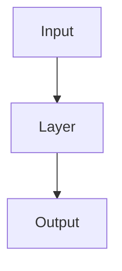

Based on the user's request to add Mermaid flowcharts below the ASCII diagrams in `models/模型架构说明/01_Model_Architectures.md`, and my review of the file, I will proceed with the following plan:

1.  **Identify Targets**: I have identified all sections with ASCII diagrams:
    *   1.1 Swin-UNet
    *   1.2 FNO 2D
    *   1.3 Classic U-Net
    *   1.4 DeepONet 2D
    *   1.5 SegFormer
    *   1.6 UNetFormer
    *   1.7 ModularSR
    *   1.8 SparseAttentionEncoder
    *   2.1 SwinTemporal Wrapper
    *   2.2 PhysicsTransformer
    *   2.3 Temporal Components (3 variants: Conv1D, Transformer, FiLM)
    *   3.1 ARWrapper
    *   4.1 HybridModel
    *   4.2 MLPModel

2.  **Generate Mermaid Code**: I will convert each ASCII diagram into a valid Mermaid `graph TD` (Top-Down) flowchart. I will ensure the Mermaid syntax accurately reflects the structure shown in the ASCII and the code logic verified in the previous turn.

3.  **Update File**: I will append the Mermaid code block immediately after each ASCII code block in the markdown file. I will use the `mermaid` language identifier for the code blocks.

**Action**: I will use `SearchReplace` to insert the Mermaid diagrams. Since there are many diagrams, I will do this in batches to avoid extremely large tool calls, or one large replacement if the context allows. Given the file size, multiple replacements or a full rewrite might be safer, but `SearchReplace` is generally preferred for targeted edits. I will use `SearchReplace` to insert them one by one or grouped by chapter to keep it manageable.

**Example Transformation**:
ASCII:
```text
[Input] -> [Layer] -> [Output]
```
Mermaid:


I will start by creating the Mermaid diagrams for Chapter 1.