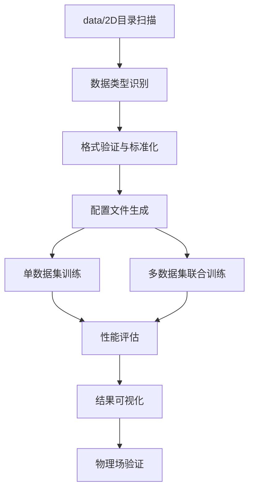

# PDEBench数据集扩展方案

## 1. 项目概述

PDEBench稀疏观测重建系统数据集扩展方案，旨在充分利用data/2D目录下的所有PDE数据类型，实现多物理场景的稀疏观测重建能力。该方案支持达西流、扩散反应、不可压缩Navier-Stokes等多种偏微分方程的数据处理和模型训练。

## 2. 核心功能

### 2.1 用户角色
本系统主要面向科研人员和工程师，无需复杂的用户角色区分。

### 2.2 功能模块

数据集扩展系统包含以下核心页面：

1. **数据集管理页面**：数据类型识别、格式验证、统计分析
2. **配置生成页面**：自动生成训练配置、参数优化建议
3. **多数据集训练页面**：联合训练策略、性能监控
4. **结果分析页面**：跨数据集性能对比、物理场可视化

### 2.3 页面详情

| 页面名称 | 模块名称 | 功能描述 |
|---------|----------|----------|
| 数据集管理页面 | 数据扫描模块 | 自动扫描data/2D目录，识别所有HDF5文件类型和结构 |
| 数据集管理页面 | 格式验证模块 | 验证数据格式兼容性，检查键名、维度、数据类型 |
| 数据集管理页面 | 统计分析模块 | 计算数据统计量、生成数据卡片、内存需求评估 |
| 配置生成页面 | 配置模板模块 | 基于数据类型自动生成YAML配置文件 |
| 配置生成页面 | 参数优化模块 | 根据数据规模推荐批处理大小、学习率等参数 |
| 多数据集训练页面 | 联合训练模块 | 实现多数据集混合训练、课程学习策略 |
| 多数据集训练页面 | 监控面板模块 | 实时显示训练进度、损失曲线、资源使用情况 |
| 结果分析页面 | 性能对比模块 | 跨数据集模型性能对比、统计显著性检验 |
| 结果分析页面 | 可视化模块 | 物理场重建结果可视化、误差分析图表 |

## 3. 核心流程

### 数据集扩展流程

1. **数据发现阶段**：系统扫描data/2D目录，自动识别所有PDE数据类型
2. **格式标准化**：将不同格式的数据统一为项目标准格式
3. **配置生成**：为每种数据类型生成优化的训练配置
4. **联合训练**：实施多数据集混合训练策略
5. **性能评估**：跨数据集性能对比和物理场验证

## 4. 用户界面设计

### 4.1 设计风格
- **主色调**：深蓝色(#1e3a8a)和科技蓝(#3b82f6)
- **辅助色**：灰色(#6b7280)和绿色(#10b981)
- **按钮样式**：圆角矩形，渐变背景
- **字体**：Roboto 14px（英文）、微软雅黑 14px（中文）
- **布局风格**：卡片式布局，左侧导航栏
- **图标风格**：线性图标，科技感设计

### 4.2 页面设计概览

| 页面名称 | 模块名称 | UI元素 |
|---------|----------|--------|
| 数据集管理页面 | 数据扫描模块 | 文件树组件、进度条、状态指示器、深蓝色主题 |
| 数据集管理页面 | 统计分析模块 | 数据表格、统计图表、内存使用饼图、响应式布局 |
| 配置生成页面 | 配置模板模块 | 表单组件、代码编辑器、实时预览、语法高亮 |
| 多数据集训练页面 | 监控面板模块 | 实时图表、指标卡片、日志窗口、深色主题 |
| 结果分析页面 | 可视化模块 | 热力图、对比图表、交互式3D可视化、颜色映射 |

### 4.3 响应式设计
- **桌面优先**：主要面向科研工作站和高性能计算环境
- **移动适配**：支持平板设备查看训练进度和结果
- **触控优化**：图表支持缩放和平移操作