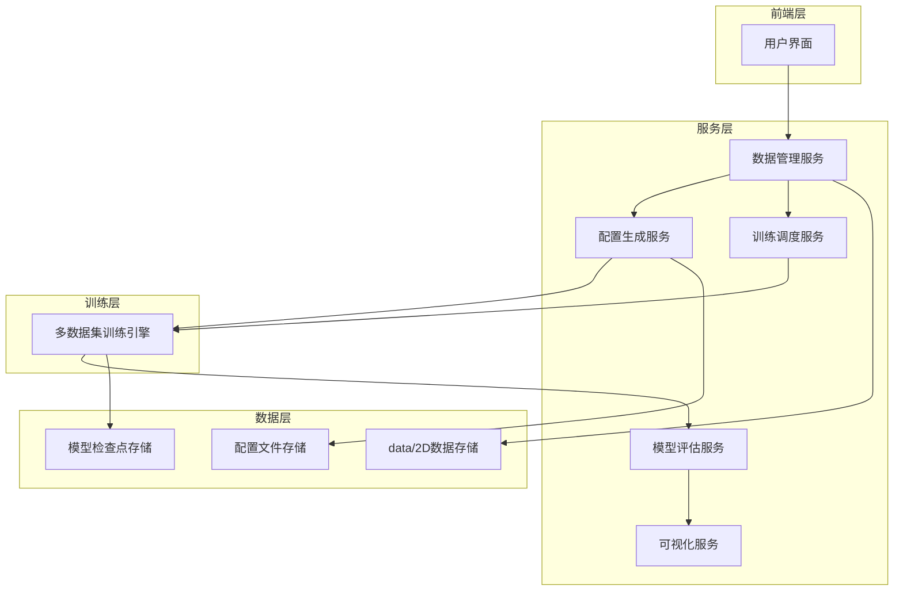
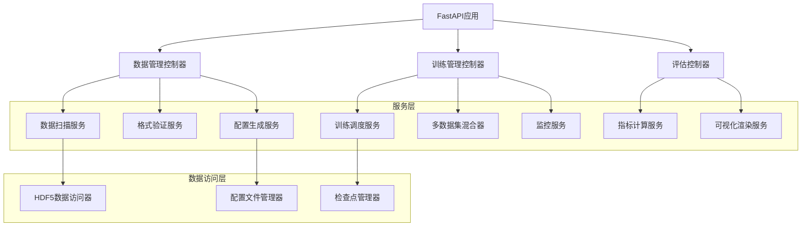
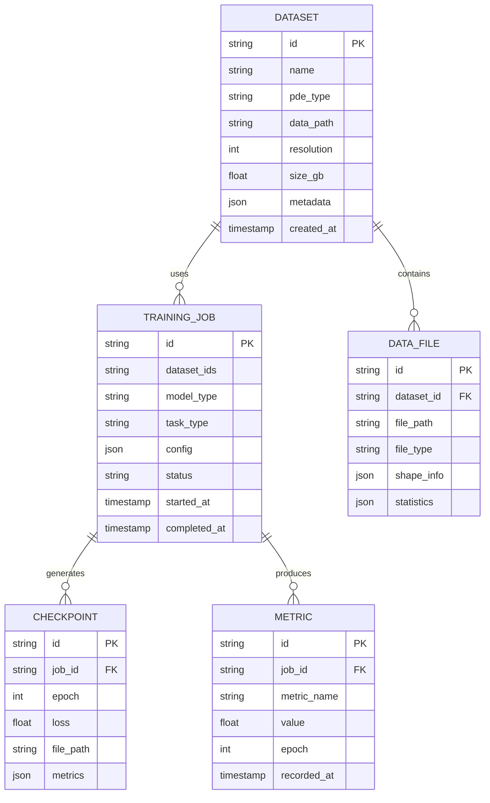

# PDEBench数据集扩展技术架构

## 1. 架构设计



## 2. 技术描述

- **前端**: React@18 + TypeScript + TailwindCSS + Vite
- **后端**: Python FastAPI + PyTorch + Hydra配置管理
- **数据处理**: HDF5 + NumPy + 自定义数据加载器
- **训练框架**: PyTorch Lightning + 分布式训练支持
- **可视化**: Matplotlib + Plotly + 自定义物理场渲染器

## 3. 路由定义

| 路由 | 用途 |
|------|-----|
| /dashboard | 主控制面板，显示所有数据集状态和训练进度 |
| /datasets | 数据集管理页面，扫描和配置data/2D目录数据 |
| /config-generator | 配置生成器，自动生成训练配置文件 |
| /training | 多数据集训练监控页面 |
| /evaluation | 模型评估和性能对比页面 |
| /visualization | 物理场可视化和结果分析页面 |

## 4. API定义

### 4.1 数据集管理API

**扫描data/2D目录**
```
POST /api/datasets/scan
```

请求:
| 参数名 | 参数类型 | 是否必需 | 描述 |
|--------|----------|----------|------|
| root_path | string | true | data/2D目录路径 |
| recursive | boolean | false | 是否递归扫描子目录 |

响应:
| 参数名 | 参数类型 | 描述 |
|--------|----------|------|
| datasets | array | 发现的数据集列表 |
| total_size_gb | number | 总数据大小(GB) |
| supported_types | array | 支持的PDE类型 |

示例:
```json
{
  "root_path": "data/2D",
  "recursive": true
}
```

**生成数据集配置**
```
POST /api/datasets/generate-config
```

请求:
| 参数名 | 参数类型 | 是否必需 | 描述 |
|--------|----------|----------|------|
| dataset_type | string | true | PDE数据类型(DarcyFlow/DiffReact/IncompNS) |
| file_path | string | true | HDF5文件路径 |
| task_type | string | true | 任务类型(SR/Crop) |
| scale_factor | number | false | 超分辨率倍数 |

响应:
| 参数名 | 参数类型 | 描述 |
|--------|----------|------|
| config_yaml | string | 生成的YAML配置 |
| recommended_params | object | 推荐的训练参数 |

### 4.2 训练管理API

**启动多数据集训练**
```
POST /api/training/start-multi-dataset
```

请求:
| 参数名 | 参数类型 | 是否必需 | 描述 |
|--------|----------|----------|------|
| datasets | array | true | 数据集配置列表 |
| model_config | object | true | 模型配置 |
| training_strategy | string | true | 训练策略(sequential/mixed/curriculum) |

响应:
| 参数名 | 参数类型 | 描述 |
|--------|----------|------|
| job_id | string | 训练任务ID |
| estimated_time | number | 预估训练时间(小时) |

## 5. 服务器架构图



## 6. 数据模型

### 6.1 数据模型定义



### 6.2 数据定义语言

**数据集表 (datasets)**
```sql
-- 创建数据集表
CREATE TABLE datasets (
    id VARCHAR(36) PRIMARY KEY DEFAULT (UUID()),
    name VARCHAR(100) NOT NULL,
    pde_type ENUM('DarcyFlow', 'DiffReact', 'IncompNS', 'Other') NOT NULL,
    data_path VARCHAR(500) NOT NULL,
    resolution INTEGER NOT NULL,
    size_gb DECIMAL(10,2) NOT NULL,
    metadata JSON,
    created_at TIMESTAMP DEFAULT CURRENT_TIMESTAMP,
    updated_at TIMESTAMP DEFAULT CURRENT_TIMESTAMP ON UPDATE CURRENT_TIMESTAMP
);

-- 创建索引
CREATE INDEX idx_datasets_pde_type ON datasets(pde_type);
CREATE INDEX idx_datasets_created_at ON datasets(created_at DESC);

-- 初始化数据
INSERT INTO datasets (name, pde_type, data_path, resolution, size_gb, metadata) VALUES
('DarcyFlow_2D_Train', 'DarcyFlow', 'data/2D/DarcyFlow/2D_DarcyFlow_beta1.0_Train.hdf5', 128, 2.5, 
 '{"keys": ["tensor"], "time_steps": 10000, "physics": "porous_media_flow"}'),
('DiffReact_2D', 'DiffReact', 'data/2D/DiffReact/2D_diff-react_NA_NA.h5', 64, 1.8,
 '{"keys": ["u", "v"], "time_steps": 20, "physics": "reaction_diffusion"}'),
('IncompNS_2D', 'IncompNS', 'data/2D/IncompNS/2D_incompNS_NA_NA.h5', 128, 3.2,
 '{"keys": ["u", "v", "p"], "time_steps": 50, "physics": "fluid_dynamics"}');
```

**训练任务表 (training_jobs)**
```sql
-- 创建训练任务表
CREATE TABLE training_jobs (
    id VARCHAR(36) PRIMARY KEY DEFAULT (UUID()),
    dataset_ids JSON NOT NULL,
    model_type VARCHAR(50) NOT NULL,
    task_type ENUM('SR', 'Crop') NOT NULL,
    config JSON NOT NULL,
    status ENUM('pending', 'running', 'completed', 'failed') DEFAULT 'pending',
    started_at TIMESTAMP NULL,
    completed_at TIMESTAMP NULL,
    created_at TIMESTAMP DEFAULT CURRENT_TIMESTAMP
);

-- 创建索引
CREATE INDEX idx_training_jobs_status ON training_jobs(status);
CREATE INDEX idx_training_jobs_model_type ON training_jobs(model_type);
CREATE INDEX idx_training_jobs_created_at ON training_jobs(created_at DESC);
```

**指标表 (metrics)**
```sql
-- 创建指标表
CREATE TABLE metrics (
    id VARCHAR(36) PRIMARY KEY DEFAULT (UUID()),
    job_id VARCHAR(36) NOT NULL,
    metric_name VARCHAR(50) NOT NULL,
    value DECIMAL(10,6) NOT NULL,
    epoch INTEGER NOT NULL,
    recorded_at TIMESTAMP DEFAULT CURRENT_TIMESTAMP,
    FOREIGN KEY (job_id) REFERENCES training_jobs(id) ON DELETE CASCADE
);

-- 创建索引
CREATE INDEX idx_metrics_job_id ON metrics(job_id);
CREATE INDEX idx_metrics_name_epoch ON metrics(metric_name, epoch);
CREATE INDEX idx_metrics_recorded_at ON metrics(recorded_at DESC);
```