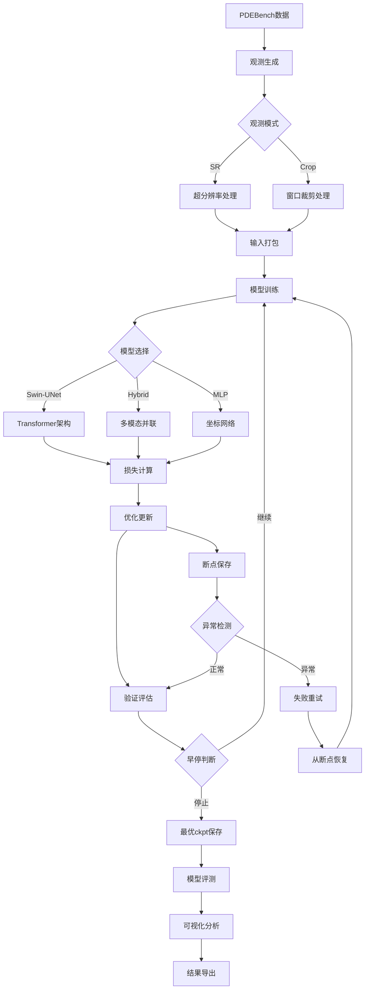

# PDEBench稀疏观测重建系统 - 产品需求文档

## 0. 术语与缩写统一表

| 术语/缩写 | 全称 | 定义说明 |
|-----------|------|----------|
| **SR** | Super-Resolution | 超分辨率观测模式，参数：scale（下采样倍率）、σ（高斯模糊标准差）、blur_kernel（模糊核大小）、boundary（边界策略：mirror/wrap/zero） |
| **Crop** | Crop Observation | 裁剪观测模式，参数：crop_size（裁剪窗口尺寸）、patch_align（patch对齐倍数，默认8）、center_sampler（中心采样策略：mixed=均匀40%+边界30%+高梯度30%） |
| **fRMSE** | Frequency-band RMSE | 频域分段均方根误差，按能谱半径划分：low（k≤k1）、mid（k1<k≤k2）、high（k>k2），默认阈值k1=1/4×Nyquist，k2=1/2×Nyquist |
| **bRMSE** | Boundary RMSE | 边界带均方根误差，默认边界带宽16px，随分辨率线性缩放 |
| **cRMSE** | Conservation RMSE | 守恒量均方根误差，全域积分守恒偏差 |
| **DC** | Data Consistency | 数据一致性，‖H(ŷ)−y‖₂损失项 |
| **H算子** | Degradation Operator | 退化算子，SR模式：blur∘downsample，Crop模式：区域提取 |
| **Params(M)** | Parameters (Million) | 模型参数量，单位：百万 |
| **FLOPs(G)** | Floating Point Operations (Giga) | 浮点运算量，@256²分辨率，单位：十亿次 |
| **显存峰值(GB)** | Peak Memory (GB) | 训练/推理时GPU显存峰值使用量 |
| **推理FPS** | Inference FPS | 推理帧率，batch=1时的每秒处理帧数 |

## 1. Product Overview

本项目是一个基于深度学习的偏微分方程（PDE）场重建系统，专门处理从稀疏观测数据到全场连续重建的任务。系统支持超分辨率（SR）和裁剪（Crop）两种观测模式，能够从有限的观测信息中准确重建完整的物理场分布。

- 核心目标：解决科学计算中稀疏传感器数据的全场重建问题，提供高精度的物理场预测能力
- 应用价值：为流体力学、热传导、反应扩散等物理仿真提供高效的数据重建解决方案，降低传感器成本并提高预测精度

## 2. Core Features

### 2.1 User Roles

| Role | Registration Method | Core Permissions |
|------|---------------------|------------------|
| 研究人员 | 直接使用，无需注册 | 创建/运行实验、查看所有公开实验、只读下载模型和结果 |
| 开发者 | 直接使用，无需注册 | 除研究人员权限外，可注册新模型、改动算子H、添加损失函数 |
| 管理员 | 系统管理员权限 | 删除实验、管理存储与配额、发布/回滚版本、用户权限管理 |

### 2.1.1 非功能性目标

- **可复现性**：同配置、同随机种子，指标方差 ≤ 1e-4
- **资源要求**：单卡16GB可跑256²、batch 8-16的Swin-UNet
- **训练时长**：单模型基线 ≤ 12h（200 epoch, 256², AMP）
- **环境基线**：Python 3.10+, PyTorch 2.0+, CUDA 12.1+

### 2.2 Feature Module

我们的PDEBench稀疏观测重建系统包含以下主要功能模块：

1. **数据处理模块**：PDEBench数据读取、观测模式生成、数据预处理
2. **模型训练模块**：多种深度学习模型训练、损失函数计算、优化器配置
3. **评测分析模块**：多维度指标计算、可视化分析、性能对比
4. **实验管理模块**：实验配置快照、模型注册表、版本控制、可复现性保证
5. **推理部署模块**：模型推理、结果导出、部署优化

### 2.3 Page Details

| Page Name | Module Name | Feature description |
|-----------|-------------|---------------------|
| 数据处理模块 | PDEBench读取器 | 读取HDF5格式数据，支持多键名["u"]或["rho","ux","uy"]，形状统一化处理，z-score归一化（详见技术架构文档4.1节API定义） |
| 数据处理模块 | 观测生成器 | SR模式：高斯模糊+区域下采样；Crop模式：窗口裁剪+对齐处理；输入打包为[baseline, coords, mask]（详见技术架构文档4.1节观测生成相关API） |
| 数据处理模块 | 数据一致性算子 | H算子实现：SR的blur+downsample，Crop的区域提取；DC损失计算；**硬验收条件：观测生成H与训练DC的H复用同一实现（核大小、σ、插值、对齐/边界策略一致）**（详见技术架构文档4.1节损失函数接口） |
| 模型训练模块 | Swin-UNet模型 | PDEformer-T架构，patch=8/16，window=8/12，embed=96，可选FNO瓶颈（详见技术架构文档7.6节模型文件清单） |
| 模型训练模块 | Hybrid模型 | 注意力+FNO+UNet并联，低潜stride=8，d=256，depth=6，PixelShuffle上采样（详见技术架构文档7.6节模型文件清单） |
| 模型训练模块 | MLP模型 | 坐标-INR或Patch-MLP/Mixer，宽度256，层数6-8，带FourierPE（详见技术架构文档7.6节模型文件清单） |
| 模型训练模块 | 损失函数 | 重建损失(Rel-L2/MAE)，低频谱损失(2D FFT)，数据一致性损失，可选梯度损失（详见技术架构文档4.1节损失函数接口） |
| 模型训练模块 | 训练循环 | Hydra配置解析，DataLoader构建，AMP+反传+梯度裁剪，日志记录（详见技术架构文档3节Route Definitions） |
| 评测分析模块 | 指标计算 | Rel-L2、MAE、PSNR、SSIM、fRMSE(low/mid/high)、bRMSE、cRMSE、DC一致性（详见技术架构文档4.1节评测指标接口） |
| 评测分析模块 | 可视化分析 | GT/Pred/Error热图，功率谱对数显示，边界带误差分析，横向对比表；**多通道聚合：先逐通道算指标，再等权平均**（详见技术架构文档附录A.3节指标计算细则） |
| 实验管理模块 | 实验配置快照 | Hydra YAML合并后快照、Git commit、随机种子、环境指纹（PyTorch/CUDA版本）（详见技术架构文档6.2节数据定义语言） |
| 实验管理模块 | 模型注册表 | 统一命名规则：`<task>-<data>-<res>-<model>-<keyhyper>-<seed>-<date>`，包含ckpt、指标、可视化、ONNX导出（详见技术架构文档6.2节数据定义语言） |
| 推理部署模块 | 模型推理 | 加载checkpoint，输入管线一致性，DC自检，批量推理（详见技术架构文档3节Route Definitions） |
| 推理部署模块 | 结果导出 | ONNX/TensorRT导出，静态/动态尺寸支持，性能优化（详见技术架构文档3节Route Definitions） |

## 3. Core Process

### 主要操作流程

**数据处理流程**：
1. 加载PDEBench HDF5数据 → 2. 选择观测模式(SR/Crop) → 3. 生成稀疏观测 → 4. 构建输入张量

**模型训练流程**：
1. 解析Hydra配置 → 2. 构建数据加载器 → 3. 初始化模型和优化器 → 4. 训练循环(前向+损失+反传) → 5. 验证和早停

**评测分析流程**：
1. 加载训练好的模型 → 2. 在测试集上推理 → 3. 计算多维度指标 → 4. 生成可视化报告

**横向实验流程**：
1. 配置实验矩阵 → 2. 并行训练多个模型 → 3. 统一评测对比 → 4. 生成横向分析表

## 4. User Interface Design

### 4.1 Design Style

- **主色调**：深蓝色(#1f2937)作为主色，青色(#06b6d4)作为强调色
- **辅助色**：灰色系(#6b7280, #9ca3af)用于文本和边框
- **按钮样式**：圆角矩形，渐变背景，悬停效果
- **字体**：等宽字体用于代码和数值，无衬线字体用于界面文本
- **布局风格**：卡片式布局，顶部导航，左侧配置面板，右侧结果展示
- **图标风格**：线性图标，科学计算主题，支持数学符号显示
- **无障碍设计**：深色/浅色对比度 ≥ WCAG AA标准
- **交互控制**：训练/评测可中止/暂停，长任务显示进度条
- **错误处理**：错误面板显示堆栈+失败步骤+建议修复（如"观测H和DC H配置不一致"）

### 4.2 Page Design Overview

| Page Name | Module Name | UI Elements |
|-----------|-------------|-------------|
| 数据处理模块 | 数据加载界面 | 文件选择器，数据预览表格，参数配置面板，进度条显示 |
| 数据处理模块 | 观测配置界面 | 模式选择按钮(SR/Crop)，参数滑块，实时预览窗口，对比显示 |
| 模型训练模块 | 训练配置界面 | 模型选择下拉框，超参数输入框，训练按钮，日志显示区域 |
| 模型训练模块 | 训练监控界面 | 实时损失曲线图，指标仪表盘，训练状态指示器，早停控制 |
| 评测分析模块 | 结果展示界面 | 指标对比表格，热图可视化，功率谱图表，误差分析图 |
| 评测分析模块 | 横向对比界面 | 模型性能雷达图，排行榜表格，详细指标展开，导出按钮 |
| 推理部署模块 | 推理界面 | 模型加载器，输入数据上传，推理按钮，结果下载链接 |
| 推理部署模块 | 部署配置界面 | 导出格式选择，优化选项，部署脚本生成，性能测试 |

### 4.3 Responsiveness

本系统主要面向科研和开发环境，采用桌面优先设计，支持大屏幕显示复杂的数据可视化。界面支持响应式布局，在不同分辨率下自动调整图表和表格尺寸。考虑到科学计算的特殊需求，优化了数学公式显示和高精度数值展示。

## 5. 验收标准与可执行清单

### 5.1 一致性自检
- 对随机100个样本，验证MSE(H(GT), y) < 1e-8
- 观测生成H与训练DC的H算子完全一致（核大小、σ、插值、对齐/边界策略）

### 5.2 复现性自检
- 同一YAML配置、同随机种子，val Rel-L2差值 < 1e-4
- 实验配置快照包含：Hydra YAML、Git commit、随机种子、环境指纹

### 5.3 资源自检
- 单卡16GB下三模型（Swin、Swin+FNO、MLP）能跑通256²分辨率
- 训练时长：单模型基线 ≤ 12h（200 epoch, 256², AMP）

### 5.4 指标门槛
- Swin+FNO的低频谱误差/守恒cRMSE优于Swin基线 ≥ 5%
- 所有模型优于U-Net和MLP基线的Rel-L2和频谱指标

### 5.5 导出自检
- ONNX/FP16推理与PyTorch误差 < 1e-4
- 推理管线与训练一致性验证通过

### 5.6 指标定义规范
- **fRMSE**：按能谱半径划三段（k≤k1、k1<k≤k2、k>k2），默认k1=1/4, k2=1/2的Nyquist频率（详见技术架构文档附录A.3节指标计算细则）
- **bRMSE**：边界带宽默认16px（随分辨率线性缩放），带内平均（详见技术架构文档附录A.3节指标计算细则）
- **多通道聚合**：对C_out>1的变量，先逐通道算指标，再等权平均（或按物理权重可选）（详见技术架构文档附录A.3节指标计算细则）