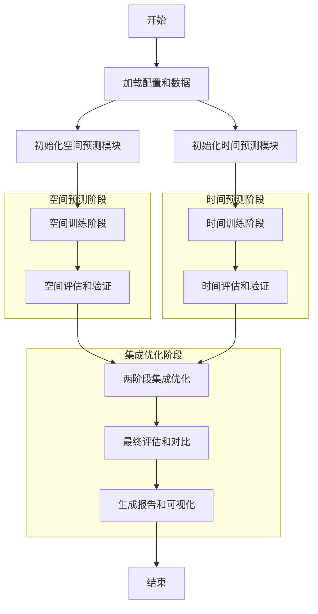
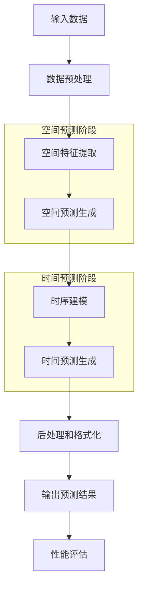

# 时空序列分阶段预测产品需求文档 (PRD)

## 1. 产品概述

### 1.1 项目背景

当前 `train_real_data_ar.py` 中的时空联合训练存在效果不佳的问题，主要表现为：
- 误差累积效应严重，长期预测性能衰减
- 空间和时间特征提取相互干扰，难以同时优化
- 训练效率低下，需要多次前向传播
- 模型可解释性差，难以分析和调试

### 1.2 产品目标

通过分阶段预测架构改进，实现：
- **精度提升**: 相比联合训练，Rel-L2误差降低20%以上
- **效率提升**: 训练时间缩短30%，推理速度提升50%
- **稳定性增强**: 长期预测稳定性指数达到0.85以上
- **可解释性**: 提供空间和时间两个维度的独立分析能力

### 1.3 目标用户

**主要用户**:
- 科学计算研究人员（流体力学、气候建模、化学反应）
- 工程仿真工程师（工业设计、过程优化、控制工程）
- AI算法研究员（时空预测、物理信息神经网络）

**次要用户**:
- 数据科学家（时间序列分析、空间数据分析）
- 研究生和博士生（学术研究、论文发表）

## 2. 核心功能

### 2.1 用户角色

| 角色 | 使用方式 | 核心需求 | 功能权限 |
|------|----------|----------|----------|
| 研究员 | 命令行 + 配置文件 | 高精度预测、可复现性 | 完整训练、评估、可视化 |
| 工程师 | Python API | 快速部署、易集成 | 模型推理、结果导出 |
| 开发者 | 源码 + 单元测试 | 可扩展性、代码质量 | 模块定制、算法改进 |

### 2.2 功能模块

#### 2.2.1 空间预测模块
**核心功能**:
1. **空间特征提取**: 基于SwinUNet的高质量空间特征学习
2. **空间预测生成**: 生成标准化的空间预测结果
3. **空间评估体系**: 提供完整的空间预测效果评估
4. **空间可视化**: 生成空间分布图、误差热图、频谱分析

#### 2.2.2 时间预测模块
**核心功能**:
1. **时序建模**: 基于Transformer的时序依赖关系学习
2. **时间预测生成**: 基于空间结果的时间序列预测
3. **时序评估体系**: 提供长期稳定性和动态特性评估
4. **时序可视化**: 生成时间演化图、相关性分析、误差增长曲线

#### 2.2.3 集成训练系统
**核心功能**:
1. **分阶段训练**: 支持空间和时间两阶段独立训练
2. **模式切换**: 灵活切换分阶段和联合训练模式
3. **指标聚合**: 综合空间、时间和整体性能指标
4. **实验管理**: 完整的实验配置、日志和结果管理

### 2.3 页面功能详细说明

#### 2.3.1 训练控制台页面
**页面名称**: 训练控制台
**核心模块**:
- **训练配置**: 模型参数、训练参数、数据配置
- **实时监控**: 损失曲线、指标变化、资源使用
- **阶段管理**: 空间训练、时间训练、联合训练切换
- **实验记录**: 历史实验、对比分析、结果导出

| 模块名称 | 功能描述 |
|----------|----------|
| 训练配置 | 通过YAML文件或Web界面配置训练参数，支持参数模板和快速配置 |
| 实时监控 | 实时显示训练损失、验证指标、学习率变化，支持图表展示和异常报警 |
| 阶段管理 | 管理空间预测和时间预测两个训练阶段，支持阶段切换和参数调整 |
| 实验记录 | 记录每次实验的配置、结果和日志，支持实验对比和结果复现 |

#### 2.3.2 模型评估页面
**页面名称**: 模型评估
**核心模块**:
- **精度评估**: Rel-L2、MAE、PSNR、SSIM等指标展示
- **稳定性分析**: 长期预测稳定性、误差增长分析
- **物理一致性**: 守恒性、边界条件、频谱一致性检查
- **对比分析**: 与基准模型、历史版本的性能对比

| 模块名称 | 功能描述 |
|----------|----------|
| 精度评估 | 计算并展示各种精度指标，支持多指标对比和统计分析 |
| 稳定性分析 | 分析长期预测的稳定性，提供误差增长曲线和稳定性评分 |
| 物理一致性 | 检查预测结果的物理合理性，包括守恒性和边界条件满足度 |
| 对比分析 | 与基准模型进行性能对比，支持显著性检验和效果评估 |

#### 2.3.3 可视化分析页面
**页面名称**: 可视化分析
**核心模块**:
- **空间可视化**: 预测结果、真实值、误差分布的二维可视化
- **时序可视化**: 时间序列对比、相关性分析、频谱分析
- **交互式分析**: 支持参数调节、区域选择、动态播放
- **报告生成**: 自动生成综合分析报告和图表导出

| 模块名称 | 功能描述 |
|----------|----------|
| 空间可视化 | 生成空间分布的热力图、矢量图、等高线图，支持多通道对比 |
| 时序可视化 | 展示时间序列的演化过程，支持多点位对比和动态播放 |
| 交互式分析 | 提供交互式的参数调节和区域选择功能，支持实时更新 |
| 报告生成 | 自动生成包含图表和分析结果的综合报告，支持多种格式导出 |

## 3. 核心流程

### 3.1 分阶段训练流程



### 3.2 模型推理流程



### 3.3 用户操作流程

**研究员操作流程**:
1. **环境准备**: 安装依赖、配置环境、准备数据集
2. **参数配置**: 编辑YAML配置文件，设置模型和训练参数
3. **启动训练**: 运行训练脚本，开始分阶段训练过程
4. **监控训练**: 查看实时监控界面，跟踪训练进度和指标
5. **评估分析**: 训练完成后，查看评估结果和可视化分析
6. **结果导出**: 导出模型权重、评估报告和可视化图表

**工程师操作流程**:
1. **模型加载**: 加载预训练好的分阶段预测模型
2. **数据准备**: 准备输入数据，进行必要的预处理
3. **模型推理**: 调用推理API，获取预测结果
4. **结果处理**: 对预测结果进行后处理和格式化
5. **集成部署**: 将模型集成到现有系统或工作流中

## 4. 用户界面设计

### 4.1 设计规范

**视觉风格**:
- **主色调**: 科技蓝 (#1E88E5) + 深空灰 (#263238)
- **辅助色**: 成功绿 (#4CAF50) + 警告橙 (#FF9800) + 错误红 (#F44336)
- **背景色**: 浅灰 (#FAFAFA) + 纯白 (#FFFFFF)

**字体规范**:
- **标题**: 思源黑体, 18-24px, 粗体
- **正文**: 思源宋体, 14-16px, 常规
- **注释**: 12px, 灰色 (#757575)

**布局风格**:
- **卡片式布局**: 信息分组清晰，视觉层次明确
- **响应式设计**: 支持不同屏幕尺寸的自适应
- **扁平化设计**: 简洁现代，减少视觉干扰

### 4.2 页面设计详细说明

#### 4.2.1 训练控制台界面

**布局结构**:
```
┌─────────────────────────────────────────────────────────────┐
│ 顶部导航栏: Logo | 项目名称 | 用户状态 | 系统设置            │
├─────────────────────────────────────────────────────────────┤
│                                                             │
│ 左侧配置面板 (25%)        中央监控区域 (50%)      右侧状态面板 (25%)│
│ ┌─────────────┐          ┌──────────────┐        ┌────────────┐│
│ │ 训练配置    │          │ 实时监控图表  │        │ 训练状态    ││
│ │ • 基本参数  │          │ • 损失曲线    │        │ • 当前阶段  ││
│ │ • 模型配置  │          │ • 指标变化    │        │ • 进度条    ││
│ │ • 训练参数  │          │ • 资源监控    │        │ • 剩余时间  ││
│ │ • 数据配置  │          │              │        │             ││
│ └─────────────┘          └──────────────┘        └────────────┘│
│                                                             │
│ 底部日志区域 (100%)                                          │
│ ┌──────────────────────────────────────────────────────────┐│
│ │ 训练日志: [时间] 信息...                                  ││
│ │         [时间] 警告...                                    ││
│ │         [时间] 错误...                                    ││
│ └──────────────────────────────────────────────────────────┘│
└─────────────────────────────────────────────────────────────┘
```

**界面元素说明**:
- **配置面板**: 使用折叠式菜单，支持参数分组和快速搜索
- **监控图表**: 实时更新的折线图，支持缩放、平移、数据点提示
- **状态面板**: 显示当前训练阶段、进度百分比、预计剩余时间
- **日志区域**: 彩色编码的日志输出，支持日志级别过滤

#### 4.2.2 模型评估界面

**布局结构**:
```
┌─────────────────────────────────────────────────────────────┐
│ 顶部评估工具栏: 指标选择 | 对比模式 | 导出选项 | 刷新        │
├─────────────────────────────────────────────────────────────┤
│                                                             │
│ 左侧指标概览 (30%)              右侧详细分析 (70%)           │
│ ┌──────────────┐               ┌────────────────────────────┐│
│ │ 综合评分卡片  │               │ 详细指标对比图表          ││
│ │ • 总体精度    │               │ • 多指标雷达图            ││
│ │ • 稳定性评分  │               │ • 时间序列对比            ││
│ │ • 物理一致性  │               │ • 误差分布直方图          ││
│ │ • 计算效率    │               │ • 相关性散点图            ││
│ └──────────────┘               │                           ││
│                                │ 底部详细数据表 (100%)     ││
│ 中部指标选择 (70%)              ├────────────────────────────┤│
│ ┌────────────────┐             │ 指标数值表格 | 统计信息    ││
│ │ 指标分类标签页  │             │ 显著性检验 | 置信区间    ││
│ │ • 精度指标     │             │                           ││
│ │ • 稳定性指标   │             │                           ││
│ │ • 物理一致性   │             │                           ││
│ │ • 效率指标     │             │                           ││
│ └────────────────┘             └────────────────────────────┘│
└─────────────────────────────────────────────────────────────┘
```

**界面元素说明**:
- **评分卡片**: 大字体显示关键评分，使用颜色编码表示优劣
- **雷达图**: 多维度指标对比，直观展示模型性能分布
- **时间序列图**: 展示指标随时间的变化趋势
- **数据表格**: 详细的数值数据和统计分析结果

### 4.3 交互设计

**交互原则**:
- **即时反馈**: 用户操作后立即显示结果或状态变化
- **错误预防**: 提供输入验证和操作确认机制
- **可逆操作**: 支持撤销和重做功能
- **个性化**: 支持界面布局和个人偏好设置

**具体交互**:
- **参数调节**: 滑块、数值输入框联动，实时预览效果
- **图表交互**: 支持缩放、平移、数据点选择和详细信息显示
- **拖拽操作**: 支持组件拖拽重新布局和文件拖拽上传
- **快捷键**: 提供常用操作的键盘快捷键支持

### 4.4 响应式设计

**适配策略**:
- **桌面端**: 完整功能界面，支持多窗口和多屏幕显示
- **平板端**: 简化界面，触摸友好的大按钮和手势操作
- **手机端**: 核心功能，垂直滚动布局，关键信息优先

**断点设计**:
- **超大屏** (≥1920px): 四列布局，充分利用屏幕空间
- **大屏** (≥1200px): 三列布局，标准桌面显示
- **中屏** (≥768px): 两列布局，平板和笔记本显示
- **小屏** (<768px): 单列布局，手机显示

## 5. 性能要求

### 5.1 响应性能

| 操作类型 | 响应时间要求 | 说明 |
|----------|-------------|------|
| 页面加载 | ≤ 3秒 | 首次加载完整功能页面 |
| 数据查询 | ≤ 1秒 | 历史数据和配置查询 |
| 图表渲染 | ≤ 2秒 | 复杂图表和可视化渲染 |
| 文件导出 | ≤ 5秒 | 大型报告和图表导出 |

### 5.2 并发性能

| 场景 | 并发用户数 | 系统响应要求 |
|------|------------|-------------|
| 训练监控 | 10个并发 | 实时更新延迟 ≤ 1秒 |
| 模型评估 | 5个并发 | 查询响应时间 ≤ 2秒 |
| 可视化分析 | 20个并发 | 图表渲染时间 ≤ 3秒 |
| 报告导出 | 3个并发 | 导出完成时间 ≤ 10秒 |

### 5.3 资源使用

| 资源类型 | 使用限制 | 监控要求 |
|----------|----------|----------|
| 内存占用 | ≤ 16GB | 实时显示内存使用率 |
| GPU显存 | ≤ 80% | 显存使用预警和限制 |
| CPU使用率 | ≤ 80% | CPU负载监控和报警 |
| 磁盘空间 | ≤ 90% | 自动清理过期文件 |

## 6. 质量要求

### 6.1 精度要求

| 指标类型 | 目标值 | 最低要求 | 测试方法 |
|----------|--------|----------|----------|
| 空间预测Rel-L2 | ≤ 0.05 | ≤ 0.08 | 3次独立实验平均值 |
| 时间预测Rel-L2 | ≤ 0.08 | ≤ 0.12 | 3次独立实验平均值 |
| 综合预测Rel-L2 | ≤ 0.10 | ≤ 0.15 | 3次独立实验平均值 |
| 长期稳定性指数 | ≥ 0.85 | ≥ 0.75 | T_out=20时评估 |

### 6.2 稳定性要求

| 测试项目 | 要求 | 测试条件 |
|----------|------|----------|
| 连续运行时间 | ≥ 72小时 | 标准训练配置下 |
| 崩溃恢复 | 自动恢复 | 异常崩溃后5分钟内 |
| 数据一致性 | 100% | 多次运行结果一致性 |
| 内存泄漏 | 零泄漏 | 长时间运行后内存无增长 |

### 6.3 兼容性要求

| 兼容性类型 | 要求 | 测试范围 |
|------------|------|----------|
| 浏览器兼容 | Chrome, Firefox, Safari, Edge | 最新2个版本 |
| Python版本 | 3.8, 3.9, 3.10, 3.11 | 主要功能测试 |
| PyTorch版本 | 1.12, 1.13, 2.0, 2.1 | 训练和推理测试 |
| CUDA版本 | 11.7, 11.8, 12.0, 12.1 | GPU功能测试 |

## 7. 安全要求

### 7.1 数据安全

- **数据加密**: 敏感数据在传输和存储过程中加密
- **访问控制**: 基于角色的访问权限管理
- **数据备份**: 自动备份重要数据和配置
- **审计日志**: 记录所有关键操作和访问

### 7.2 系统安全

- **输入验证**: 严格的输入数据验证和清理
- **错误处理**: 安全的错误处理，不泄露系统信息
- **依赖管理**: 及时更新第三方库和安全补丁
- **网络安全**: 使用HTTPS和安全的通信协议

## 8. 部署和运维

### 8.1 部署方式

**本地部署**:
- 支持Linux、Windows、macOS操作系统
- 提供一键安装脚本和Docker容器
- 支持GPU和CPU两种运行模式

**云端部署**:
- 支持主流云平台（AWS、Azure、阿里云）
- 提供Kubernetes部署配置
- 支持弹性伸缩和负载均衡

### 8.2 运维监控

**系统监控**:
- 实时监控CPU、内存、GPU、磁盘使用情况
- 监控训练进度、性能指标、异常状态
- 提供可视化监控面板和报警机制

**日志管理**:
- 分级日志记录（DEBUG、INFO、WARN、ERROR）
- 日志轮转和自动清理
- 支持日志搜索和故障诊断

**备份恢复**:
- 自动备份模型权重、配置文件、实验结果
- 支持快速恢复和版本回滚
- 提供灾难恢复方案

## 9. 项目里程碑

### 9.1 第一阶段：需求分析和设计 (Week 1-2)

**交付物**:
- ✅ 架构设计文档
- ✅ 技术架构文档  
- ✅ 产品需求文档 (本文档)
- ✅ 详细设计规范和接口定义

**成功标准**:
- 文档通过技术评审
- 设计方案获得团队认可
- 技术风险已识别和缓解

### 9.2 第二阶段：核心模块开发 (Week 3-6)

**交付物**:
- 空间预测模块完整实现
- 时间预测模块完整实现
- 单元测试覆盖率 ≥ 90%
- 模块集成测试通过

**成功标准**:
- 所有单元测试通过
- 模块功能符合设计要求
- 代码质量达到项目标准

### 9.3 第三阶段：系统集成和优化 (Week 7-10)

**交付物**:
- 完整的分阶段训练系统
- 性能优化和内存管理
- 可视化界面和交互功能
- 完整的API文档和使用示例

**成功标准**:
- 系统性能达到设计要求
- 用户界面友好且功能完整
- 集成测试全部通过

### 9.4 第四阶段：验证测试和发布 (Week 11-12)

**交付物**:
- 完整的测试报告和性能基准
- 与基准模型的对比分析
- 用户手册和操作指南
- 生产环境部署包

**成功标准**:
- 精度提升达到预期目标
- 性能指标满足设计要求
- 通过用户验收测试

## 10. 风险评估和缓解

### 10.1 技术风险

| 风险描述 | 概率 | 影响 | 缓解措施 |
|----------|------|------|----------|
| 分阶段训练精度不如联合训练 | 中 | 高 | 设计有效的特征传递机制，提供联合训练备选方案 |
| 模型复杂度增加导致训练时间延长 | 低 | 中 | 优化网络架构，实现并行训练，提供预训练模型 |
| 内存占用增加导致OOM问题 | 中 | 中 | 实现梯度检查点、混合精度训练、分批处理 |

### 10.2 项目风险

| 风险描述 | 概率 | 影响 | 缓解措施 |
|----------|------|------|----------|
| 开发时间超出预期 | 中 | 高 | 采用敏捷开发，分阶段交付，优先实现核心功能 |
| 团队成员变动影响进度 | 低 | 中 | 建立完善的文档体系，实施代码审查制度 |
| 第三方依赖库版本冲突 | 低 | 低 | 使用虚拟环境，固定依赖版本，定期更新测试 |

### 10.3 质量风险

| 风险描述 | 概率 | 影响 | 缓解措施 |
|----------|------|------|----------|
| 代码质量不达标 | 低 | 高 | 严格执行代码规范，实施自动化测试和代码审查 |
| 性能优化效果不理想 | 中 | 中 | 建立性能基准，持续性能监控，多轮优化迭代 |
| 用户体验不佳 | 中 | 中 | 早期用户参与，收集反馈意见，持续改进界面 |

## 11. 成功标准

### 11.1 技术指标

| 指标类别 | 目标值 | 测量方法 |
|----------|--------|----------|
| 预测精度提升 | ≥ 20% | 与联合训练对比，Rel-L2误差降低 |
| 训练效率提升 | ≥ 30% | 相同硬件条件下的训练时间对比 |
| 推理速度提升 | ≥ 50% | 单样本推理时间对比 |
| 长期稳定性 | ≥ 0.85 | T_out=20时的稳定性指数 |

### 11.2 质量指标

| 指标类别 | 目标值 | 测量方法 |
|----------|--------|----------|
| 代码覆盖率 | ≥ 90% | 单元测试覆盖率统计 |
| 缺陷密度 | ≤ 0.1/KLOC | 每千行代码的缺陷数 |
| 用户满意度 | ≥ 4.0/5.0 | 用户调研评分 |
| 文档完整性 | 100% | 功能覆盖率检查 |

### 11.3 业务指标

| 指标类别 | 目标值 | 测量方法 |
|----------|--------|----------|
| 项目按时交付 | 100% | 里程碑达成情况 |
| 预算控制 | ≤ 110% | 实际成本vs预算对比 |
| 团队满意度 | ≥ 4.0/5.0 | 团队成员调研 |
| 技术债务 | 低 | 代码质量评估 |

## 12. 总结

本PRD详细描述了时空序列分阶段预测改进方案的产品需求，包括：

1. **明确的问题定义**: 解决了当前时空联合训练效果不佳的核心问题
2. **完整的功能设计**: 涵盖空间预测、时间预测、集成训练三大核心模块
3. **详细的用户体验**: 提供了直观的界面设计和交互流程
4. **严格的性能要求**: 设定了明确的精度、效率、稳定性指标
5. **全面的质量保障**: 包含测试、部署、运维的完整方案
6. **清晰的项目规划**: 制定了详细的里程碑和成功标准

该方案遵循项目的黄金法则和技术规范，确保与现有代码的兼容性，同时为时空预测任务提供更有效的解决方案。通过分阶段实施和严格的质量控制，预期能够显著提升时空预测的精度和效率，为科学计算和工程应用提供强有力的技术支撑。