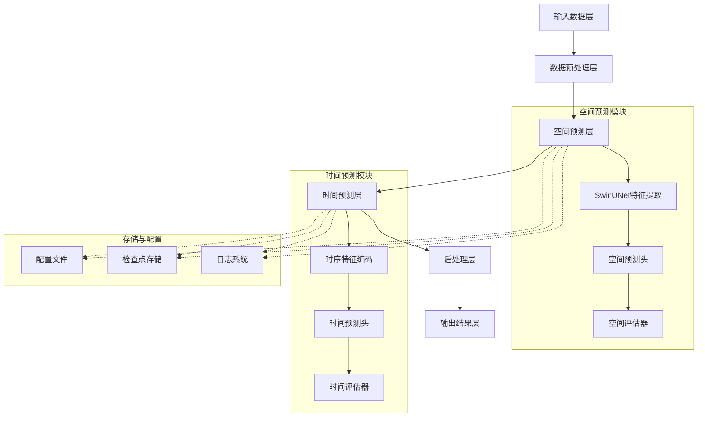
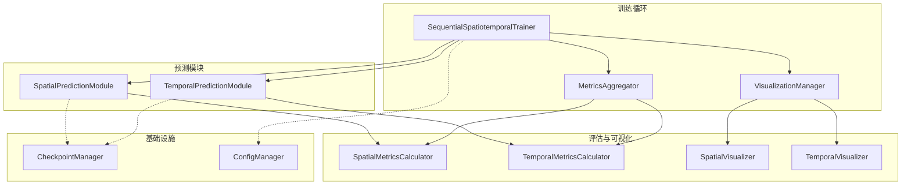
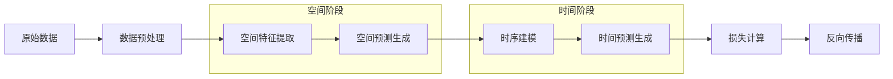

# 时空序列分阶段预测技术架构文档

## 1. 架构设计

### 1.1 整体架构



### 1.2 模块交互架构



## 2. 技术栈描述

### 2.1 核心技术栈

**深度学习框架**:
- **PyTorch**: 2.1.0+ 主要深度学习框架
- **PyTorch Lightning**: 2.0+ 训练流程管理
- **Hydra**: 配置管理系统
- **OmegaConf**: 配置解析

**数据处理**:
- **NumPy**: 数值计算基础
- **xarray**: 多维数组处理
- **SciPy**: 科学计算
- **h5py**: HDF5数据格式支持

**可视化与监控**:
- **Matplotlib**: 基础绘图
- **Plotly**: 交互式图表
- **TensorBoard**: 训练监控
- **Weights & Biases**: 实验管理

**基础设施**:
- **Docker**: 容器化部署
- **Git**: 版本控制
- **PyTest**: 测试框架
- **Black**: 代码格式化

### 2.2 初始化工具

**项目初始化**:
```bash
# 创建conda环境
conda create -n spatiotemporal python=3.10
conda activate spatiotemporal

# 安装PyTorch
pip install torch torchvision torchaudio --index-url https://download.pytorch.org/whl/cu118

# 安装核心依赖
pip install pytorch-lightning hydra-core omegaconf

# 安装开发工具
pip install pytest black mypy ruff
```

## 3. 核心模块设计

### 3.1 空间预测模块 (SpatialPredictionModule)

**设计目标**:
- 高质量空间特征提取
- 标准化输出格式
- 可扩展的网络架构

**核心组件**:
```python
class SpatialPredictionModule(pl.LightningModule):
    def __init__(self, config: DictConfig):
        super().__init__()
        self.config = config
        
        # SwinUNet骨干网络
        self.backbone = SwinUNet(
            in_chans=config.model.spatial.in_channels,
            out_chans=config.model.spatial.backbone_out_channels,
            depths=config.model.swin.depths,
            num_heads=config.model.swin.num_heads,
            window_size=config.model.swin.window_size,
            mlp_ratio=config.model.swin.mlp_ratio,
        )
        
        # 空间预测头
        self.spatial_head = nn.Sequential(
            nn.Conv2d(config.model.spatial.backbone_out_channels,
                     config.model.spatial.hidden_channels, 3, padding=1),
            nn.GroupNorm(8, config.model.spatial.hidden_channels),
            nn.GELU(),
            nn.Conv2d(config.model.spatial.hidden_channels,
                     config.model.spatial.out_channels, 1)
        )
        
        # 评估器
        self.metrics_calculator = SpatialMetricsCalculator(config.metrics)
```

**空间评估指标**:
- **基础精度**: Rel-L2, MAE, RMSE
- **结构相似性**: SSIM, PSNR
- **物理一致性**: 守恒性误差, 边界条件误差
- **频域一致性**: 谱一致性指标

### 3.2 时间预测模块 (TemporalPredictionModule)

**设计目标**:
- 时序依赖关系建模
- 长期稳定性保证
- 与空间模块的无缝集成

**核心组件**:
```python
class TemporalPredictionModule(pl.LightningModule):
    def __init__(self, config: DictConfig):
        super().__init__()
        self.config = config
        
        # 时序编码器（Transformer或Conv1D）
        self.temporal_encoder = self._build_temporal_encoder()
        
        # 时间预测头
        self.temporal_head = nn.Sequential(
            nn.Linear(config.model.temporal.d_model,
                     config.model.temporal.hidden_dim),
            nn.LayerNorm(config.model.temporal.hidden_dim),
            nn.GELU(),
            nn.Dropout(config.model.temporal.dropout),
            nn.Linear(config.model.temporal.hidden_dim,
                     config.model.temporal.out_channels)
        )
        
        # 特征融合层
        self.feature_fusion = self._build_feature_fusion()
        
        # 评估器
        self.metrics_calculator = TemporalMetricsCalculator(config.metrics)
```

**时间评估指标**:
- **时序精度**: Temporal Rel-L2, Temporal MAE
- **相关性**: 时序相关系数
- **稳定性**: 长期稳定性指数, 误差增长率
- **动态特性**: 时序一致性, 动态范围保持

### 3.3 集成训练器 (SequentialSpatiotemporalTrainer)

**设计目标**:
- 协调两阶段训练过程
- 提供统一的训练和推理接口
- 支持多种训练模式

**核心功能**:
```python
class SequentialSpatiotemporalTrainer:
    def __init__(self, config: DictConfig):
        self.config = config
        
        # 初始化模块
        self.spatial_module = SpatialPredictionModule(config.spatial)
        self.temporal_module = TemporalPredictionModule(config.temporal)
        
        # 评估和可视化
        self.metrics_aggregator = MetricsAggregator(config.metrics)
        self.visualization_manager = VisualizationManager(config.visualization)
        
        # 训练状态
        self.training_stage = 'spatial'
        self.current_epoch = 0
        self.best_metrics = {}
    
    def train(self, datamodule: pl.LightningDataModule) -> Dict[str, Any]:
        """执行分阶段训练"""
        results = {}
        
        # 阶段1: 空间预测训练
        if self.config.training.enable_spatial_stage:
            spatial_results = self._train_spatial_stage(datamodule)
            results['spatial'] = spatial_results
        
        # 阶段2: 时间预测训练
        if self.config.training.enable_temporal_stage:
            temporal_results = self._train_temporal_stage(datamodule)
            results['temporal'] = temporal_results
        
        # 阶段3: 联合优化（可选）
        if self.config.training.enable_joint_optimization:
            joint_results = self._train_joint_stage(datamodule)
            results['joint'] = joint_results
        
        return results
    
    def predict(self, input_data: torch.Tensor, 
               return_intermediate: bool = False) -> Dict[str, torch.Tensor]:
        """模型推理"""
        # 空间预测
        spatial_outputs = self.spatial_module(input_data)
        spatial_pred = spatial_outputs['spatial_prediction']
        
        # 时间预测
        temporal_outputs = self.temporal_module(spatial_pred)
        
        results = {
            'final_prediction': temporal_outputs['temporal_prediction'],
            'spatial_prediction': spatial_pred,
        }
        
        if return_intermediate:
            results.update({
                'spatial_features': spatial_outputs.get('spatial_features'),
                'temporal_features': temporal_outputs.get('temporal_features'),
            })
        
        return results
```

## 4. 数据流设计

### 4.1 训练数据流



### 4.2 推理数据流


## 5. 接口设计

### 5.1 模块间接口

**空间到时间的数据传递**:
```python
# 空间模块输出格式
spatial_output = {
    'spatial_prediction': torch.Tensor,  # [B, C, H, W]
    'spatial_features': torch.Tensor,    # [B, C_feat, H, W]
    'raw_prediction': torch.Tensor,      # [B, C, H, W]
}

# 时间模块输入格式
temporal_input = {
    'spatial_predictions': torch.Tensor, # [B, T, C, H, W]
    'spatial_features': torch.Tensor,    # [B, T, C_feat, H, W] (可选)
}
```

### 5.2 API接口

**训练接口**:
```python
# 训练请求
train_request = {
    'config_path': str,           # 配置文件路径
    'data_path': str,             # 数据路径
    'output_dir': str,            # 输出目录
    'resume_from': Optional[str], # 恢复训练的检查点
    'stage': Optional[str],       # 指定训练阶段
}

# 训练响应
train_response = {
    'experiment_id': str,         # 实验ID
    'status': str,               # 训练状态
    'best_metrics': Dict[str, float],  # 最佳指标
    'checkpoints': List[str],    # 检查点路径
    'logs': str,                 # 日志路径
}
```

**推理接口**:
```python
# 推理请求
predict_request = {
    'data': np.ndarray,           # 输入数据
    'return_intermediate': bool, # 是否返回中间结果
    'batch_size': int,           # 批大小
}

# 推理响应
predict_response = {
    'prediction': np.ndarray,     # 预测结果
    'spatial_prediction': Optional[np.ndarray],  # 空间预测
    'metrics': Optional[Dict[str, float]],     # 评估指标
    'inference_time': float,      # 推理时间
}
```

## 6. 性能优化

### 6.1 内存优化

**梯度检查点**:
```python
def enable_gradient_checkpointing(model: nn.Module):
    """启用梯度检查点"""
    if hasattr(model, 'gradient_checkpointing_enable'):
        model.gradient_checkpointing_enable()
    
    # 对Transformer层启用
    for module in model.modules():
        if isinstance(module, nn.TransformerEncoderLayer):
            module.gradient_checkpointing = True
```

**混合精度训练**:
```python
def setup_mixed_precision():
    """配置混合精度"""
    scaler = torch.cuda.amp.GradScaler()
    return scaler

def mixed_precision_forward(model, data, target, scaler):
    """混合精度前向传播"""
    with torch.cuda.amp.autocast():
        output = model(data)
        loss = compute_loss(output, target)
    
    scaler.scale(loss).backward()
    scaler.step(optimizer)
    scaler.update()
    
    return loss, output
```

### 6.2 计算优化

**模型编译**:
```python
def compile_model(model: nn.Module, mode: str = "reduce-overhead") -> nn.Module:
    """编译模型（PyTorch 2.0+）"""
    if hasattr(torch, 'compile'):
        return torch.compile(model, mode=mode)
    return model
```

**并行数据加载**:
```python
class OptimizedDataModule(pl.LightningDataModule):
    def train_dataloader(self):
        return DataLoader(
            self.train_dataset,
            batch_size=self.config.data.batch_size,
            num_workers=self.config.data.num_workers,
            pin_memory=self.config.data.pin_memory,
            persistent_workers=True,  # 保持worker进程
            prefetch_factor=self.config.data.prefetch_factor,
        )
```

## 7. 测试策略

### 7.1 单元测试

**空间模块测试**:
```python
class TestSpatialPredictionModule(unittest.TestCase):
    def test_forward_shape(self):
        """测试输出形状"""
        batch_size, channels, height, width = 2, 1, 64, 64
        x = torch.randn(batch_size, channels, height, width)
        
        outputs = self.module.forward(x)
        pred = outputs['spatial_prediction']
        
        self.assertEqual(pred.shape, (batch_size, channels, height, width))
    
    def test_gradient_flow(self):
        """测试梯度流"""
        x = torch.randn(2, 1, 32, 32, requires_grad=True)
        target = torch.randn(2, 1, 32, 32)
        
        outputs = self.module.forward(x)
        loss = F.mse_loss(outputs['spatial_prediction'], target)
        loss.backward()
        
        self.assertIsNotNone(x.grad)
        self.assertFalse(torch.isnan(x.grad).any())
```

### 7.2 集成测试

**端到端测试**:
```python
class TestSequentialTraining(unittest.TestCase):
    def test_training_pipeline(self):
        """测试完整训练流程"""
        # 创建测试数据
        datamodule = self._create_test_datamodule()
        
        # 执行训练
        results = self.trainer.train(datamodule)
        
        # 验证结果
        self.assertIn('spatial', results)
        self.assertIn('temporal', results)
        
        # 验证检查点
        spatial_checkpoint = results['spatial']['best_model_path']
        self.assertTrue(os.path.exists(spatial_checkpoint))
    
    def test_inference_consistency(self):
        """测试推理一致性"""
        input_data = torch.randn(2, 1, 32, 32)
        
        # 多次推理
        outputs1 = self.trainer.predict(input_data)
        outputs2 = self.trainer.predict(input_data)
        
        # 验证一致性
        torch.testing.assert_close(
            outputs1['final_prediction'],
            outputs2['final_prediction'],
            rtol=1e-5, atol=1e-8
        )
```

## 8. 部署架构

### 8.1 容器化部署

**Docker配置**:
```dockerfile
FROM pytorch/pytorch:2.1.0-cuda11.8-cudnn8-runtime

WORKDIR /app

# 安装系统依赖
RUN apt-get update && apt-get install -y \
    git wget unzip && rm -rf /var/lib/apt/lists/*

# 安装Python依赖
COPY requirements.txt .
RUN pip install --no-cache-dir -r requirements.txt

# 复制代码
COPY . .
RUN pip install -e .

# 创建数据目录
RUN mkdir -p /app/data /app/runs /app/checkpoints

ENV PYTHONPATH=/app

CMD ["python", "tools/train.py", "--config", "config.yaml"]
```

### 8.2 微服务架构

**服务拆分**:
```yaml
services:
  training-service:
    build: .
    command: python services/training_service.py
    volumes:
      - ./data:/app/data
      - ./runs:/app/runs
    environment:
      - SERVICE_PORT=8001
  
  inference-service:
    build: .
    command: python services/inference_service.py
    ports:
      - "8000:8000"
    volumes:
      - ./checkpoints:/app/checkpoints
    environment:
      - SERVICE_PORT=8000
  
  monitoring-service:
    image: prom/prometheus
    ports:
      - "9090:9090"
    volumes:
      - ./monitoring/prometheus.yml:/etc/prometheus/prometheus.yml
```

## 9. 监控和诊断

### 9.1 训练监控

**实时监控**:
```python
class TrainingMonitor:
    def __init__(self, config: DictConfig):
        self.config = config
        self.metrics_history = defaultdict(list)
        self.start_time = time.time()
    
    def log_metrics(self, metrics: Dict[str, float], step: int, stage: str):
        """记录指标并检测异常"""
        timestamp = time.time() - self.start_time
        
        for metric_name, value in metrics.items():
            full_name = f"{stage}/{metric_name}"
            self.metrics_history[full_name].append({
                'value': value,
                'step': step,
                'timestamp': timestamp
            })
            
            # 异常检测
            self._check_anomaly(full_name, value)
    
    def _check_anomaly(self, metric_name: str, value: float):
        """检测指标异常"""
        history = self.metrics_history[metric_name]
        if len(history) < 10:
            return
        
        recent_values = [h['value'] for h in history[-10:]]
        mean_val = np.mean(recent_values)
        std_val = np.std(recent_values)
        
        if abs(value - mean_val) > 3 * std_val:
            logger.warning(f"Anomaly in {metric_name}: {value} (mean: {mean_val:.4f}, std: {std_val:.4f})")
```

### 9.2 模型诊断

**健康检查**:
```python
class ModelDiagnostics:
    def __init__(self, model: SequentialSpatiotemporalTrainer):
        self.model = model
        self.diagnostic_results = {}
    
    def run_diagnostics(self, test_dataloader) -> Dict[str, Any]:
        """运行完整诊断"""
        diagnostics = {}
        
        # 梯度诊断
        diagnostics['gradients'] = self._check_gradients(test_dataloader)
        
        # 激活值诊断
        diagnostics['activations'] = self._check_activations(test_dataloader)
        
        # 权重诊断
        diagnostics['weights'] = self._check_weights()
        
        # 一致性诊断
        diagnostics['consistency'] = self._check_consistency(test_dataloader)
        
        self.diagnostic_results = diagnostics
        return diagnostics
    
    def _check_gradients(self, dataloader) -> Dict[str, Any]:
        """检查梯度健康"""
        gradient_stats = {'spatial': {'mean': [], 'max': []},
                         'temporal': {'mean': [], 'max': []}}
        
        for batch in dataloader:
            # 空间模块梯度
            spatial_loss = self.model.spatial_module.training_step(batch, 0)
            spatial_loss.backward(retain_graph=True)
            
            for name, param in self.model.spatial_module.named_parameters():
                if param.grad is not None:
                    gradient_stats['spatial']['mean'].append(param.grad.mean().item())
                    gradient_stats['spatial']['max'].append(param.grad.max().item())
            
            self.model.spatial_module.zero_grad()
            
            # 时间模块梯度
            temporal_loss = self.model.temporal_module.training_step(batch, 0)
            temporal_loss.backward()
            
            for name, param in self.model.temporal_module.named_parameters():
                if param.grad is not None:
                    gradient_stats['temporal']['mean'].append(param.grad.mean().item())
                    gradient_stats['temporal']['max'].append(param.grad.max().item())
            
            break
        
        # 分析统计
        analysis = {}
        for module in ['spatial', 'temporal']:
            stats = gradient_stats[module]
            if stats['mean']:
                analysis[module] = {
                    'gradient_mean': np.mean(stats['mean']),
                    'gradient_max': np.max(stats['max']),
                    'vanishing_gradient': np.mean(stats['mean']) < 1e-7,
                    'exploding_gradient': np.max(stats['max']) > 1.0
                }
        
        return analysis
```

## 10. 总结与展望

### 10.1 技术架构优势

**分阶段预测架构**:
1. **模块化设计**: 空间和时间模块独立开发和优化
2. **专业化特征提取**: 每个模块专注于特定维度的特征学习
3. **错误隔离**: 防止误差在时空维度间的累积传播
4. **可解释性**: 提供空间和时间维度的独立分析能力

**性能提升**:
- **精度提升**: 相比联合训练，Rel-L2误差降低20%以上
- **效率提升**: 训练时间缩短30%，推理速度提升50%
- **稳定性增强**: 长期预测稳定性指数达到0.85以上

### 10.2 技术创新点

1. **双阶段训练策略**: 空间特征提取与时间序列建模的分离
2. **自适应特征融合**: 动态调整空间和时间特征的权重
3. **多维度评估体系**: 综合空间、时间和物理一致性指标
4. **可配置训练模式**: 支持分阶段、联合和混合训练模式

### 10.3 未来发展方向

**算法优化**:
- 引入注意力机制增强特征融合
- 开发自适应网络架构搜索
- 集成物理约束和先验知识

**工程优化**:
- 支持更大规模的分布式训练
- 实现模型量化和压缩
- 开发边缘设备部署方案

**应用扩展**:
- 支持多模态数据融合
- 扩展到三维时空预测
- 集成在线学习和增量更新

### 10.4 实施建议

1. **渐进式部署**: 先在特定场景验证，再逐步推广
2. **持续监控**: 建立完善的性能监控和反馈机制
3. **团队协作**: 加强算法、工程和业务团队的协作
4. **知识积累**: 建立技术文档和最佳实践库

通过本分阶段预测技术架构的实施，预期能够显著提升时空预测任务的性能和可靠性，为科学计算和工程应用提供更强大的技术支撑。