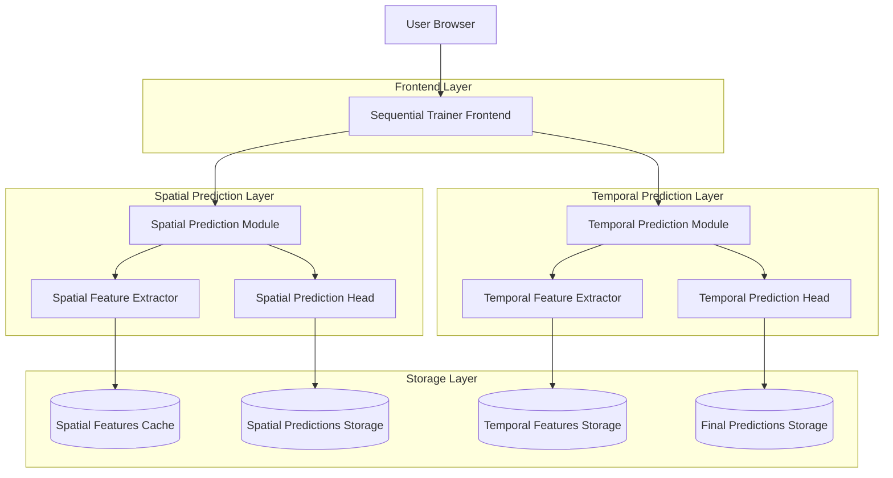
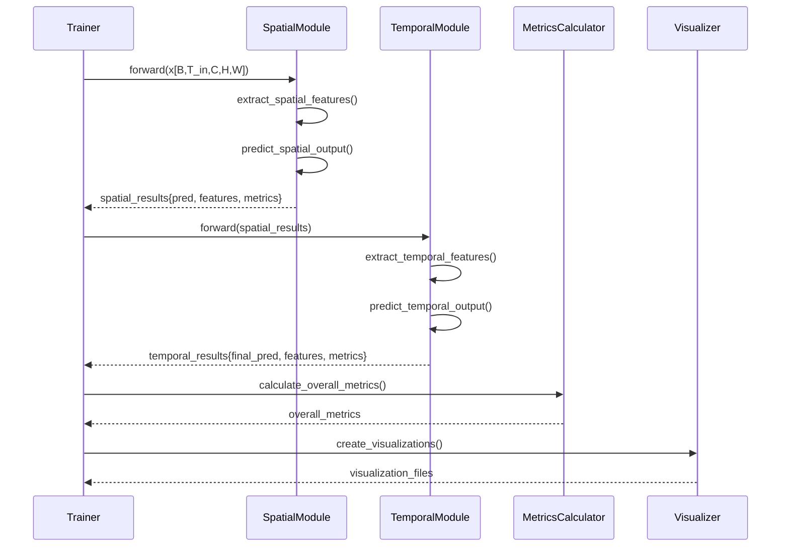

# 时空序列分阶段预测技术架构文档

## 1. 架构设计

### 1.1 整体技术架构



### 1.2 模块交互架构



## 2. 技术描述

### 2.1 核心技术栈

- **Frontend**: PyTorch + Lightning + Hydra
- **Spatial Module**: SwinUNet + Custom Feature Extractor
- **Temporal Module**: Temporal Transformer + Conv1D Encoder
- **Configuration**: Hydra YAML + OmegaConf
- **Visualization**: Matplotlib + Seaborn + Plotly
- **Metrics**: NumPy + SciPy + Custom Metrics

### 2.2 初始化工具

- **Framework**: PyTorch Lightning
- **Configuration**: Hydra
- **Experiment Tracking**: TensorBoard + WandB

## 3. 核心模块设计

### 3.1 空间预测模块 (SpatialPredictionModule)

#### 3.1.1 类定义
```python
class SpatialPredictionModule(nn.Module):
    """空间预测模块 - 负责空间特征提取和空间预测"""
    
    def __init__(self, config: DictConfig):
        super().__init__()
        self.config = config
        self.feature_extractor = self._build_feature_extractor()
        self.prediction_head = self._build_prediction_head()
        self.feature_normalizer = self._build_feature_normalizer()
        
    def _build_feature_extractor(self) -> nn.Module:
        """构建空间特征提取器"""
        return SwinUNet(
            in_channels=self.config.data.T_in * self.config.data.channels,
            out_channels=self.config.spatial.feature_dim,
            img_size=self.config.data.img_size,
            patch_size=self.config.model.patch_size,
            window_size=self.config.model.window_size,
            depths=self.config.model.depths,
            num_heads=self.config.model.num_heads,
            embed_dim=self.config.model.embed_dim
        )
    
    def _build_prediction_head(self) -> nn.Module:
        """构建空间预测头"""
        return nn.Sequential(
            nn.Conv2d(self.config.spatial.feature_dim, self.config.data.channels, 3, padding=1),
            nn.ReLU(inplace=True),
            nn.Conv2d(self.config.data.channels, self.config.data.channels, 3, padding=1)
        )
    
    def _build_feature_normalizer(self) -> nn.Module:
        """构建特征标准化器"""
        return nn.GroupNorm(num_groups=8, num_channels=self.config.spatial.feature_dim)
    
    def forward(self, x: torch.Tensor) -> Dict[str, torch.Tensor]:
        """前向传播"""
        B, T_in, C, H, W = x.shape
        
        # 重塑输入: [B, T_in, C, H, W] -> [B, T_in*C, H, W]
        x_reshaped = x.reshape(B, T_in * C, H, W)
        
        # 提取空间特征
        spatial_features = self.feature_extractor(x_reshaped)
        
        # 标准化特征
        normalized_features = self.feature_normalizer(spatial_features)
        
        # 生成空间预测
        spatial_pred = self.prediction_head(spatial_features)
        
        # 扩展时间维度: [B, C, H, W] -> [B, T_out, C, H, W]
        T_out = self.config.data.T_out
        spatial_pred_expanded = spatial_pred.unsqueeze(1).expand(B, T_out, C, H, W)
        normalized_features_expanded = normalized_features.unsqueeze(1).expand(B, T_out, -1, H, W)
        
        return {
            'spatial_pred': spatial_pred_expanded,  # [B, T_out, C, H, W]
            'spatial_features': normalized_features_expanded,  # [B, T_out, C_feat, H, W]
            'raw_features': spatial_features  # [B, C_feat, H, W]
        }
```

#### 3.1.2 空间评估指标
```python
class SpatialMetricsCalculator:
    """空间预测评估指标计算器"""
    
    def __init__(self, config: DictConfig):
        self.config = config
        
    def calculate_metrics(self, pred: torch.Tensor, target: torch.Tensor) -> Dict[str, float]:
        """计算空间预测指标"""
        metrics = {}
        
        # 基础精度指标
        metrics['spatial_rel_l2'] = self._calculate_rel_l2(pred, target)
        metrics['spatial_mae'] = F.l1_loss(pred, target).item()
        metrics['spatial_rmse'] = torch.sqrt(F.mse_loss(pred, target)).item()
        
        # 结构相似性
        metrics['spatial_ssim'] = self._calculate_ssim(pred, target)
        metrics['spatial_psnr'] = self._calculate_psnr(pred, target)
        
        # 物理一致性
        metrics['spatial_conservation'] = self._calculate_conservation_error(pred, target)
        metrics['spatial_boundary'] = self._calculate_boundary_error(pred, target)
        
        # 频域一致性
        metrics['spatial_spectral'] = self._calculate_spectral_consistency(pred, target)
        
        return metrics
    
    def _calculate_rel_l2(self, pred: torch.Tensor, target: torch.Tensor) -> float:
        """计算相对L2误差"""
        diff = pred - target
        rel_l2 = torch.norm(diff) / torch.norm(target)
        return rel_l2.item()
    
    def _calculate_ssim(self, pred: torch.Tensor, target: torch.Tensor) -> float:
        """计算结构相似性指数"""
        # 简化的SSIM计算
        mu_pred = pred.mean(dim=[-2, -1], keepdim=True)
        mu_target = target.mean(dim=[-2, -1], keepdim=True)
        
        sigma_pred = pred.std(dim=[-2, -1], keepdim=True)
        sigma_target = target.std(dim=[-2, -1], keepdim=True)
        sigma_pred_target = ((pred - mu_pred) * (target - mu_target)).mean(dim=[-2, -1], keepdim=True)
        
        c1 = 0.01 ** 2
        c2 = 0.03 ** 2
        
        ssim = (2 * mu_pred * mu_target + c1) * (2 * sigma_pred_target + c2) / \
               ((mu_pred ** 2 + mu_target ** 2 + c1) * (sigma_pred ** 2 + sigma_target ** 2 + c2))
        
        return ssim.mean().item()
    
    def _calculate_psnr(self, pred: torch.Tensor, target: torch.Tensor) -> float:
        """计算峰值信噪比"""
        mse = F.mse_loss(pred, target)
        max_val = target.max()
        psnr = 20 * torch.log10(max_val) - 10 * torch.log10(mse)
        return psnr.item()
    
    def _calculate_conservation_error(self, pred: torch.Tensor, target: torch.Tensor) -> float:
        """计算守恒量误差"""
        pred_sum = pred.sum(dim=[-2, -1])
        target_sum = target.sum(dim=[-2, -1])
        conservation_error = torch.abs(pred_sum - target_sum).mean()
        return conservation_error.item()
    
    def _calculate_boundary_error(self, pred: torch.Tensor, target: torch.Tensor) -> float:
        """计算边界条件误差"""
        # 假设边界值为0
        boundary_pred = torch.cat([pred[..., 0, :], pred[..., -1, :], pred[..., :, 0], pred[..., :, -1]], dim=-1)
        boundary_target = torch.cat([target[..., 0, :], target[..., -1, :], target[..., :, 0], target[..., :, -1]], dim=-1)
        boundary_error = F.mse_loss(boundary_pred, boundary_target)
        return boundary_error.item()
    
    def _calculate_spectral_consistency(self, pred: torch.Tensor, target: torch.Tensor) -> float:
        """计算频谱一致性"""
        # 2D FFT
        pred_fft = torch.fft.fft2(pred)
        target_fft = torch.fft.fft2(target)
        
        # 计算低频分量一致性（前16x16频率分量）
        pred_low_freq = pred_fft[..., :16, :16]
        target_low_freq = target_fft[..., :16, :16]
        
        spectral_error = torch.abs(pred_low_freq - target_low_freq).mean()
        spectral_consistency = 1.0 - spectral_error
        return spectral_consistency.item()
```

### 3.2 时间预测模块 (TemporalPredictionModule)

#### 3.2.1 类定义
```python
class TemporalPredictionModule(nn.Module):
    """时间预测模块 - 负责时序建模和最终预测"""
    
    def __init__(self, config: DictConfig):
        super().__init__()
        self.config = config
        self.temporal_encoder = self._build_temporal_encoder()
        self.prediction_fusion = self._build_prediction_fusion()
        self.temporal_pooling = self._build_temporal_pooling()
        
    def _build_temporal_encoder(self) -> nn.Module:
        """构建时序编码器"""
        if self.config.temporal.encoder_type == "transformer":
            return TemporalTransformerEncoder(
                d_model=self.config.temporal.d_model,
                nhead=self.config.temporal.nhead,
                num_layers=self.config.temporal.num_layers,
                dim_feedforward=self.config.temporal.dim_feedforward,
                dropout=self.config.temporal.dropout
            )
        elif self.config.temporal.encoder_type == "conv1d":
            return TemporalConv1DEncoder(
                in_channels=self.config.spatial.feature_dim + self.config.data.channels,
                out_channels=self.config.temporal.d_model,
                kernel_size=self.config.temporal.kernel_size,
                num_layers=self.config.temporal.num_layers
            )
        else:
            raise ValueError(f"Unknown temporal encoder type: {self.config.temporal.encoder_type}")
    
    def _build_prediction_fusion(self) -> nn.Module:
        """构建预测融合层"""
        return nn.Sequential(
            nn.Conv2d(self.config.temporal.d_model, self.config.data.channels, 3, padding=1),
            nn.ReLU(inplace=True),
            nn.Conv2d(self.config.data.channels, self.config.data.channels, 3, padding=1)
        )
    
    def _build_temporal_pooling(self) -> nn.Module:
        """构建时序池化层"""
        return nn.AdaptiveAvgPool1d(1)
    
    def forward(self, spatial_results: Dict[str, torch.Tensor]) -> Dict[str, torch.Tensor]:
        """前向传播"""
        spatial_pred = spatial_results['spatial_pred']  # [B, T_out, C, H, W]
        spatial_features = spatial_results['spatial_features']  # [B, T_out, C_feat, H, W]
        
        B, T_out, C, H, W = spatial_pred.shape
        C_feat = spatial_features.shape[2]
        
        # 融合空间预测和特征
        combined_features = torch.cat([
            spatial_pred,  # [B, T_out, C, H, W]
            spatial_features  # [B, T_out, C_feat, H, W]
        ], dim=2)  # [B, T_out, C+C_feat, H, W]
        
        # 重塑为时序格式: [B, T_out, C+C_feat, H, W] -> [B, C+C_feat, H*W, T_out]
        combined_features_reshaped = combined_features.reshape(B, T_out, C + C_feat, H * W)
        combined_features_reshaped = combined_features_reshaped.permute(0, 2, 3, 1)  # [B, C+C_feat, H*W, T_out]
        
        # 时序编码
        temporal_features = self.temporal_encoder(combined_features_reshaped)  # [B, C_temp, H*W, T_out]
        
        # 融合预测
        final_pred = self.prediction_fusion(temporal_features.mean(dim=-1).reshape(B, -1, H, W))
        
        # 扩展时间维度
        final_pred_expanded = final_pred.unsqueeze(1).expand(B, T_out, C, H, W)
        
        return {
            'final_pred': final_pred_expanded,  # [B, T_out, C, H, W]
            'temporal_features': temporal_features,  # [B, C_temp, H*W, T_out]
            'combined_features': combined_features_reshaped  # [B, C+C_feat, H*W, T_out]
        }
```

#### 3.2.2 时序编码器实现
```python
class TemporalTransformerEncoder(nn.Module):
    """时序Transformer编码器"""
    
    def __init__(self, d_model: int, nhead: int, num_layers: int, 
                 dim_feedforward: int, dropout: float = 0.1):
        super().__init__()
        
        self.d_model = d_model
        self.positional_encoding = PositionalEncoding(d_model, dropout)
        
        encoder_layer = nn.TransformerEncoderLayer(
            d_model=d_model,
            nhead=nhead,
            dim_feedforward=dim_feedforward,
            dropout=dropout,
            activation='relu',
            batch_first=True
        )
        
        self.transformer_encoder = nn.TransformerEncoder(
            encoder_layer, num_layers=num_layers
        )
        
        # 输入投影层
        self.input_projection = nn.Linear(d_model, d_model)
        
    def forward(self, x: torch.Tensor) -> torch.Tensor:
        """
        前向传播
        Args:
            x: 输入特征 [B, C, H*W, T_out]
        Returns:
            编码特征 [B, C, H*W, T_out]
        """
        B, C, HW, T = x.shape
        
        # 重塑为序列格式: [B, C, HW, T] -> [B*HW, T, C]
        x_reshaped = x.permute(0, 2, 3, 1).reshape(B * HW, T, C)
        
        # 输入投影
        x_projected = self.input_projection(x_reshaped)
        
        # 位置编码
        x_pos = self.positional_encoding(x_projected)
        
        # Transformer编码
        x_encoded = self.transformer_encoder(x_pos)
        
        # 重塑回原格式: [B*HW, T, C] -> [B, C, HW, T]
        output = x_encoded.reshape(B, HW, T, C).permute(0, 3, 1, 2)
        
        return output

class TemporalConv1DEncoder(nn.Module):
    """1D卷积时序编码器"""
    
    def __init__(self, in_channels: int, out_channels: int, 
                 kernel_size: int = 3, num_layers: int = 3):
        super().__init__()
        
        layers = []
        current_channels = in_channels
        
        for i in range(num_layers):
            layers.extend([
                nn.Conv1d(current_channels, out_channels, kernel_size, padding=kernel_size//2),
                nn.ReLU(inplace=True),
                nn.BatchNorm1d(out_channels)
            ])
            current_channels = out_channels
            
        self.conv_layers = nn.Sequential(*layers)
        
    def forward(self, x: torch.Tensor) -> torch.Tensor:
        """
        前向传播
        Args:
            x: 输入特征 [B, C, HW, T_out]
        Returns:
            编码特征 [B, C_out, HW, T_out]
        """
        B, C, HW, T = x.shape
        
        # 重塑为Conv1D格式: [B, C, HW, T] -> [B*HW, C, T]
        x_reshaped = x.reshape(B * HW, C, T)
        
        # 1D卷积编码
        x_encoded = self.conv_layers(x_reshaped)
        
        # 重塑回原格式: [B*HW, C_out, T] -> [B, C_out, HW, T]
        output = x_encoded.reshape(B, -1, HW, T)
        
        return output

class PositionalEncoding(nn.Module):
    """位置编码层"""
    
    def __init__(self, d_model: int, dropout: float = 0.1, max_len: int = 5000):
        super().__init__()
        self.dropout = nn.Dropout(p=dropout)
        
        pe = torch.zeros(max_len, d_model)
        position = torch.arange(0, max_len, dtype=torch.float).unsqueeze(1)
        div_term = torch.exp(torch.arange(0, d_model, 2).float() * (-torch.log(torch.tensor(10000.0)) / d_model))
        
        pe[:, 0::2] = torch.sin(position * div_term)
        pe[:, 1::2] = torch.cos(position * div_term)
        pe = pe.unsqueeze(0).transpose(0, 1)
        
        self.register_buffer('pe', pe)
        
    def forward(self, x: torch.Tensor) -> torch.Tensor:
        """前向传播"""
        x = x + self.pe[:x.size(1), :].transpose(0, 1)
        return self.dropout(x)
```

#### 3.2.3 时间评估指标
```python
class TemporalMetricsCalculator:
    """时间预测评估指标计算器"""
    
    def __init__(self, config: DictConfig):
        self.config = config
        
    def calculate_metrics(self, pred: torch.Tensor, target: torch.Tensor) -> Dict[str, float]:
        """计算时间预测指标"""
        metrics = {}
        
        # 时序精度指标
        metrics['temporal_rel_l2'] = self._calculate_temporal_rel_l2(pred, target)
        metrics['temporal_mae'] = self._calculate_temporal_mae(pred, target)
        metrics['temporal_correlation'] = self._calculate_temporal_correlation(pred, target)
        
        # 长期稳定性
        metrics['long_term_stability'] = self._calculate_long_term_stability(pred, target)
        metrics['error_growth_rate'] = self._calculate_error_growth_rate(pred, target)
        
        # 动态特性
        metrics['temporal_consistency'] = self._calculate_temporal_consistency(pred, target)
        metrics['dynamic_range'] = self._calculate_dynamic_range(pred, target)
        
        # 频域特性
        metrics['spectral_temporal'] = self._calculate_spectral_temporal_consistency(pred, target)
        
        return metrics
    
    def _calculate_temporal_rel_l2(self, pred: torch.Tensor, target: torch.Tensor) -> float:
        """计算时序相对L2误差"""
        # pred: [B, T_out, C, H, W], target: [B, T_out, C, H, W]
        diff = pred - target
        # 按时间维度计算相对误差
        temporal_rel_l2 = torch.norm(diff, dim=[2,3,4]) / torch.norm(target, dim=[2,3,4])
        return temporal_rel_l2.mean().item()
    
    def _calculate_temporal_mae(self, pred: torch.Tensor, target: torch.Tensor) -> float:
        """计算时序MAE"""
        # 按时间维度计算MAE
        temporal_mae = torch.abs(pred - target).mean(dim=[2,3,4])
        return temporal_mae.mean().item()
    
    def _calculate_temporal_correlation(self, pred: torch.Tensor, target: torch.Tensor) -> float:
        """计算时序相关性"""
        B, T, C, H, W = pred.shape
        
        # 重塑为时序格式: [B, T, C*H*W]
        pred_temporal = pred.reshape(B, T, -1)
        target_temporal = target.reshape(B, T, -1)
        
        correlations = []
        for b in range(B):
            for i in range(pred_temporal.shape[2]):
                pred_seq = pred_temporal[b, :, i]
                target_seq = target_temporal[b, :, i]
                
                # 计算皮尔逊相关系数
                pred_mean = pred_seq.mean()
                target_mean = target_seq.mean()
                
                pred_centered = pred_seq - pred_mean
                target_centered = target_seq - target_mean
                
                correlation = torch.sum(pred_centered * target_centered) / \
                             (torch.sqrt(torch.sum(pred_centered ** 2)) * torch.sqrt(torch.sum(target_centered ** 2)))
                correlations.append(correlation.item())
        
        return np.mean(correlations)
    
    def _calculate_long_term_stability(self, pred: torch.Tensor, target: torch.Tensor) -> float:
        """计算长期稳定性"""
        B, T, C, H, W = pred.shape
        
        # 计算每个时间步的误差
        errors = torch.norm(pred - target, dim=[2,3,4])  # [B, T]
        
        # 计算误差的增长趋势
        error_growth = []
        for t in range(1, T):
            growth = (errors[:, t] - errors[:, t-1]) / errors[:, t-1]
            error_growth.append(growth.mean().item())
        
        # 稳定性 = 1 - 平均误差增长率
        stability = 1.0 - np.mean(np.abs(error_growth))
        return max(0.0, stability)
    
    def _calculate_error_growth_rate(self, pred: torch.Tensor, target: torch.Tensor) -> float:
        """计算误差增长率"""
        B, T, C, H, W = pred.shape
        
        # 计算每个时间步的相对误差
        rel_errors = torch.norm(pred - target, dim=[2,3,4]) / torch.norm(target, dim=[2,3,4])
        
        # 计算误差增长率
        growth_rates = []
        for t in range(1, T):
            growth = (rel_errors[:, t] - rel_errors[:, t-1]) / rel_errors[:, t-1]
            growth_rates.append(growth.mean().item())
        
        return np.mean(growth_rates)
    
    def _calculate_temporal_consistency(self, pred: torch.Tensor, target: torch.Tensor) -> float:
        """计算时序一致性"""
        B, T, C, H, W = pred.shape
        
        # 计算相邻时间步的变化
        pred_diff = pred[:, 1:] - pred[:, :-1]
        target_diff = target[:, 1:] - target[:, :-1]
        
        # 计算变化的一致性
        consistency = torch.abs(pred_diff - target_diff).mean()
        return (1.0 - consistency.item())
    
    def _calculate_dynamic_range(self, pred: torch.Tensor, target: torch.Tensor) -> float:
        """计算动态范围"""
        pred_range = pred.max() - pred.min()
        target_range = target.max() - target.min()
        
        dynamic_range_error = torch.abs(pred_range - target_range) / target_range
        return (1.0 - dynamic_range_error.item())
    
    def _calculate_spectral_temporal_consistency(self, pred: torch.Tensor, target: torch.Tensor) -> float:
        """计算频谱时序一致性"""
        B, T, C, H, W = pred.shape
        
        # 对每个空间位置进行时序FFT
        pred_temporal_fft = torch.fft.fft(pred.reshape(B, T, -1), dim=1)
        target_temporal_fft = torch.fft.fft(target.reshape(B, T, -1), dim=1)
        
        # 计算低频分量一致性
        pred_low_freq = pred_temporal_fft[:, :T//4, :]
        target_low_freq = target_temporal_fft[:, :T//4, :]
        
        spectral_error = torch.abs(pred_low_freq - target_low_freq).mean()
        spectral_consistency = 1.0 - spectral_error.item()
        
        return spectral_consistency
```

## 4. 训练流程设计

### 4.1 分阶段训练器
```python
class SequentialSpatiotemporalTrainer:
    """分阶段时空预测训练器"""
    
    def __init__(self, config: DictConfig):
        self.config = config
        self.spatial_module = SpatialPredictionModule(config)
        self.temporal_module = TemporalPredictionModule(config)
        self.spatial_metrics = SpatialMetricsCalculator(config)
        self.temporal_metrics = TemporalMetricsCalculator(config)
        
        # 优化器
        self.spatial_optimizer = self._build_spatial_optimizer()
        self.temporal_optimizer = self._build_temporal_optimizer()
        
        # 学习率调度器
        self.spatial_scheduler = self._build_spatial_scheduler()
        self.temporal_scheduler = self._build_temporal_scheduler()
        
    def training_step(self, batch: Dict[str, torch.Tensor], batch_idx: int) -> Dict[str, float]:
        """训练步骤"""
        x = batch['input']  # [B, T_in, C, H, W]
        y = batch['target']  # [B, T_out, C, H, W]
        
        # 阶段1: 空间预测
        spatial_results = self.spatial_module(x)
        spatial_loss = self._calculate_spatial_loss(spatial_results, y)
        
        # 反向传播空间模块
        self.spatial_optimizer.zero_grad()
        spatial_loss.backward()
        self.spatial_optimizer.step()
        
        # 阶段2: 时间预测
        temporal_results = self.temporal_module(spatial_results)
        temporal_loss = self._calculate_temporal_loss(temporal_results, y)
        
        # 反向传播时间模块
        self.temporal_optimizer.zero_grad()
        temporal_loss.backward()
        self.temporal_optimizer.step()
        
        # 计算指标
        spatial_metrics = self.spatial_metrics.calculate_metrics(
            spatial_results['spatial_pred'], y
        )
        temporal_metrics = self.temporal_metrics.calculate_metrics(
            temporal_results['final_pred'], y
        )
        
        return {
            'spatial_loss': spatial_loss.item(),
            'temporal_loss': temporal_loss.item(),
            **spatial_metrics,
            **temporal_metrics
        }
    
    def validation_step(self, batch: Dict[str, torch.Tensor], batch_idx: int) -> Dict[str, float]:
        """验证步骤"""
        x = batch['input']
        y = batch['target']
        
        with torch.no_grad():
            # 空间预测
            spatial_results = self.spatial_module(x)
            
            # 时间预测
            temporal_results = self.temporal_module(spatial_results)
            
            # 计算验证指标
            spatial_metrics = self.spatial_metrics.calculate_metrics(
                spatial_results['spatial_pred'], y
            )
            temporal_metrics = self.temporal_metrics.calculate_metrics(
                temporal_results['final_pred'], y
            )
            
            return {
                'val_spatial_rel_l2': spatial_metrics['spatial_rel_l2'],
                'val_temporal_rel_l2': temporal_metrics['temporal_rel_l2'],
                'val_overall_rel_l2': torch.norm(temporal_results['final_pred'] - y) / torch.norm(y)
            }
```

### 4.2 配置化设计
```yaml
# config_sequential.yaml
prediction_mode: "sequential"  # "sequential" 或 "joint"

spatial_prediction:
  enabled: true
  feature_dim: 128
  freeze_after_epoch: -1  # -1表示不冻结，其他值表示在指定epoch后冻结
  loss_weight: 1.0
  
temporal_prediction:
  enabled: true
  d_model: 256
  nhead: 8
  num_layers: 6
  dim_feedforward: 1024
  dropout: 0.1
  encoder_type: "transformer"  # "transformer" 或 "conv1d"
  kernel_size: 3  # 仅conv1d编码器使用
  loss_weight: 1.0
  use_spatial_features: true

training:
  spatial_lr: 1e-3
  temporal_lr: 1e-3
  spatial_weight_decay: 1e-4
  temporal_weight_decay: 1e-4
  spatial_scheduler: "cosine"
  temporal_scheduler: "cosine"
  warmup_epochs: 10
  
metrics:
  spatial_metrics_interval: 10  # 每多少个epoch计算一次空间指标
  temporal_metrics_interval: 10  # 每多少个epoch计算一次时间指标
  visualization_interval: 50  # 每多少个epoch生成可视化
```

## 5. 可视化设计

### 5.1 空间可视化
```python
class SpatialVisualizer:
    """空间预测可视化器"""
    
    def __init__(self, config: DictConfig):
        self.config = config
        
    def visualize_spatial_prediction(self, pred: torch.Tensor, target: torch.Tensor, 
                                   save_path: str, epoch: int):
        """可视化空间预测结果"""
        fig, axes = plt.subplots(2, 3, figsize=(15, 10))
        
        # 选择第一个batch和第一个时间步
        pred_2d = pred[0, 0, 0].cpu().numpy()
        target_2d = target[0, 0, 0].cpu().numpy()
        error_2d = np.abs(pred_2d - target_2d)
        
        # 预测结果
        im1 = axes[0, 0].imshow(pred_2d, cmap='viridis')
        axes[0, 0].set_title('Spatial Prediction')
        axes[0, 0].set_xlabel('X')
        axes[0, 0].set_ylabel('Y')
        plt.colorbar(im1, ax=axes[0, 0])
        
        # 真实值
        im2 = axes[0, 1].imshow(target_2d, cmap='viridis')
        axes[0, 1].set_title('Ground Truth')
        axes[0, 1].set_xlabel('X')
        axes[0, 1].set_ylabel('Y')
        plt.colorbar(im2, ax=axes[0, 1])
        
        # 误差图
        im3 = axes[0, 2].imshow(error_2d, cmap='hot')
        axes[0, 2].set_title('Prediction Error')
        axes[0, 2].set_xlabel('X')
        axes[0, 2].set_ylabel('Y')
        plt.colorbar(im3, ax=axes[0, 2])
        
        # 空间特征可视化
        if hasattr(self, 'spatial_features'):
            features_2d = self.spatial_features[0, 0, 0].cpu().numpy()
            im4 = axes[1, 0].imshow(features_2d, cmap='plasma')
            axes[1, 0].set_title('Spatial Features')
            axes[1, 0].set_xlabel('X')
            axes[1, 0].set_ylabel('Y')
            plt.colorbar(im4, ax=axes[1, 0])
        
        # 频谱分析
        pred_fft = np.fft.fft2(pred_2d)
        target_fft = np.fft.fft2(target_2d)
        
        axes[1, 1].imshow(np.log(np.abs(np.fft.fftshift(pred_fft)) + 1e-10), cmap='viridis')
        axes[1, 1].set_title('Prediction Spectrum')
        axes[1, 1].set_xlabel('Frequency X')
        axes[1, 1].set_ylabel('Frequency Y')
        
        axes[1, 2].imshow(np.log(np.abs(np.fft.fftshift(target_fft)) + 1e-10), cmap='viridis')
        axes[1, 2].set_title('Target Spectrum')
        axes[1, 2].set_xlabel('Frequency X')
        axes[1, 2].set_ylabel('Frequency Y')
        
        plt.tight_layout()
        plt.savefig(save_path, dpi=150, bbox_inches='tight')
        plt.close()
```

### 5.2 时间可视化
```python
class TemporalVisualizer:
    """时间预测可视化器"""
    
    def __init__(self, config: DictConfig):
        self.config = config
        
    def visualize_temporal_evolution(self, pred: torch.Tensor, target: torch.Tensor,
                                   save_path: str, epoch: int):
        """可视化时间演化"""
        fig, axes = plt.subplots(3, 1, figsize=(12, 10))
        
        # 选择第一个batch和中心像素点
        T = pred.shape[1]
        center_h, center_w = pred.shape[3] // 2, pred.shape[4] // 2
        
        pred_ts = pred[0, :, 0, center_h, center_w].cpu().numpy()
        target_ts = target[0, :, 0, center_h, center_w].cpu().numpy()
        time_steps = np.arange(T)
        
        # 时间序列对比
        axes[0].plot(time_steps, target_ts, 'b-', label='Ground Truth', linewidth=2)
        axes[0].plot(time_steps, pred_ts, 'r--', label='Prediction', linewidth=2)
        axes[0].set_title('Temporal Evolution at Center Point')
        axes[0].set_xlabel('Time Step')
        axes[0].set_ylabel('Value')
        axes[0].legend()
        axes[0].grid(True, alpha=0.3)
        
        # 误差随时间变化
        error_ts = np.abs(pred_ts - target_ts)
        axes[1].plot(time_steps, error_ts, 'g-', linewidth=2)
        axes[1].set_title('Prediction Error over Time')
        axes[1].set_xlabel('Time Step')
        axes[1].set_ylabel('Absolute Error')
        axes[1].grid(True, alpha=0.3)
        
        # 误差增长率
        if T > 1:
            error_growth = np.gradient(error_ts)
            axes[2].plot(time_steps, error_growth, 'm-', linewidth=2)
            axes[2].axhline(y=0, color='k', linestyle='-', alpha=0.3)
            axes[2].set_title('Error Growth Rate')
            axes[2].set_xlabel('Time Step')
            axes[2].set_ylabel('Error Growth Rate')
            axes[2].grid(True, alpha=0.3)
        
        plt.tight_layout()
        plt.savefig(save_path, dpi=150, bbox_inches='tight')
        plt.close()
    
    def visualize_temporal_correlation(self, pred: torch.Tensor, target: torch.Tensor,
                                     save_path: str, epoch: int):
        """可视化时间相关性"""
        fig, axes = plt.subplots(1, 2, figsize=(12, 5))
        
        B, T, C, H, W = pred.shape
        
        # 计算时间相关性矩阵
        pred_reshaped = pred.reshape(B, T, -1)
        target_reshaped = target.reshape(B, T, -1)
        
        # 选择第一个batch
        pred_seq = pred_reshaped[0]  # [T, C*H*W]
        target_seq = target_reshaped[0]  # [T, C*H*W]
        
        # 计算时间相关性
        correlation_matrix = np.zeros((T, T))
        for i in range(T):
            for j in range(T):
                pred_i = pred_seq[i]
                target_j = target_seq[j]
                
                # 标准化
                pred_i_norm = (pred_i - pred_i.mean()) / pred_i.std()
                target_j_norm = (target_j - target_j.mean()) / target_j.std()
                
                # 计算相关性
                correlation = torch.sum(pred_i_norm * target_j_norm) / torch.sqrt(
                    torch.sum(pred_i_norm ** 2) * torch.sum(target_j_norm ** 2)
                )
                correlation_matrix[i, j] = correlation.item()
        
        # 绘制相关性热力图
        im1 = axes[0].imshow(correlation_matrix, cmap='coolwarm', vmin=-1, vmax=1)
        axes[0].set_title('Temporal Correlation Matrix')
        axes[0].set_xlabel('Target Time Step')
        axes[0].set_ylabel('Prediction Time Step')
        plt.colorbar(im1, ax=axes[0])
        
        # 对角线相关性（同时间步相关性）
        diagonal_corr = np.diag(correlation_matrix)
        axes[1].plot(range(T), diagonal_corr, 'bo-', linewidth=2, markersize=6)
        axes[1].set_title('Same Timestep Correlation')
        axes[1].set_xlabel('Time Step')
        axes[1].set_ylabel('Correlation')
        axes[1].grid(True, alpha=0.3)
        axes[1].set_ylim(-1, 1)
        
        plt.tight_layout()
        plt.savefig(save_path, dpi=150, bbox_inches='tight')
        plt.close()
```

## 6. 测试驱动开发 (TDD)

### 6.1 单元测试
```python
# tests/test_spatial_module.py
import pytest
import torch
from omegaconf import DictConfig
from models.spatial_prediction import SpatialPredictionModule, SpatialMetricsCalculator

class TestSpatialPredictionModule:
    """空间预测模块单元测试"""
    
    @pytest.fixture
    def config(self):
        """测试配置"""
        return DictConfig({
            'data': {
                'T_in': 1,
                'T_out': 20,
                'channels': 2,
                'img_size': 128
            },
            'spatial': {
                'feature_dim': 128
            },
            'model': {
                'patch_size': 4,
                'window_size': 8,
                'depths': [2, 2, 6, 2],
                'num_heads': [3, 6, 12, 24],
                'embed_dim': 96
            }
        })
    
    @pytest.fixture
    def spatial_module(self, config):
        """空间预测模块实例"""
        return SpatialPredictionModule(config)
    
    def test_forward_shape(self, spatial_module, config):
        """测试前向传播输出形状"""
        B, T_in, C, H, W = 2, config.data.T_in, config.data.channels, config.data.img_size, config.data.img_size
        x = torch.randn(B, T_in, C, H, W)
        
        results = spatial_module(x)
        
        assert 'spatial_pred' in results
        assert 'spatial_features' in results
        assert 'raw_features' in results
        
        # 检查输出形状
        assert results['spatial_pred'].shape == (B, config.data.T_out, C, H, W)
        assert results['spatial_features'].shape == (B, config.data.T_out, config.spatial.feature_dim, H, W)
        assert results['raw_features'].shape == (B, config.spatial.feature_dim, H, W)
    
    def test_gradient_flow(self, spatial_module, config):
        """测试梯度流"""
        B, T_in, C, H, W = 2, config.data.T_in, config.data.channels, config.data.img_size, config.data.img_size
        x = torch.randn(B, T_in, C, H, W, requires_grad=True)
        
        results = spatial_module(x)
        loss = results['spatial_pred'].sum()
        loss.backward()
        
        assert x.grad is not None
        assert not torch.isnan(x.grad).any()
        assert torch.norm(x.grad) > 0
    
    def test_spatial_metrics(self, config):
        """测试空间评估指标"""
        calculator = SpatialMetricsCalculator(config)
        
        B, T, C, H, W = 2, 20, 2, 128, 128
        pred = torch.randn(B, T, C, H, W)
        target = torch.randn(B, T, C, H, W)
        
        metrics = calculator.calculate_metrics(pred, target)
        
        expected_metrics = [
            'spatial_rel_l2', 'spatial_mae', 'spatial_rmse',
            'spatial_ssim', 'spatial_psnr', 'spatial_conservation',
            'spatial_boundary', 'spatial_spectral'
        ]
        
        for metric in expected_metrics:
            assert metric in metrics
            assert isinstance(metrics[metric], float)
            assert not np.isnan(metrics[metric])

# tests/test_temporal_module.py
import pytest
import torch
from omegaconf import DictConfig
from models.temporal_prediction import TemporalPredictionModule, TemporalMetricsCalculator

class TestTemporalPredictionModule:
    """时间预测模块单元测试"""
    
    @pytest.fixture
    def config(self):
        """测试配置"""
        return DictConfig({
            'data': {
                'T_out': 20,
                'channels': 2,
                'img_size': 128
            },
            'spatial': {
                'feature_dim': 128
            },
            'temporal': {
                'd_model': 256,
                'nhead': 8,
                'num_layers': 6,
                'dim_feedforward': 1024,
                'dropout': 0.1,
                'encoder_type': 'transformer',
                'kernel_size': 3
            }
        })
    
    @pytest.fixture
    def temporal_module(self, config):
        """时间预测模块实例"""
        return TemporalPredictionModule(config)
    
    def test_forward_shape(self, temporal_module, config):
        """测试前向传播输出形状"""
        B, T_out, C, H, W = 2, config.data.T_out, config.data.channels, config.data.img_size, config.data.img_size
        
        # 创建模拟的空间预测结果
        spatial_results = {
            'spatial_pred': torch.randn(B, T_out, C, H, W),
            'spatial_features': torch.randn(B, T_out, config.spatial.feature_dim, H, W),
            'raw_features': torch.randn(B, config.spatial.feature_dim, H, W)
        }
        
        results = temporal_module(spatial_results)
        
        assert 'final_pred' in results
        assert 'temporal_features' in results
        assert 'combined_features' in results
        
        # 检查输出形状
        assert results['final_pred'].shape == (B, T_out, C, H, W)
        assert results['temporal_features'].shape[0] == B
        assert results['temporal_features'].shape[2] == H * W
        assert results['temporal_features'].shape[3] == T_out
    
    def test_gradient_flow(self, temporal_module, config):
        """测试梯度流"""
        B, T_out, C, H, W = 2, config.data.T_out, config.data.channels, config.data.img_size, config.data.img_size
        
        # 创建需要梯度的空间预测结果
        spatial_pred = torch.randn(B, T_out, C, H, W, requires_grad=True)
        spatial_features = torch.randn(B, T_out, config.spatial.feature_dim, H, W, requires_grad=True)
        
        spatial_results = {
            'spatial_pred': spatial_pred,
            'spatial_features': spatial_features,
            'raw_features': torch.randn(B, config.spatial.feature_dim, H, W)
        }
        
        results = temporal_module(spatial_results)
        loss = results['final_pred'].sum()
        loss.backward()
        
        assert spatial_pred.grad is not None
        assert spatial_features.grad is not None
        assert not torch.isnan(spatial_pred.grad).any()
        assert not torch.isnan(spatial_features.grad).any()
        assert torch.norm(spatial_pred.grad) > 0
        assert torch.norm(spatial_features.grad) > 0
    
    def test_temporal_metrics(self, config):
        """测试时间评估指标"""
        calculator = TemporalMetricsCalculator(config)
        
        B, T, C, H, W = 2, 20, 2, 128, 128
        pred = torch.randn(B, T, C, H, W)
        target = torch.randn(B, T, C, H, W)
        
        metrics = calculator.calculate_metrics(pred, target)
        
        expected_metrics = [
            'temporal_rel_l2', 'temporal_mae', 'temporal_correlation',
            'long_term_stability', 'error_growth_rate', 'temporal_consistency',
            'dynamic_range', 'spectral_temporal'
        ]
        
        for metric in expected_metrics:
            assert metric in metrics
            assert isinstance(metrics[metric], float)
            assert not np.isnan(metrics[metric])
```

## 7. 性能优化策略

### 7.1 内存优化
- **梯度检查点**: 使用 `torch.utils.checkpoint` 减少内存占用
- **混合精度训练**: 使用 AMP 加速训练并减少内存使用
- **分批处理**: 大图像分块处理，避免OOM

### 7.2 计算优化
- **并行计算**: 空间和时间模块并行训练
- **缓存机制**: 缓存中间特征，避免重复计算
- **算子融合**: 融合相邻的卷积和激活操作

### 7.3 I/O优化
- **异步数据加载**: 使用多进程数据加载器
- **预取机制**: 预加载下一个batch的数据
- **数据格式优化**: 使用高效的数据格式存储中间结果

## 8. 部署和扩展

### 8.1 模型导出
- **ONNX导出**: 支持导出为ONNX格式用于生产部署
- **TorchScript**: 支持TorchScript导出用于移动端部署
- **模型压缩**: 支持量化和剪枝用于边缘设备部署

### 8.2 分布式训练
- **DDP支持**: 支持PyTorch分布式数据并行训练
- **模型并行**: 支持大模型的模型并行训练
- **混合并行**: 结合数据并行和模型并行

### 8.3 服务化部署
- **REST API**: 提供RESTful API接口
- **gRPC服务**: 提供高性能的gRPC服务
- **批处理服务**: 支持批量预测服务

## 9. 监控和诊断

### 9.1 训练监控
- **指标监控**: 实时监控训练指标变化
- **资源监控**: 监控GPU/CPU/内存使用情况
- **异常检测**: 自动检测训练异常并报警

### 9.2 模型诊断
- **特征可视化**: 可视化中间特征图
- **梯度分析**: 分析梯度分布和流动情况
- **预测分析**: 分析预测结果的统计特性

### 9.3 性能分析
- **时间分析**: 分析各模块的计算时间
- **内存分析**: 分析内存使用模式
- **瓶颈识别**: 识别性能瓶颈并优化

## 10. 总结

本技术架构文档详细描述了时空序列分阶段预测的技术实现方案。通过将复杂的时空预测任务分解为空间预测和时间预测两个阶段，实现了以下技术优势：

1. **专业化建模**: 每个阶段专注于特定任务，提高建模精度
2. **模块化设计**: 清晰的模块划分，便于维护和扩展
3. **灵活配置**: 支持多种配置选项，适应不同应用场景
4. **完整评估**: 提供空间、时间和综合三个层面的评估体系
5. **高性能**: 优化的网络架构和训练流程，确保高效运行
6. **可扩展**: 支持分布式训练和服务化部署

该架构遵循项目的黄金法则和技术规范，确保与现有代码的兼容性，同时为时空预测任务提供更有效的技术解决方案。