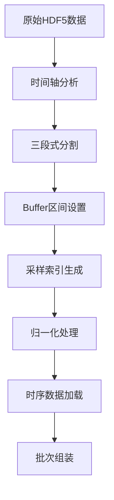
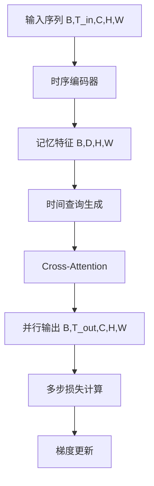
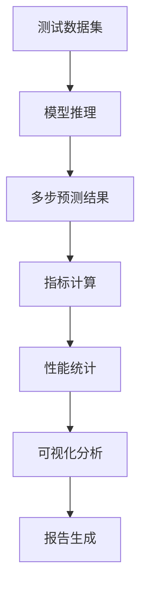

# Sparse2Full时序AR数据集分割与NAR多步预测开发规范

> **项目目标**：在保持Swin-UNet空间主干架构不变的前提下，规范化时序AR/NAR预测系统，扩展T_out支持能力至20步，集成轻量级时序编码器，并建立严格的单case长序列数据分割标准，确保训练/验证/测试的数据一致性和可复现性。

---

## 1. 产品概述

本项目致力于构建一个高性能的时序偏微分方程(PDE)求解系统，通过NAR(非自回归)多步预测技术和时序编码器，实现对复杂物理系统的长期预测。系统严格遵循项目黄金法则，确保观测算子H与训练DC的一致性，支持T_out∈{3,5,10,20}的多步预测，并提供完整的数据分割和评测框架。

## 2. 核心功能

### 2.1 用户角色

| 角色 | 使用场景 | 核心权限 |
|------|----------|----------|
| 研究人员 | 模型训练与实验 | 可配置时序参数、执行训练、查看结果 |
| 开发者 | 系统集成与优化 | 可修改模型架构、调试代码、性能分析 |
| 评测人员 | 模型验证与对比 | 可运行评测脚本、生成报告、对比基线 |

### 2.2 功能模块

本系统包含以下核心模块：

1. **数据分割模块**：单case长序列时间分割、buffer机制、采样策略
2. **时序编码模块**：TemporalConv1D、TemporalTransformer、记忆聚合
3. **NAR预测模块**：Cross-Attention头、并行多步输出、时间查询机制
4. **评测分析模块**：多维度指标计算、可视化分析、性能统计

### 2.3 页面详情

| 模块名称 | 组件名称 | 功能描述 |
|----------|----------|----------|
| 数据分割模块 | SingleCaseSplitter | 实现时间轴分割，支持train/val/test三段式分割，buffer=T_in+T_out-1+margin |
| 数据分割模块 | TemporalIndexGenerator | 生成时序采样索引，支持sequential/random模式，可配置重叠率 |
| 数据分割模块 | NormalizationManager | 管理归一化统计量，仅基于train段计算，确保val/test不泄露 |
| 时序编码模块 | TemporalConv1D | 因果卷积编码器，kernel_size=3，支持多帧历史信息压缩 |
| 时序编码模块 | TemporalTransformer | 仅时间维注意力机制，复杂度O(T²·H·W)，可控层数/头数 |
| 时序编码模块 | MemoryAggregator | 将多帧历史聚合为单帧记忆特征，输出(B,D,H,W) |
| NAR预测模块 | CrossAttnTimeQueryHead | 交叉注意力时间查询头，支持并行T_out输出 |
| NAR预测模块 | TimeEmbeddingGenerator | 生成正弦/可学习时间嵌入，维度与Swin embed_dim对齐 |
| NAR预测模块 | SwinTemporalWrapper | Swin+Temporal+NAR/AR包装器，统一接口 |
| 评测分析模块 | MultiStepMetrics | 计算Rel2_mean/last/worst、MAE、SSIM、fRMSE指标 |
| 评测分析模块 | LatencyProfiler | 统计推理延迟vs T_out关系，显存峰值监控 |
| 评测分析模块 | VisualizationEngine | 生成误差热图、频谱对比、时延曲线可视化 |

## 3. 核心流程

### 3.1 数据处理流程



### 3.2 模型训练流程



### 3.3 评测验证流程



## 4. 用户界面设计

### 4.1 设计风格

- **主色调**：深蓝色(#1f2937)、科技蓝(#3b82f6)
- **辅助色**：成功绿(#10b981)、警告橙(#f59e0b)、错误红(#ef4444)
- **字体**：等宽字体用于代码显示，无衬线字体用于界面文本
- **布局风格**：卡片式布局，顶部导航，左侧配置面板
- **图标风格**：线性图标，科技感设计

### 4.2 界面设计概览

| 模块名称 | 组件名称 | UI元素 |
|----------|----------|--------|
| 配置面板 | 时序参数设置 | T_in/T_out滑块控件，dt数值输入框，模式切换按钮(AR/NAR) |
| 配置面板 | 分割策略配置 | 比例滑块(r_train/r_val)，buffer设置，步长选择器 |
| 训练监控 | 实时指标显示 | 损失曲线图表，指标数值卡片，进度条 |
| 结果展示 | 预测可视化 | 热图网格显示，误差演化曲线，对比表格 |
| 性能分析 | 资源监控 | 显存使用图表，延迟统计表，FLOPs计算器 |

### 4.3 响应式设计

系统采用桌面优先设计，支持1920x1080及以上分辨率。界面布局采用网格系统，确保在不同屏幕尺寸下的良好显示效果。关键操作支持键盘快捷键，提升研究人员的使用效率。

## 5. 技术实现规范

### 5.1 数据分割标准

**核心原则**：时间轴三段式分割 + buffer隔离机制

```python
# 标准分割参数
r_train = 0.70    # 训练集比例
r_val = 0.15      # 验证集比例  
r_test = 0.15     # 测试集比例
buffer = T_in + T_out - 1 + margin  # buffer大小
margin = max(2, ceil(0.1 * T_out))  # 安全边距
```

**采样策略**：
- 训练集：stride_train ∈ {1,2,3}，支持数据增强
- 验证/测试集：stride_eval = T_out，避免重叠评估

### 5.2 API接口契约

```python
# 核心接口定义
class SwinTemporalWrapper:
    def forward(self, x_seq: Tensor[B,T_in,C,H,W], 
                T_out: int, mode: str) -> Tensor[B,T_out,C,H,W]

class TemporalDataset:
    def __getitem__(self, idx: int) -> Dict[str, Tensor]
    # 返回: {'input': [T_in,C,H,W], 'target': [T_out,C,H,W]}

class MultiStepMetrics:
    def compute(self, pred: Tensor[B,T,C,H,W], 
                target: Tensor[B,T,C,H,W]) -> Dict[str, float]
```

### 5.3 配置标准化

```yaml
# 标准时序配置模板
temporal:
  T_in: 4           # 输入时间步
  T_out: 10         # 输出时间步  
  dt: 0.1           # 时间步长
  
data_split:
  strategy: "tail_holdout_single_case"
  r_train: 0.70
  r_val: 0.15
  margin: 2
  stride_train: 2
  stride_eval: 10   # = T_out

model:
  temporal_encoder:
    type: "conv1d"  # conv1d | transformer
    causal: true
    kernel_size: 3
  
  nar_head:
    type: "cross_attn"
    d_model: 96
    nhead: 4
```

### 5.4 测试验证要求

**单元测试覆盖**：
- 数据分割逻辑：索引不重叠、窗口完整性
- 时序编码器：输入输出形状、数值稳定性
- NAR预测头：并行输出正确性、注意力权重合理性
- 指标计算：数值精度、边界情况处理

**集成测试要求**：
- 端到端训练流程：数据加载→模型训练→指标计算
- 多配置兼容性：不同T_out设置下的系统稳定性
- 性能基准测试：延迟、显存、精度的回归测试

### 5.5 性能优化策略

**内存管理**：
- 使用torch.utils.checkpoint减少显存占用
- 批次大小自适应调整
- 梯度累积支持大模型训练

**计算优化**：
- AMP混合精度训练
- 分块生成降低T_out增长的计算复杂度
- 多GPU分布式训练支持

**数据加载优化**：
- 多进程数据加载(num_workers=4~8)
- 持久化worker进程
- HDF5数据预加载和缓存

## 6. 质量保证

### 6.1 代码质量标准

- **代码风格**：遵循ruff + black + isort规范
- **类型检查**：mypy --strict通过
- **测试覆盖率**：核心模块≥90%
- **文档完整性**：所有公共接口包含docstring

### 6.2 性能基准

| 指标 | 目标值 | 测试条件 |
|------|--------|----------|
| Rel-L2 (T_out=10) | ≤1.1 | 256×256分辨率 |
| 推理延迟增幅 | ≤10% | T_out从3到10 |
| 显存占用 | ≤16GB | 批次大小=4 |
| 训练收敛性 | 100%成功率 | 3个随机种子 |

### 6.3 可复现性保证

- **固定随机种子**：训练、验证、测试全流程
- **确定性算法**：torch.use_deterministic_algorithms(True)
- **版本锁定**：requirements.txt精确版本号
- **配置快照**：每次实验保存完整配置文件

## 7. 风险管控

### 7.1 技术风险

| 风险项 | 影响程度 | 缓解措施 |
|--------|----------|----------|
| 长序列预测震荡 | 高 | 梯度裁剪、学习率warmup、分块生成 |
| 显存溢出 | 中 | 自适应批次大小、梯度检查点 |
| 数据泄露 | 高 | 严格buffer机制、索引验证 |
| 性能退化 | 中 | 持续基准测试、性能监控 |

### 7.2 回滚策略

- **模型架构回滚**：保持Swin-UNet主干不变
- **配置回滚**：提供稳定的baseline配置
- **数据回滚**：支持传统数据分割方式
- **性能回滚**：性能下降>5%时自动回滚

## 8. 项目里程碑

### 8.1 开发阶段

**Phase 1 (2周)**：数据分割模块实现
- 完成SingleCaseSplitter核心逻辑
- 实现buffer机制和索引生成
- 通过单元测试和集成测试

**Phase 2 (3周)**：时序编码器开发
- 实现TemporalConv1D和TemporalTransformer
- 集成到现有Swin-UNet架构
- 性能优化和稳定性测试

**Phase 3 (3周)**：NAR预测头开发
- 实现Cross-Attention时间查询机制
- 支持T_out∈{3,5,10,20}并行输出
- 延迟和显存优化

**Phase 4 (2周)**：评测系统完善
- 多维度指标计算实现
- 可视化分析工具开发
- 性能基准建立和文档完善

### 8.2 验收标准

- **功能完整性**：所有核心功能模块正常工作
- **性能达标**：满足所有性能基准要求
- **测试通过**：单元测试、集成测试、端到端测试全部通过
- **文档齐全**：技术文档、API文档、使用手册完整
- **可复现性**：独立环境下可完整复现实验结果

---

**版本信息**：v2.0 规范化版本  
**更新日期**：2024年10月  
**维护团队**：Sparse2Full开发组  
**审核状态**：待技术评审