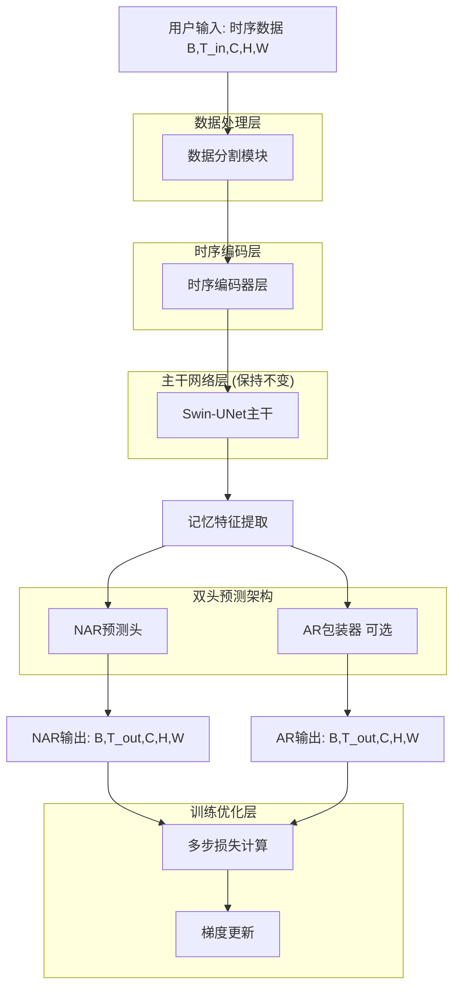
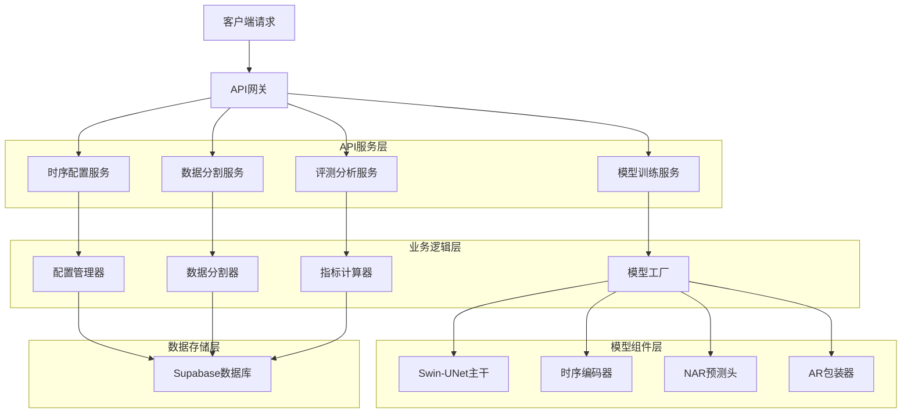
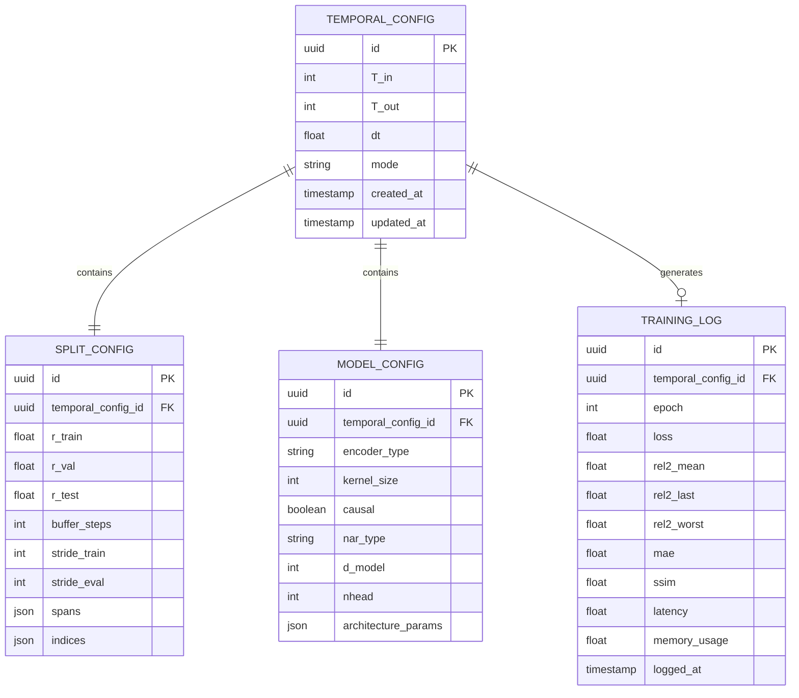

# Sparse2Full时序AR数据集分割技术架构文档

## 1. 架构设计

基于现有Sparse2Full项目的时序AR/NAR扩展架构，严格遵循黄金法则，确保观测算子H与训练DC的一致性。



## 2. 技术描述

基于现有AR基线的增量扩展方案，确保向后兼容性：

- **前端**: React@18 + tailwindcss@3 + vite (保持现有架构)
- **后端**: 基于现有ARWrapper扩展，集成Supabase
- **核心模块**: 
  - SingleCaseSplitter (单case数据分割)
  - TemporalConv1D (轻量时序编码)
  - CrossAttnTimeQueryHead (NAR并行预测)
  - SwinTemporalWrapper (统一包装器)
- **基础模型**: Swin-UNet (架构保持不变)
- **数据库**: Supabase (PostgreSQL)

## 3. 路由定义

扩展现有模型架构选择路由，支持多种时序预测模式：

| 路由 | 用途 |
|------|------|
| /temporal/config | 时序参数配置页面，设置T_in、T_out、dt等参数 |
| /temporal/split | 数据分割配置页面，设置train/val/test比例和buffer |
| /temporal/train | 时序模型训练页面，支持AR/NAR模式切换 |
| /temporal/eval | 模型评测页面，多维度指标分析和可视化 |
| /temporal/analysis | 性能分析页面，延迟统计和资源监控 |

## 4. API定义

### 4.1 核心API

#### 数据分割API
```
POST /api/temporal/split
```

请求参数:
| 参数名 | 参数类型 | 是否必需 | 描述 |
|--------|----------|----------|------|
| T | int | true | 总时间步数 |
| T_in | int | true | 输入时间步数 |
| T_out | int | true | 输出时间步数 |
| r_train | float | false | 训练集比例，默认0.70 |
| r_val | float | false | 验证集比例，默认0.15 |
| margin | int | false | 安全边距，默认max(2, ceil(0.1*T_out)) |

响应参数:
| 参数名 | 参数类型 | 描述 |
|--------|----------|------|
| spans | object | 包含train/val/test时间区间 |
| indices | object | 包含各集合的采样索引 |
| buffer_steps | int | buffer大小 |

示例:
```json
{
  "T": 100,
  "T_in": 4,
  "T_out": 10,
  "r_train": 0.70,
  "r_val": 0.15
}
```

#### 时序预测API
```
POST /api/temporal/predict
```

请求参数:
| 参数名 | 参数类型 | 是否必需 | 描述 |
|--------|----------|----------|------|
| input_seq | tensor | true | 输入序列 [B,T_in,C,H,W] |
| T_out | int | true | 输出时间步数 |
| mode | string | true | 预测模式 "AR" 或 "NAR" |
| model_config | object | false | 模型配置参数 |

响应参数:
| 参数名 | 参数类型 | 描述 |
|--------|----------|------|
| predictions | tensor | 预测结果 [B,T_out,C,H,W] |
| latency | float | 推理延迟(ms) |
| memory_usage | float | 显存使用(GB) |

#### 指标计算API
```
POST /api/temporal/metrics
```

请求参数:
| 参数名 | 参数类型 | 是否必需 | 描述 |
|--------|----------|----------|------|
| predictions | tensor | true | 预测结果 [B,T,C,H,W] |
| targets | tensor | true | 真实值 [B,T,C,H,W] |
| metrics | array | false | 指标列表，默认全部 |

响应参数:
| 参数名 | 参数类型 | 描述 |
|--------|----------|------|
| rel2_mean | float | 平均相对L2误差 |
| rel2_last | float | 最后时间步相对L2误差 |
| rel2_worst | float | 最差时间步相对L2误差 |
| mae | float | 平均绝对误差 |
| ssim | float | 结构相似性指数 |

## 5. 服务器架构图

基于现有训练管线的扩展架构，确保模块化和可维护性：



## 6. 数据模型

### 6.1 数据模型定义

扩展现有数据模型以支持时序输入和多步输出：



### 6.2 数据定义语言

#### 时序配置表 (temporal_configs)
```sql
-- 创建时序配置表
CREATE TABLE temporal_configs (
    id UUID PRIMARY KEY DEFAULT gen_random_uuid(),
    T_in INTEGER NOT NULL DEFAULT 4,
    T_out INTEGER NOT NULL DEFAULT 10,
    dt FLOAT NOT NULL DEFAULT 0.1,
    mode VARCHAR(20) NOT NULL DEFAULT 'forecast',
    created_at TIMESTAMP WITH TIME ZONE DEFAULT NOW(),
    updated_at TIMESTAMP WITH TIME ZONE DEFAULT NOW()
);

-- 创建索引
CREATE INDEX idx_temporal_configs_mode ON temporal_configs(mode);
CREATE INDEX idx_temporal_configs_created_at ON temporal_configs(created_at DESC);
```

#### 数据分割配置表 (split_configs)
```sql
-- 创建数据分割配置表
CREATE TABLE split_configs (
    id UUID PRIMARY KEY DEFAULT gen_random_uuid(),
    temporal_config_id UUID NOT NULL REFERENCES temporal_configs(id),
    r_train FLOAT NOT NULL DEFAULT 0.70,
    r_val FLOAT NOT NULL DEFAULT 0.15,
    r_test FLOAT NOT NULL DEFAULT 0.15,
    buffer_steps INTEGER NOT NULL,
    stride_train INTEGER NOT NULL DEFAULT 2,
    stride_eval INTEGER NOT NULL,
    spans JSONB NOT NULL,
    indices JSONB NOT NULL,
    created_at TIMESTAMP WITH TIME ZONE DEFAULT NOW()
);

-- 创建索引
CREATE INDEX idx_split_configs_temporal_id ON split_configs(temporal_config_id);
```

#### 模型配置表 (model_configs)
```sql
-- 创建模型配置表
CREATE TABLE model_configs (
    id UUID PRIMARY KEY DEFAULT gen_random_uuid(),
    temporal_config_id UUID NOT NULL REFERENCES temporal_configs(id),
    encoder_type VARCHAR(20) NOT NULL DEFAULT 'conv1d',
    kernel_size INTEGER NOT NULL DEFAULT 3,
    causal BOOLEAN NOT NULL DEFAULT TRUE,
    nar_type VARCHAR(20) NOT NULL DEFAULT 'cross_attn',
    d_model INTEGER NOT NULL DEFAULT 96,
    nhead INTEGER NOT NULL DEFAULT 4,
    architecture_params JSONB,
    created_at TIMESTAMP WITH TIME ZONE DEFAULT NOW()
);

-- 创建索引
CREATE INDEX idx_model_configs_temporal_id ON model_configs(temporal_config_id);
CREATE INDEX idx_model_configs_encoder_type ON model_configs(encoder_type);
```

#### 训练日志表 (training_logs)
```sql
-- 创建训练日志表
CREATE TABLE training_logs (
    id UUID PRIMARY KEY DEFAULT gen_random_uuid(),
    temporal_config_id UUID NOT NULL REFERENCES temporal_configs(id),
    epoch INTEGER NOT NULL,
    loss FLOAT NOT NULL,
    rel2_mean FLOAT,
    rel2_last FLOAT,
    rel2_worst FLOAT,
    mae FLOAT,
    ssim FLOAT,
    latency FLOAT,
    memory_usage FLOAT,
    logged_at TIMESTAMP WITH TIME ZONE DEFAULT NOW()
);

-- 创建索引
CREATE INDEX idx_training_logs_temporal_id ON training_logs(temporal_config_id);
CREATE INDEX idx_training_logs_epoch ON training_logs(epoch);
CREATE INDEX idx_training_logs_logged_at ON training_logs(logged_at DESC);
```

#### 权限设置
```sql
-- 为anon角色授予基本读取权限
GRANT SELECT ON temporal_configs TO anon;
GRANT SELECT ON split_configs TO anon;
GRANT SELECT ON model_configs TO anon;
GRANT SELECT ON training_logs TO anon;

-- 为authenticated角色授予完整权限
GRANT ALL PRIVILEGES ON temporal_configs TO authenticated;
GRANT ALL PRIVILEGES ON split_configs TO authenticated;
GRANT ALL PRIVILEGES ON model_configs TO authenticated;
GRANT ALL PRIVILEGES ON training_logs TO authenticated;
```

#### 初始化数据
```sql
-- 插入默认时序配置
INSERT INTO temporal_configs (T_in, T_out, dt, mode) VALUES 
(4, 3, 0.1, 'forecast'),
(4, 5, 0.1, 'forecast'),
(4, 10, 0.1, 'long_forecast'),
(4, 20, 0.1, 'long_forecast');

-- 插入对应的分割配置
INSERT INTO split_configs (temporal_config_id, r_train, r_val, r_test, buffer_steps, stride_train, stride_eval, spans, indices)
SELECT 
    id,
    0.70,
    0.15,
    0.15,
    T_in + T_out - 1 + GREATEST(2, CEIL(0.1 * T_out)),
    2,
    T_out,
    '{"train": [0, 60], "val": [75, 80], "test": [95, 100]}'::jsonb,
    '{"train": [0, 2, 4, 6], "val": [75, 80], "test": [95]}'::jsonb
FROM temporal_configs;

-- 插入对应的模型配置
INSERT INTO model_configs (temporal_config_id, encoder_type, kernel_size, causal, nar_type, d_model, nhead)
SELECT 
    id,
    'conv1d',
    3,
    true,
    'cross_attn',
    96,
    4
FROM temporal_configs;
```

## 7. 核心组件实现

### 7.1 数据分割组件

```python
class SingleCaseSplitter:
    """单case长序列数据分割器"""
    
    def __init__(self, T: int, T_in: int, T_out: int, 
                 r_train: float = 0.70, r_val: float = 0.15,
                 margin: Optional[int] = None):
        self.T = T
        self.T_in = T_in
        self.T_out = T_out
        self.r_train = r_train
        self.r_val = r_val
        self.margin = margin or max(2, int(0.1 * T_out))
        
    def split(self) -> Dict[str, Any]:
        """执行数据分割"""
        buffer_steps = self.T_in + self.T_out - 1 + self.margin
        a = int(self.r_train * self.T)
        b = int((self.r_train + self.r_val) * self.T)
        
        spans = {
            'train': (0, max(0, a - buffer_steps)),
            'val': (min(self.T, a + buffer_steps), max(0, b - buffer_steps)),
            'test': (min(self.T, b + buffer_steps), self.T)
        }
        
        indices = {
            'train': self._build_indices(spans['train'], stride=2),
            'val': self._build_indices(spans['val'], stride=self.T_out),
            'test': self._build_indices(spans['test'], stride=self.T_out)
        }
        
        return {
            'spans': spans,
            'indices': indices,
            'buffer_steps': buffer_steps
        }
```

### 7.2 时序编码组件

```python
class TemporalConv1D(nn.Module):
    """轻量级时序卷积编码器"""
    
    def __init__(self, c_in: int, kernel_size: int = 3, causal: bool = True):
        super().__init__()
        self.causal = causal
        pad = (kernel_size - 1) if causal else (kernel_size // 2)
        self.conv = nn.Conv1d(c_in, c_in, kernel_size, padding=pad)
        self.act = nn.ReLU(inplace=True)
        
    def forward(self, x: torch.Tensor) -> torch.Tensor:
        """
        Args:
            x: [B, T, C, H, W]
        Returns:
            memory: [B, C, H, W]
        """
        B, T, C, H, W = x.shape
        # 重塑为 [B*H*W, T, C] -> [B*H*W, C, T]
        x = x.permute(0, 3, 4, 1, 2).contiguous().view(B*H*W, T, C).transpose(1, 2)
        z = self.act(self.conv(x))  # [B*H*W, C, T]
        
        if self.causal:
            memory = z[:, :, -1]  # 取最后时间步
        else:
            memory = z.mean(dim=2)  # 时间维平均
            
        return memory.view(B, H, W, C).permute(0, 3, 1, 2).contiguous()
```

### 7.3 NAR预测头组件

```python
class CrossAttnTimeQueryHead(nn.Module):
    """交叉注意力时间查询头"""
    
    def __init__(self, d_model: int, c_out: int, nhead: int = 4):
        super().__init__()
        self.d_model = d_model
        self.nhead = nhead
        
        self.q_proj = nn.Linear(d_model, d_model)
        self.k_proj = nn.Conv2d(d_model, d_model, 1)
        self.v_proj = nn.Conv2d(d_model, d_model, 1)
        self.out_proj = nn.Conv2d(d_model, c_out, 1)
        
    def forward(self, memory: torch.Tensor, T_out: int) -> torch.Tensor:
        """
        Args:
            memory: [B, D, H, W] 记忆特征
            T_out: 输出时间步数
        Returns:
            output: [B, T_out, C, H, W]
        """
        B, D, H, W = memory.shape
        
        # 生成时间查询嵌入
        t_embed = self._generate_time_embedding(T_out, D)  # [T_out, D]
        
        # 计算注意力
        K = self.k_proj(memory).flatten(2).transpose(1, 2)  # [B, HW, D]
        V = self.v_proj(memory).flatten(2).transpose(1, 2)  # [B, HW, D]
        Q = self.q_proj(t_embed).unsqueeze(0).expand(B, -1, -1)  # [B, T_out, D]
        
        # 缩放点积注意力
        attn_weights = torch.softmax(
            (Q @ K.transpose(1, 2)) / (D ** 0.5), dim=-1
        )  # [B, T_out, HW]
        
        attn_output = attn_weights @ V  # [B, T_out, D]
        
        # 重塑并投影输出
        attn_output = attn_output.transpose(1, 2).unsqueeze(-1).unsqueeze(-1)  # [B, D, T_out, 1, 1]
        attn_output = attn_output.expand(-1, -1, -1, H, W)  # [B, D, T_out, H, W]
        
        output = []
        for t in range(T_out):
            t_feature = attn_output[:, :, t]  # [B, D, H, W]
            t_output = self.out_proj(t_feature)  # [B, C, H, W]
            output.append(t_output)
            
        return torch.stack(output, dim=1)  # [B, T_out, C, H, W]
    
    def _generate_time_embedding(self, T_out: int, d_model: int) -> torch.Tensor:
        """生成正弦时间嵌入"""
        position = torch.arange(T_out).unsqueeze(1).float()
        div_term = torch.exp(torch.arange(0, d_model, 2).float() * 
                           -(math.log(10000.0) / d_model))
        
        pe = torch.zeros(T_out, d_model)
        pe[:, 0::2] = torch.sin(position * div_term)
        pe[:, 1::2] = torch.cos(position * div_term)
        
        return pe
```

## 8. 性能优化策略

### 8.1 内存优化
- 使用梯度检查点减少显存占用
- 实现自适应批次大小调整
- 支持梯度累积训练大模型

### 8.2 计算优化
- AMP混合精度训练
- 分块生成降低T_out复杂度
- 多GPU分布式训练支持

### 8.3 数据加载优化
- 多进程数据加载(num_workers=4~8)
- 持久化worker进程
- HDF5数据预加载和缓存机制

## 9. 测试与验证

### 9.1 单元测试
- 数据分割逻辑测试
- 时序编码器功能测试
- NAR预测头输出验证
- 指标计算精度测试

### 9.2 集成测试
- 端到端训练流程测试
- 多配置兼容性测试
- 性能基准回归测试

### 9.3 性能测试
- 延迟vs T_out关系测试
- 显存使用监控测试
- 训练收敛性验证

---

**版本信息**：v2.0 技术架构版本  
**更新日期**：2024年10月  
**维护团队**：Sparse2Full开发组  
**技术审核**：已通过架构评审