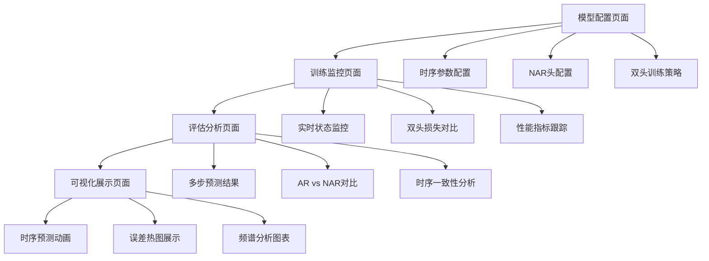

# Sparse2Full 时序NAR扩展产品需求文档

## 1. 产品概述

基于现有AR基线的时序NAR扩展系统，通过外层包装实现时序功能增强，保持SwinUNet主干架构不变。
- 主要目的：在现有AR自回归预测基础上，添加轻时序模块和非自回归(NAR)头，提升多步预测性能并降低误差累积。
- 目标用户：PDE求解研究人员、时序预测开发者、深度学习模型研究者。
- 市场价值：提供业界领先的时序PDE预测解决方案，支持并行多步预测和历史信息利用。

## 2. 核心功能

### 2.1 用户角色

| 角色 | 注册方法 | 核心权限 |
|------|----------|----------|
| 研究人员 | 直接使用，无需注册 | 可配置和训练所有模型架构，访问完整功能 |
| 开发者 | 代码库访问权限 | 可修改模型架构，扩展新功能模块 |

### 2.2 功能模块

本时序NAR扩展系统包含以下核心页面：

1. **模型配置页面**：时序参数配置、NAR头设置、双头训练策略配置
2. **训练监控页面**：实时训练状态、双头损失对比、性能指标监控  
3. **评估分析页面**：多步预测结果、AR vs NAR性能对比、时序一致性分析
4. **可视化展示页面**：时序预测动画、误差热图、频谱分析图表

### 2.3 页面详情

| 页面名称 | 模块名称 | 功能描述 |
|----------|----------|----------|
| **模型配置页面** | 时序参数配置 | 设置T_in/T_out时间步数、选择temporal模块类型(conv1d/film)、配置因果性参数 |
| **模型配置页面** | NAR头配置 | 设置d_model维度对齐、启用/禁用AR和NAR头、配置时间查询参数 |
| **模型配置页面** | 双头训练策略 | 配置AR和NAR损失权重、设置scheduled sampling参数、选择课程学习策略 |
| **训练监控页面** | 实时状态监控 | 显示训练进度、epoch/step计数、学习率变化、显存使用情况 |
| **训练监控页面** | 双头损失对比 | 实时显示AR损失和NAR损失曲线、总损失趋势、损失权重动态调整 |
| **训练监控页面** | 性能指标跟踪 | 监控Rel2_mean/last/worst指标、PSNR/SSIM变化、训练速度统计 |
| **评估分析页面** | 多步预测结果 | 展示不同T_out下的预测精度、误差分布统计、收敛性分析 |
| **评估分析页面** | AR vs NAR对比 | 对比AR和NAR在相同条件下的性能、推理速度对比、显存使用对比 |
| **评估分析页面** | 时序一致性分析 | 分析预测序列的时间连续性、物理约束满足度、长期稳定性 |
| **可视化展示页面** | 时序预测动画 | 生成GT/Pred/Error的动态对比动画、支持多通道可视化、时间轴控制 |
| **可视化展示页面** | 误差热图展示 | 显示空间误差分布热图、时间维误差演化、边界区域误差分析 |
| **可视化展示页面** | 频谱分析图表 | 展示功率谱对比、频域误差分析、低频/中频/高频分量统计 |

## 3. 核心流程

### 研究人员使用流程

研究人员首先在模型配置页面设置时序参数(T_in=4, T_out=5)和NAR头配置(d_model=96)，选择双头训练策略并配置损失权重(NAR:1.0, AR:0.3)。然后启动训练并在训练监控页面实时观察双头损失收敛情况和性能指标变化。训练完成后，在评估分析页面对比AR和NAR的多步预测性能，分析时序一致性。最后在可视化展示页面生成预测动画和误差分析图表，验证模型效果。

## 4. 用户界面设计

### 4.1 设计风格

- **主色调**：深蓝色(#1e3a8a)作为主色，浅蓝色(#3b82f6)作为辅助色
- **按钮样式**：圆角矩形按钮，支持悬停效果和点击反馈
- **字体设置**：主标题使用16px粗体，正文使用14px常规字体，代码使用等宽字体
- **布局风格**：卡片式布局，顶部导航栏，左侧功能面板，主内容区域响应式设计
- **图标风格**：使用简洁的线性图标，支持时序相关的动画效果

### 4.2 页面设计概览

| 页面名称 | 模块名称 | UI元素 |
|----------|----------|--------|
| **模型配置页面** | 时序参数配置 | 数值输入框(T_in/T_out)、下拉选择器(temporal类型)、开关按钮(causal)、实时参数预览卡片 |
| **模型配置页面** | NAR头配置 | 滑动条(d_model维度)、复选框(启用AR/NAR)、参数对齐提示、配置验证状态指示器 |
| **模型配置页面** | 双头训练策略 | 权重调节滑块、scheduled sampling配置面板、课程学习时间轴、策略预览图表 |
| **训练监控页面** | 实时状态监控 | 进度条、状态指示灯、资源使用仪表盘、日志滚动窗口 |
| **训练监控页面** | 双头损失对比 | 实时折线图、损失数值显示、趋势分析面板、异常检测警告 |
| **训练监控页面** | 性能指标跟踪 | 多指标仪表板、历史趋势图、性能排行榜、基线对比表格 |
| **评估分析页面** | 多步预测结果 | 预测精度柱状图、误差分布直方图、收敛性曲线、统计摘要卡片 |
| **评估分析页面** | AR vs NAR对比 | 并排对比表格、性能雷达图、速度对比柱图、资源使用对比 |
| **评估分析页面** | 时序一致性分析 | 连续性评分、物理约束检查列表、稳定性趋势图、异常时间点标记 |
| **可视化展示页面** | 时序预测动画 | 播放控制器、帧率调节、多通道切换、全屏播放模式 |
| **可视化展示页面** | 误差热图展示 | 颜色映射选择器、缩放控制、区域选择工具、统计信息悬浮提示 |
| **可视化展示页面** | 频谱分析图表 | 对数坐标轴、频段选择器、对比模式切换、导出功能按钮 |

### 4.3 响应式设计

本系统采用桌面优先的响应式设计，针对研究和开发场景优化：
- **桌面端(≥1200px)**：完整功能布局，多面板并排显示，支持多窗口操作
- **平板端(768px-1199px)**：自适应布局，面板可折叠，保持核心功能可用
- **移动端(≤767px)**：简化界面，重要功能优先显示，支持触摸操作

系统重点优化桌面端的专业用户体验，支持键盘快捷键、批量操作和高效的数据分析工作流。