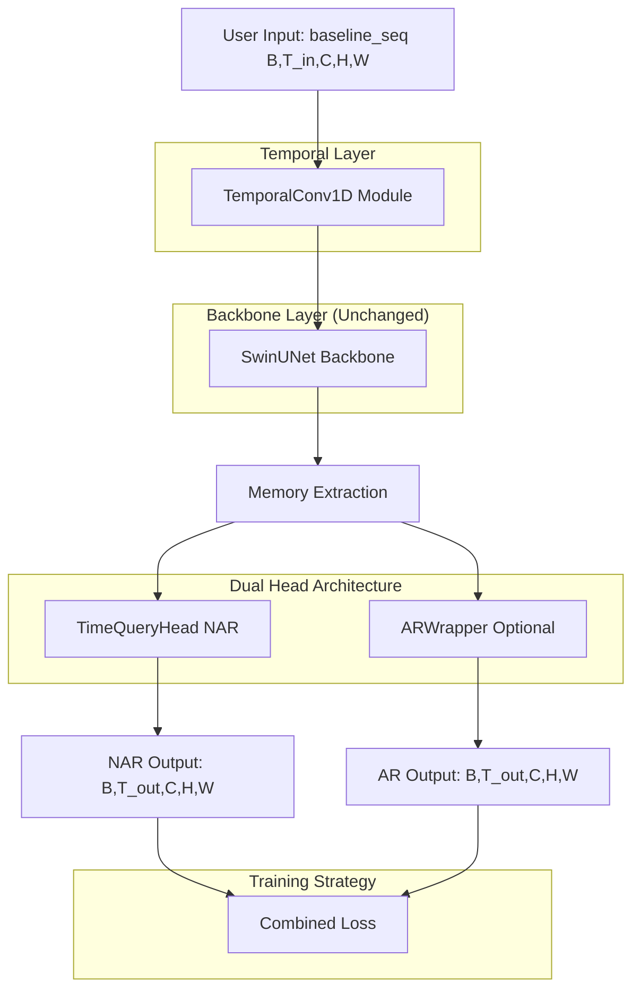
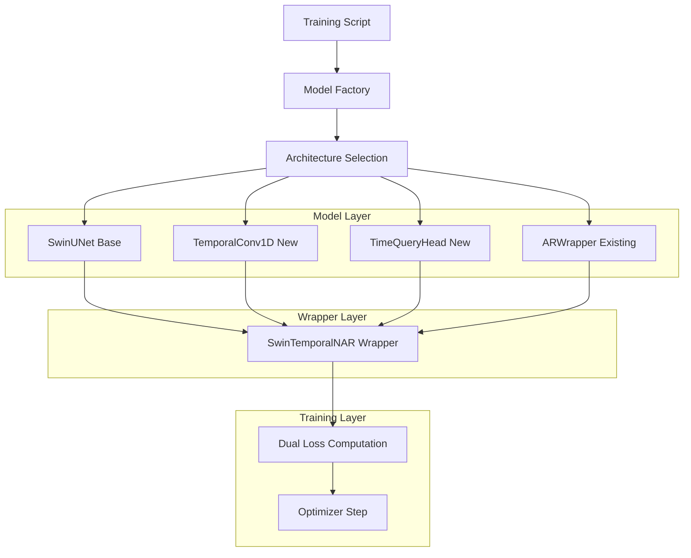
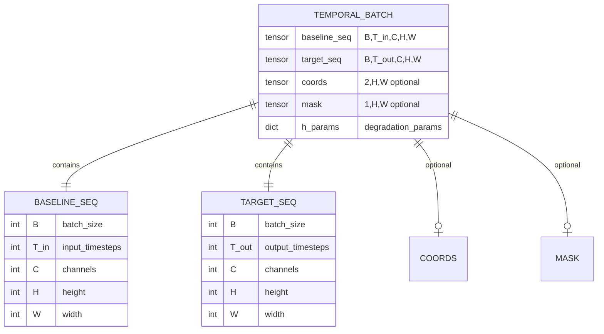

# Sparse2Full 时序NAR扩展技术架构文档

## 1. 架构设计

基于现有AR基线的时序NAR扩展架构，保持SwinUNet主干不变，通过外层包装实现时序功能。



## 2. 技术描述

基于现有AR基线的增量扩展方案：

- **Frontend**: React@18 + tailwindcss@3 + vite (保持现有)
- **Backend**: 基于现有ARWrapper扩展
- **Core Modules**: 
  - TemporalConv1D (轻时序模块)
  - TimeQueryHead (NAR一次性多步输出)
  - SwinTemporalNAR (双头包装器)
- **Base Model**: SwinUNet (保持不变)

## 3. 路由定义

扩展现有模型架构选择路由：

| 架构类型 | 用途 | 输入格式 | 输出格式 |
|---------|------|----------|----------|
| swin | 原始单帧模型 | (B,C,H,W) | (B,C,H,W) |
| swin_ar | 现有AR模型 | (B,T_in,C,H,W) | (B,T_out,C,H,W) |
| swin_temporal | 时序增强模型 | (B,T_in,C,H,W) | (B,C,H,W) |
| swin_temporal_nar | 双头时序模型 | (B,T_in,C,H,W) | (AR_out, NAR_out) |

## 4. API定义

### 4.1 核心模块API

#### TemporalConv1D 轻时序模块
```python
class TemporalConv1D:
    def __init__(self, c_in: int, c_out: int = None, k: int = 3, causal: bool = True)
    def forward(self, x: Tensor) -> Tensor  # (B,T,C,H,W) -> (B,C,H,W)
```

**参数说明**:
| 参数名 | 类型 | 必需 | 描述 |
|--------|------|------|------|
| c_in | int | true | 输入通道数 |
| c_out | int | false | 输出通道数，默认等于c_in |
| k | int | false | 卷积核大小，默认3 |
| causal | bool | false | 是否因果卷积，默认True |

#### TimeQueryHead NAR头
```python
class TimeQueryHead:
    def __init__(self, d_model: int, c_out: int)
    def forward(self, mem: Tensor, T_out: int) -> Tensor  # (B,D,H,W) -> (B,T_out,C,H,W)
```

**参数说明**:
| 参数名 | 类型 | 必需 | 描述 |
|--------|------|------|------|
| d_model | int | true | 特征维度，对齐SwinUNet embed_dim |
| c_out | int | true | 输出通道数 |
| T_out | int | true | 输出时间步数 |

#### SwinTemporalNAR 双头包装器
```python
class SwinTemporalNAR:
    def __init__(self, base_kwargs: dict, temporal_cfg: dict, nar_cfg: dict, use_ar: bool = True)
    def forward(self, x_seq: Tensor, T_out: int = 1, teacher_seq: Tensor = None, train_mode: bool = True) -> Tuple[Tensor, Tensor]
```

**参数说明**:
| 参数名 | 类型 | 必需 | 描述 |
|--------|------|------|------|
| x_seq | Tensor | true | 输入序列 (B,T_in,C,H,W) |
| T_out | int | false | 输出时间步数，默认1 |
| teacher_seq | Tensor | false | 教师信号，训练时使用 |
| train_mode | bool | false | 训练模式标志 |

**返回值**:
| 参数名 | 类型 | 描述 |
|--------|------|------|
| ar_out | Tensor | AR输出 (B,T_out,C,H,W) |
| nar_out | Tensor | NAR输出 (B,T_out,C,H,W) |

### 4.2 配置API

#### 时序配置扩展
```yaml
model:
  arch: swin_temporal_nar
  temporal:
    enabled: true
    type: conv1d
    k: 3
    causal: true
  heads:
    use_ar: true
    use_nar: true
    nar:
      d_model: 96
```

#### 数据配置扩展
```yaml
data:
  temporal:
    enabled: true
    T_in: 4
    T_out: 5
    mode: forecast
```

#### 损失配置扩展
```yaml
loss:
  rec_nar_weight: 1.0
  rec_ar_weight: 0.3
  spectral_weight: 0.0  # 初期关闭
  dc_weight: 0.0        # 初期关闭
```

## 5. 服务器架构图

基于现有训练管线的扩展架构：



## 6. 数据模型

### 6.1 数据模型定义

扩展现有数据模型以支持时序输入：



### 6.2 数据定义语言

#### 配置表扩展 (temporal_config)
```sql
-- 扩展现有配置表
ALTER TABLE model_config ADD COLUMN temporal_enabled BOOLEAN DEFAULT FALSE;
ALTER TABLE model_config ADD COLUMN temporal_type VARCHAR(20) DEFAULT 'conv1d';
ALTER TABLE model_config ADD COLUMN temporal_k INTEGER DEFAULT 3;
ALTER TABLE model_config ADD COLUMN temporal_causal BOOLEAN DEFAULT TRUE;

-- NAR配置表
CREATE TABLE nar_config (
    id INTEGER PRIMARY KEY,
    model_id INTEGER REFERENCES model_config(id),
    d_model INTEGER NOT NULL DEFAULT 96,
    use_ar BOOLEAN DEFAULT TRUE,
    use_nar BOOLEAN DEFAULT TRUE,
    created_at TIMESTAMP DEFAULT NOW()
);

-- 时序数据配置表
CREATE TABLE temporal_data_config (
    id INTEGER PRIMARY KEY,
    T_in INTEGER NOT NULL DEFAULT 1,
    T_out INTEGER NOT NULL DEFAULT 3,
    mode VARCHAR(20) DEFAULT 'forecast',
    enabled BOOLEAN DEFAULT FALSE,
    created_at TIMESTAMP DEFAULT NOW()
);

-- 损失权重配置表
CREATE TABLE loss_weights_config (
    id INTEGER PRIMARY KEY,
    rec_nar_weight FLOAT DEFAULT 1.0,
    rec_ar_weight FLOAT DEFAULT 0.3,
    spectral_weight FLOAT DEFAULT 0.0,
    dc_weight FLOAT DEFAULT 0.0,
    created_at TIMESTAMP DEFAULT NOW()
);

-- 初始化数据
INSERT INTO temporal_data_config (T_in, T_out, mode, enabled) VALUES 
(1, 3, 'forecast', true),
(4, 5, 'forecast', false),
(2, 8, 'long_forecast', false);

INSERT INTO loss_weights_config (rec_nar_weight, rec_ar_weight) VALUES (1.0, 0.3);
```

## 7. 实现策略

### 7.1 阶段性实现计划

**P1阶段：AR基线稳定化**
- 验证现有ARWrapper在T_out=3时的稳定性
- 确保训练/验证曲线平滑，无NaN
- 建立Rel2_mean/Rel2_last/Rel2_worst基线指标

**P2阶段：Temporal模块接入**
- 实现TemporalConv1D轻时序模块
- 创建SwinTemporal包装器
- 验证相比纯AR的3-5%性能提升

**P3阶段：NAR头实现**
- 实现TimeQueryHead NAR一次性多步输出
- 创建SwinTemporalNAR双头架构
- 验证NAR推理延迟不随步数增长

### 7.2 兼容性保证

**接口兼容性**：
- SwinUNet.forward(B,C,H,W) → (B,C_out,H,W) 保持不变
- 现有单帧训练脚本无需修改
- 现有数据加载器向后兼容

**配置兼容性**：
- 现有YAML配置文件继续有效
- 新增配置项采用默认值
- 渐进式功能启用

**数据兼容性**：
- 支持baseline/target单帧格式
- 支持baseline_seq/target_seq时序格式
- 自动维度适配和转换

### 7.3 性能优化策略

**显存优化**：
- TemporalConv1D仅在时间维操作
- NAR头使用轻量条件调制
- 避免全注意力机制

**训练稳定性**：
- AMP + grad_clip=1.0
- 线性warmup 1000步
- 先开重建损失，后开频谱/DC损失

**推理加速**：
- NAR并行多步预测
- 可选AR/NAR单独推理
- 内存高效的rollout实现

## 8. 验收标准

### 8.1 功能验收
- [ ] TemporalConv1D模块单元测试通过
- [ ] TimeQueryHead模块单元测试通过
- [ ] SwinTemporalNAR端到端测试通过
- [ ] 配置系统兼容性测试通过

### 8.2 性能验收
- [ ] T_out=3时训练稳定，无NaN
- [ ] Temporal模块相比AR提升3-5%
- [ ] NAR推理延迟与T_out无关
- [ ] 显存开销增加≤15%

### 8.3 兼容性验收
- [ ] 现有单帧模型正常运行
- [ ] 现有AR模型正常运行
- [ ] 现有配置文件向后兼容
- [ ] 现有数据管线正常工作

## 9. 风险控制

### 9.1 技术风险
- **维度不匹配**：patch_embed.num_patches必须是平方数
- **数值不稳定**：使用AMP+梯度裁剪+warmup
- **显存溢出**：限制时序模块复杂度

### 9.2 兼容性风险
- **接口破坏**：严格保持SwinUNet接口不变
- **配置冲突**：新配置项使用独立命名空间
- **数据格式**：提供自动转换和验证

### 9.3 性能风险
- **训练不收敛**：分阶段启用功能，先稳后强
- **推理变慢**：NAR头设计轻量化
- **精度下降**：双头训练权重平衡调优

## 10. 后续扩展

### 10.1 增强版NAR
- Cross-Attention机制 (Q=时间查询, KV=memory特征)
- 多尺度时间查询
- 自适应时间步长

### 10.2 Temporal Transformer
- 仅时间维Transformer-Encoder
- 低秩/线性注意力机制
- 位置编码优化

### 10.3 多模态融合
- FNO瓶颈层并联
- 稀疏感知注意力
- 物理约束集成