# Sparse2Full 工作区全景架构拓扑与目录职责指南 (Workspace Architecture Map)

> **版本**：v2.0 (生产与科研就绪版)  
> **更新时间**：2026-09-10  
> **目的**：为本工作区（`/root/mzy/Flow Field Prediction in World Models/Sparse2Full`）建立清晰权威的目录职责划分、数据流向指引与维护规范，消除多阶段演化带来的认知模糊与架构漂移。

---

## 一、工作区核心六大功能域划分

整个 Workspace 按职责分为以下六大功能域：

```mermaid
graph TD
    A[Sparse2Full Workspace] --> B[1. 核心生产与算法主干]
    A --> C[2. 物理算子与数据资产]
    A --> D[3. 硕士论文档案与交付物]
    A --> E[4. 历史研究与复现工具库]
    A --> F[5. 全量分层测试套件]
    A --> G[6. 归档切片与历史兼容层]

    B --> B1[models/]
    B --> B2[training/]
    B --> B3[train.py / eval.py / evaluate_test_set.py]
    B --> B4[run_train_*.sh]

    C --> C1[ops/]
    C --> C2[datasets/]
    C --> C3[splits*/]
    C --> C4[configs/]

    D --> D1[thesis_paper/]
    D --> D2[paper_draft/]
    D --> D3[paper_package/]
    D --> D4[design_system/]

    E --> E1[tools/research_scripts/]
    E --> E2[SCRIPTS_CATALOG.md]

    F --> F1[tests/unit/]
    F --> F2[tests/integration/]
    F --> F3[tests/system/]

    G --> G1[archives/]
    G --> G2[real_data_ar/]
    G --> G3[training_system/]
    G --> G4[src/]
```

---

## 二、顶级目录与核心主干文件全景映射

| 路径 (Path) | 归属功能域 | 定位与核心职责 | 维护与修改规范 |
| :--- | :--- | :--- | :--- |
| **`train.py`** | 生产主干 | **统一训练主控入口 (Facade)**：负责配置合并、子系统调度、多卡初始化与 Epoch 流水线 | **当前活跃主干**，仅通过组件代理扩展 |
| **`eval.py`** | 生产主干 | **主评估主控入口**：单模型指标计算、空间重构可视化与误差统计 | **当前活跃主干** |
| **`evaluate_test_set.py`** | 生产主干 | **独立测试集盲测与流体能谱分析**：Bicubic / 旧模型 / 新模型跨架构对比 | **当前活跃主干**，支持学术评测 |
| **`train_temporal.py`** | 生产主干 | **时序自回归与非自回归 (NAR) 专用训练入口** | **当前活跃主干** |
| **`run_train_swin_fluid_sr.sh`** | 启动脚本 | **双卡科学流体超分辨率模型标准启动脚本** (PixelShuffle 4x + 频域能谱损失) | **主推荐训练入口** |
| **`run_train_swin_t_enc.sh`** | 启动脚本 | 原 SwinT 编码器模型训练脚本 | 基线训练脚本 |
| **`run_train_rdb.sh`** | 启动脚本 | 标准 RDB 扩散反应流场训练脚本 | 通用训练脚本 |
| **`models/`** | 算法库 | **统一模型算法仓**：包含 `registry.py` 模型工厂，以及 `spatial/` (SwinFluidSR, SwinUNet, FNO2D, EDSR), `temporal/`, `ar/` 等 | **唯一权威模型开发目录** |
| **`training/`** | 引擎层 | **Trainer 正交解耦子系统**：`batch_processor.py`, `engine_builder.py`, `artifact_manager.py`, `curriculum.py`, `data_orchestrator.py` | **高内聚解耦架构**，新增训练流请修改此子系统 |
| **`ops/`** | 物理核心 | **流体物理守恒算子库**：频域能量谱损失、不可压缩散度损失 ($\nabla \cdot \mathbf{u}=0$)、涡度损失、退化算子 | **物理严谨性防线**，严禁静默双线性插值 |
| **`datasets/`** | 数据流 | **流体 PDEBench 数据加载体系**：PDEBenchSR, 归一化统计、稀疏掩码生成 | 生产数据加载模块 |
| **`configs/`** | 配置中心 | **Hydra 层次化配置**：包含 `model/`, `data/`, `training/`, `loss/`, `experiment/` | 统一配置源 |
| **`splits/`, `splits_shallow/`**| 数据切分 | 标准样本索引（train 80 样本，val 10 样本，test 10 样本） | 核心数据集切分文件 |
| **`thesis_paper/`** | 论文档案 | **硕士学位论文核心源码仓**：LaTeX 源码、章节结构、审稿修订批注、高分辨率矢量配图 | **学术核心资产**，受 Git 追踪 |
| **`paper_draft/`** | 论文初稿 | 早期 Markdown 格式初稿与实验指南手稿 | 论文写作历史底稿 |
| **`paper_package/`** | 论文交付物 | 论文各章节图表集合 (`figs/`)、数据卡片 (`data_cards/`) 与指标表 (`metrics/`) | 交付包资产 |
| **`design_system/`** | 可视化规范 | 界面与论文图表排版的设计 Token (`design_tokens.json`)、SCSS 样式与 QA 检查表 | 视觉一致性规范 |
| **`tools/`** | 工具与脚本 | 包含 `research_scripts/` (已分类收纳 150+ 历史实验/消融/排版脚本)、多模型扫描与论文制图工具 | 查阅 `SCRIPTS_CATALOG.md` 获取索引 |
| **`tests/`** | 质量防线 | **全量分层测试套件**：`unit/` (464 项单测), `integration/`, `system/`, `e2e/` | 保持 100% 绿色通过标准 |
| **`archives/`** | 静态切片 | 存放压缩保全的 142k 行代码镜像 (`clean_export_backup.tar.gz`)，不纳入 Git 索引 | 历史备份，避免符号干扰 |
| **`real_data_ar/`** | 历史兼容层 | 早期自回归独立子包（被部分单元测试引用） | 保持向后兼容，不建议主动扩充 |
| **`training_system/`** | 历史兼容层 | 早期框架化尝试子包（被配置校验模块兼容引用） | 保持向后兼容 |
| **`src/`** | 历史兼容层 | 早期模块化尝试副本 | 保持向后兼容 |
| **`losses/`** | 历史兼容层 | 早期测试 CombinedLoss 极简封装 (2KB) | 保持测试兼容 |
| **`runs/`** | 实验产物 | 历史模型运行目录（仅保留最优权重 `best.pth` 与对比日志） | 已经过 1.42GB 瘦身 |
| **`runs_swin_fluid_sr/`** | 实验产物 | 全新 100-Epoch 科学流体超分辨率模型生产产物 (含 `best.pth`, 湍流能谱图, 盲测画廊) | **最新生产成果** |
| **`.trae/`** | IDE 知识库 | Trae IDE 规则、规划文档与学术写作 Skills | 核心个人开发环境资产 |

---

## 三、开发与科研推荐工作流 (Golden Workflow)

1. **新增或修改模型**：
   - 在 `models/spatial/` 或 `models/temporal/` 下新增模型文件；
   - 使用 `@register_model('YourModelName')` 注册至 `models/registry.py`；
   - 编写 `tests/unit/test_your_model.py` 验证前向传播与尺寸守恒。
2. **启动流体物理训练**：
   - 编写对应 yaml 或复用 `run_train_swin_fluid_sr.sh`；
   - 执行 `bash run_train_*.sh`；
   - 产出将安全落盘在对应的 `runs_*/` 下，自动生成四栏流场图与 `metrics.jsonl`。
3. **模型测试与物理能谱验证**：
   - 运行 `python3 evaluate_test_set.py` 对比基线，自动输出相对 L2、PSNR、SSIM 以及湍流能量谱 $E(k)$。
4. **提交代码前检查**：
   - 运行 `pytest tests/unit/ -q`，确认 464 项单元测试 100% 通过；
   - 确认工作区无离散临时日志，保持 `git status` 纯净。
