# 模型架构详细说明文档

**版本**: 2.0
**生成日期**: 2026-01-04
**维护者**: Sparse2Full Team

本文档系统性地整理了 `Sparse2Full` 项目中 `models/spatial/` 目录下所有核心模型架构的详细信息。文档按模型类型和应用场景分章，涵盖了从经典的 CNN/Transformer 基线到前沿的 Neural Operator 和稀疏重建专用模型。所有流程图均与源码逻辑严格对应。

---

## 目录 (Index)

- [第一章：核心空间重建模型 (Core Spatial Models)](#第一章核心空间重建模型-core-spatial-models)
  - [1.1 Swin-UNet](#11-swin-unet)
  - [1.2 FNO 2D / StableFNO](#12-fno-2d--stablefno-fourier-neural-operator)
  - [1.3 Classic U-Net](#13-classic-u-net)
  - [1.4 DeepONet 2D](#14-deeponet-2d)
  - [1.5 UNO (U-shaped Neural Operator)](#15-uno-u-shaped-neural-operator)
  - [1.6 U-FNO U-Net (UFNOUNet)](#16-u-fno-u-net-ufnounet)
  - [1.7 UNet++ (Nested U-Net)](#17-unet-nested-u-net)
- [第二章：Transformer 类架构 (Transformer Architectures)](#第二章transformer-类架构-transformer-architectures)
  - [2.1 Swin Transformer Tiny (SwinT)](#21-swin-transformer-tiny-swint)
  - [2.2 SwinT With Encoder](#22-swint-with-encoder)
  - [2.3 Standard Transformer](#23-standard-transformer)
  - [2.4 Vision Transformer (ViT-AE)](#24-vision-transformer-vit-ae)
  - [2.5 SegFormer](#25-segformer)
  - [2.6 UNetFormer](#26-unetformer)
  - [2.7 PerceiverIO](#27-perceiverio)
- [第三章：图像复原与超分基线 (Restoration & SR Baselines)](#第三章图像复原与超分基线-restoration--sr-baselines)
  - [3.1 EDSR (Enhanced Deep Residual Networks)](#31-edsr-enhanced-deep-residual-networks)
  - [3.2 RCAN (Residual Channel Attention Network)](#32-rcan-residual-channel-attention-network)
  - [3.3 RDN (Residual Dense Network)](#33-rdn-residual-dense-network)
  - [3.4 SwinIR](#34-swinir)
  - [3.5 NAFNet](#35-nafnet)
  - [3.6 Restormer](#36-restormer)
  - [3.7 LIIF (Local Implicit Image Function)](#37-liif-local-implicit-image-function)
- [第四章：轻量化与高效模型 (Lightweight & Efficient Models)](#第四章轻量化与高效模型-lightweight--efficient-models)
  - [4.1 CNNAttnLite](#41-cnnattnlite)
  - [4.2 ConvGateLite](#42-convgatelite)
  - [4.3 ConvUNetLite](#43-convunetlite)
  - [4.4 ResNetLite](#44-resnetlite)
  - [4.5 MLP (Pointwise/Global)](#45-mlp-pointwiseglobal)
  - [4.6 MLP-Mixer](#46-mlp-mixer)
- [第五章：专用模块与变体 (Specialized Modules)](#第五章专用模块与变体-specialized-modules)
  - [5.1 PartialConvUNet](#51-partialconvunet)
  - [5.2 ModularSR](#52-modularsr)
  - [5.3 SparseAttentionEncoder](#53-sparseattentionencoder)
  - [5.4 CoordinateEncoder](#54-coordinateencoder)
- [第六章：时序与自回归模型 (Temporal & AR Models)](#第六章时序与自回归模型-temporal--ar-models)
  - [6.1 SwinTemporal Wrapper](#61-swintemporal-wrapper)
  - [6.2 PhysicsTransformer](#62-physicstransformer)
  - [6.3 ARWrapper](#63-arwrapper)
- [第七章：混合模型 (Hybrid Models)](#第七章混合模型-hybrid-models)
  - [7.1 HybridModel](#71-hybridmodel)

---

## 第一章：核心空间重建模型 (Core Spatial Models)

### 1.1 Swin-UNet
**对应文件**: `swin_unet.py`

基于 Swin Transformer 的 U-Net 架构，集成了分层 Transformer 编码器与解码器，支持可选的频域瓶颈层。

#### 核心组件与层级结构
```text
[Input] (B, C_in, H, W)
   │
   ▼
[PatchEmbed] -> Token序列
   │
   ▼
[Encoder] (Swin Transformer Blocks)
   ├── Stage 1: SwinBlock x2 -> PatchMerging (H/2, W/2)
   ├── Stage 2: SwinBlock x2 -> PatchMerging (H/4, W/4)
   ├── Stage 3: SwinBlock x6 -> PatchMerging (H/8, W/8)
   └── Stage 4: SwinBlock x2
   │
   ▼
[Bottleneck] (Optional FNO)
   ├── FFT2D -> 频域卷积 (SpectralConv) -> IFFT2D
   │
   ▼
[Decoder] (Symmetric Swin Blocks)
   ├── Stage 4: SwinBlock x2 -> PatchExpanding (H/4, W/4) + Skip Connect
   ├── Stage 3: SwinBlock x6 -> PatchExpanding (H/2, W/2) + Skip Connect
   ├── Stage 2: SwinBlock x2 -> PatchExpanding (H, W) + Skip Connect
   └── Stage 1: SwinBlock x2
   │
   ▼
[Output Head] Conv2d(1x1) -> Activation -> (B, C_out, H, W)
```

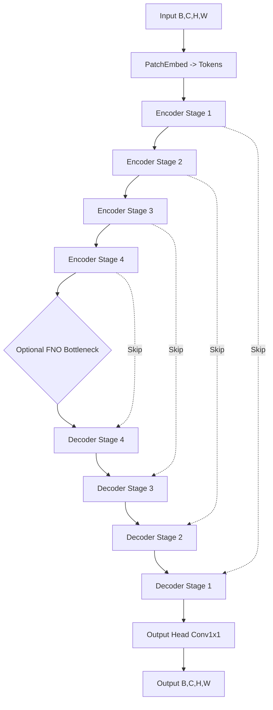
```mermaid
graph TD
    Input[Input B,C,H,W] --> PatchEmbed[PatchEmbed -> Tokens]
    PatchEmbed --> Enc1[Encoder Stage 1]
    Enc1 --> Enc2[Encoder Stage 2]
    Enc2 --> Enc3[Encoder Stage 3]
    Enc3 --> Enc4[Encoder Stage 4]
    Enc4 --> Bottleneck{Optional FNO Bottleneck}
    Bottleneck --> Dec4[Decoder Stage 4]
    Enc4 -.->|Skip| Dec4
    Dec4 --> Dec3[Decoder Stage 3]
    Enc3 -.->|Skip| Dec3
    Dec3 --> Dec2[Decoder Stage 2]
    Enc2 -.->|Skip| Dec2
    Dec2 --> Dec1[Decoder Stage 1]
    Enc1 -.->|Skip| Dec1
    Dec1 --> OutHead[Output Head Conv1x1]
    OutHead --> Output[Output B,C,H,W]
```

### 1.2 FNO 2D / StableFNO (Fourier Neural Operator)
**对应文件**: `fno2d.py`, `fno2d_stable.py`

基于频域卷积的神经算子。`StableFNO` (fno2d_stable.py) 是工程增强版，增加了 NaN 检测、双精度回退 (Double Precision Fallback) 和更稳健的初始化。

#### 核心组件与层级结构
```text
[Input] (B, C_in, H, W) + [Grid]
   │
   ▼
[Lift] Linear(C_in+2 -> width)
   │
   ▼
[Spectral Layers] x N_Layers
   ├── 分支1 (频域): FFT -> 截断高频 -> ComplexMul -> IFFT
   ├── 分支2 (空域): Conv1x1 (W)
   └── 融合: Activation(分支1 + 分支2)
   │
   ▼
[Proj] MLP(width -> 128 -> C_out) -> Output
```

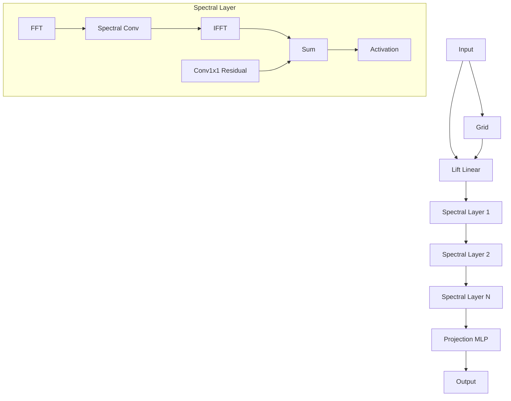
```mermaid
graph TD
    Input[Input] --> Grid[Grid]
    Input & Grid --> Lift[Lift Linear]
    Lift --> Spec1[Spectral Layer 1]
    Spec1 --> Spec2[Spectral Layer 2]
    Spec2 --> SpecN[Spectral Layer N]
    SpecN --> Proj[Projection MLP]
    Proj --> Output[Output]
    
    subgraph Spectral Layer
        FFT[FFT] --> SpecConv[Spectral Conv]
        SpecConv --> IFFT[IFFT]
        ConvW[Conv1x1 Residual]
        IFFT & ConvW --> Sum[Sum]
        Sum --> Act[Activation]
    end
```

### 1.3 Classic U-Net
**对应文件**: `unet.py`

经典全卷积网络，适用于作为稳健的对比基线。

#### 核心组件与层级结构
```text
[Encoder] DoubleConv(64)->Pool -> DoubleConv(128)->Pool -> ...
[Bottleneck] DoubleConv(1024)
[Decoder] Up->Concat->DoubleConv(512) -> ... -> Output
```

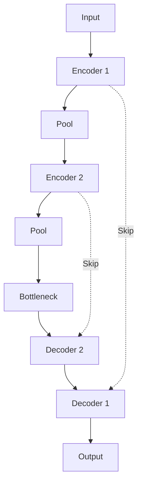
```mermaid
graph TD
    Input --> Enc1[Encoder 1]
    Enc1 --> Pool1[Pool]
    Pool1 --> Enc2[Encoder 2]
    Enc2 --> Pool2[Pool]
    Pool2 --> Bottleneck[Bottleneck]
    Bottleneck --> Dec2[Decoder 2]
    Enc2 -.->|Skip| Dec2
    Dec2 --> Dec1[Decoder 1]
    Enc1 -.->|Skip| Dec1
    Dec1 --> Output
```

### 1.4 DeepONet 2D
**对应文件**: `deeponet.py`

基于算子理论的 Branch-Trunk 架构。

#### 核心组件与层级结构
```text
[Sparse Input] --> [Branch Net (CNN)] --> [Coeffs B, P]
                                                │
[Query Coords] --> [Trunk Net (MLP)]  --> [Basis B, N, P]
                                                │
                                                ▼
                                           [Dot Product] -> Output
```

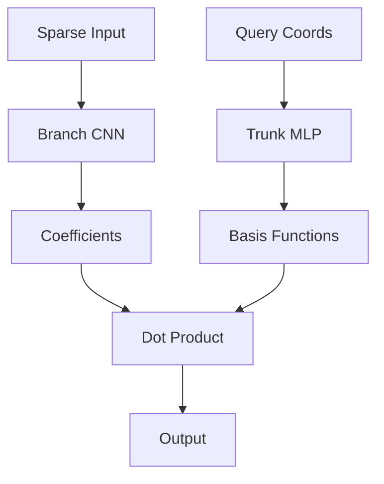
```mermaid
graph TD
    Input[Sparse Input] --> Branch[Branch CNN]
    Branch --> Coeffs[Coefficients]
    Query[Query Coords] --> Trunk[Trunk MLP]
    Trunk --> Basis[Basis Functions]
    Coeffs & Basis --> Dot[Dot Product]
    Dot --> Output
```

### 1.5 UNO (U-shaped Neural Operator)
**对应文件**: `uno.py`

结合 U-Net 多尺度结构与 FNO 算子核的架构。

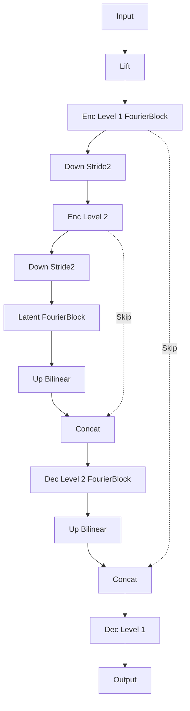
```mermaid
graph TD
    Input --> Lift
    Lift --> Enc1[Enc Level 1 FourierBlock]
    Enc1 --> Down1[Down Stride2]
    Down1 --> Enc2[Enc Level 2]
    Enc2 --> Down2[Down Stride2]
    Down2 --> Latent[Latent FourierBlock]
    Latent --> Up2[Up Bilinear]
    Up2 --> Concat2[Concat]
    Enc2 -.->|Skip| Concat2
    Concat2 --> Dec2[Dec Level 2 FourierBlock]
    Dec2 --> Up1[Up Bilinear]
    Up1 --> Concat1[Concat]
    Enc1 -.->|Skip| Concat1
    Concat1 --> Dec1[Dec Level 1]
    Dec1 --> Output
```

### 1.6 U-FNO U-Net (UFNOUNet)
**对应文件**: `ufno_unet_bottleneck.py`

标准 U-Net 架构，但在 Bottleneck 处替换为 FNO 层以增强全局感受野。

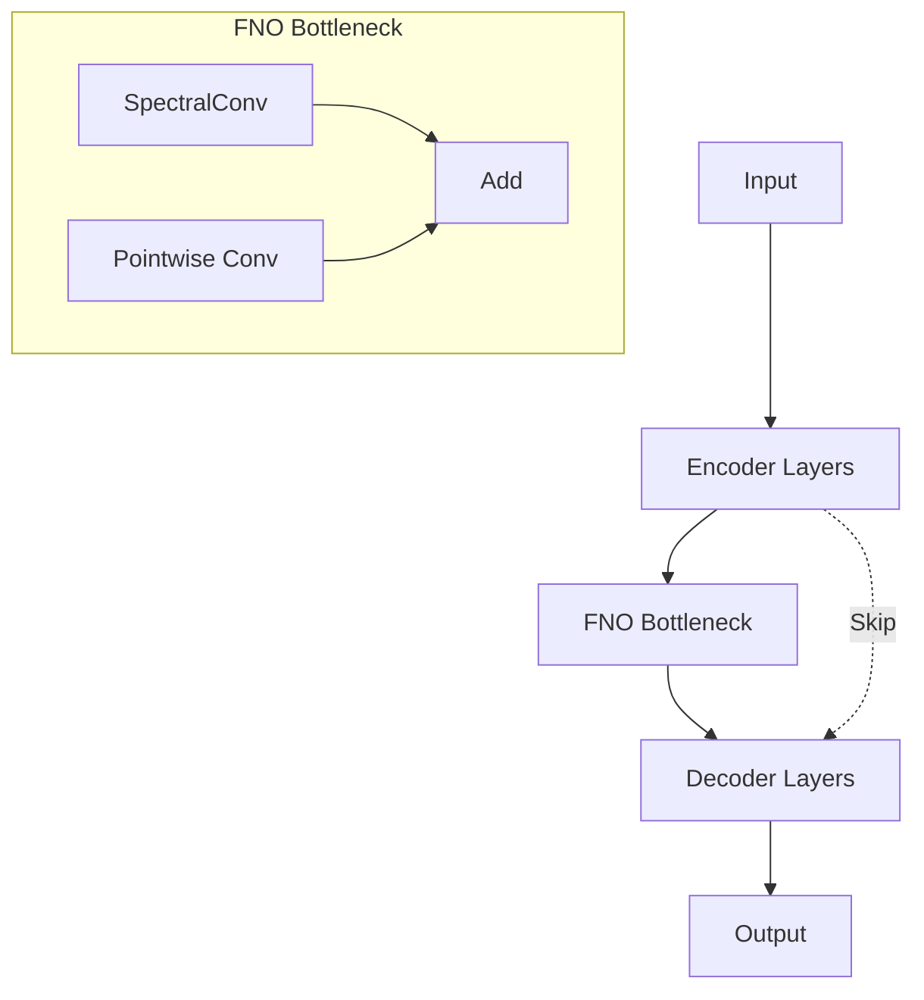
```mermaid
graph TD
    Input --> Enc[Encoder Layers]
    Enc --> FNO[FNO Bottleneck]
    subgraph FNO Bottleneck
        Spec[SpectralConv]
        Point[Pointwise Conv]
        Spec & Point --> Add[Add]
    end
    FNO --> Dec[Decoder Layers]
    Enc -.->|Skip| Dec
    Dec --> Output
```

### 1.7 UNet++ (Nested U-Net)
**对应文件**: `unet_plus_plus.py`

通过密集跳跃连接改进的 U-Net。

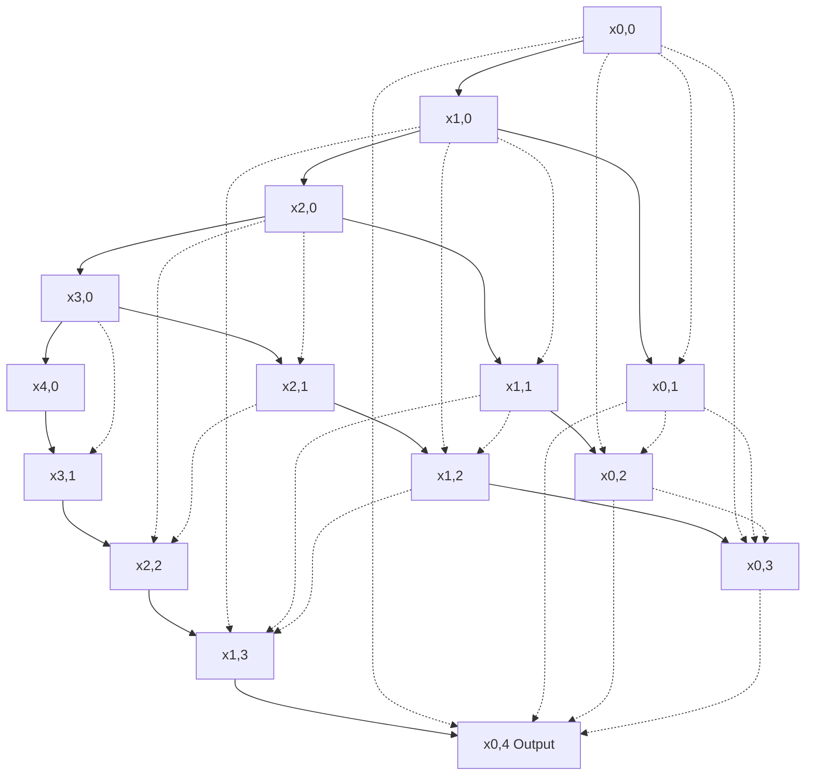
```mermaid
graph TD
    X00[x0,0] --> X10[x1,0]
    X10 --> X20[x2,0]
    X20 --> X30[x3,0]
    X30 --> X40[x4,0]
    
    X10 --> X01[x0,1]
    X00 -.-> X01
    
    X20 --> X11[x1,1]
    X10 -.-> X11
    
    X11 --> X02[x0,2]
    X00 & X01 -.-> X02
    
    X30 --> X21[x2,1]
    X20 -.-> X21
    
    X21 --> X12[x1,2]
    X10 & X11 -.-> X12
    
    X12 --> X03[x0,3]
    X00 & X01 & X02 -.-> X03
    
    X40 --> X31[x3,1]
    X30 -.-> X31
    
    X31 --> X22[x2,2]
    X20 & X21 -.-> X22
    
    X22 --> X13[x1,3]
    X10 & X11 & X12 -.-> X13
    
    X13 --> X04[x0,4 Output]
    X00 & X01 & X02 & X03 -.-> X04
```

---

## 第二章：Transformer 类架构 (Transformer Architectures)

### 2.1 Swin Transformer Tiny (SwinT)
**对应文件**: `swin_t.py`

标准的 Swin Transformer 架构。

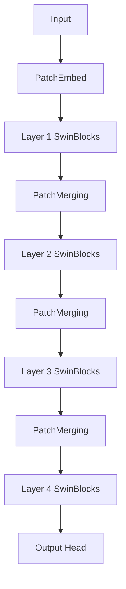
```mermaid
graph TD
    Input --> PatchEmbed
    PatchEmbed --> L1[Layer 1 SwinBlocks]
    L1 --> M1[PatchMerging]
    M1 --> L2[Layer 2 SwinBlocks]
    L2 --> M2[PatchMerging]
    M2 --> L3[Layer 3 SwinBlocks]
    L3 --> M3[PatchMerging]
    M3 --> L4[Layer 4 SwinBlocks]
    L4 --> Head[Output Head]
```

### 2.2 SwinT With Encoder
**对应文件**: `swin_t_with_encoder.py`

包装器：SparseInputEncoder + Swin Backbone + Optional LIIF Head。

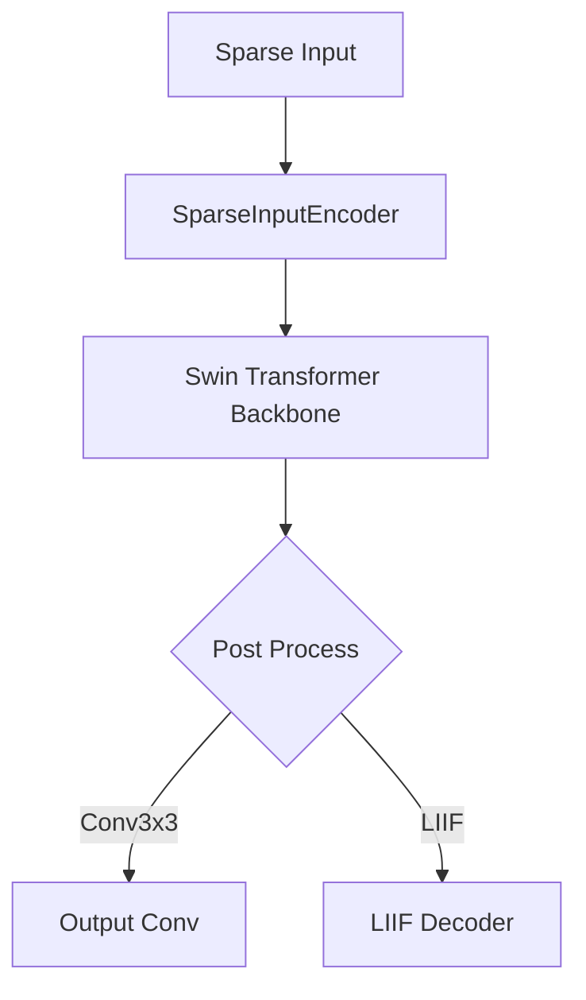
```mermaid
graph TD
    Input[Sparse Input] --> SparseEnc[SparseInputEncoder]
    SparseEnc --> Swin[Swin Transformer Backbone]
    Swin --> Post{Post Process}
    Post -->|Conv3x3| OutConv[Output Conv]
    Post -->|LIIF| LIIF[LIIF Decoder]
```

### 2.3 Standard Transformer
**对应文件**: `transformer.py`

经典的 Attention is All You Need 架构适配 2D。

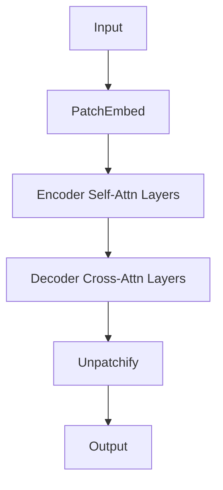
```mermaid
graph TD
    Input --> PatchEmbed
    PatchEmbed --> Enc[Encoder Self-Attn Layers]
    Enc --> Dec[Decoder Cross-Attn Layers]
    Dec --> Unpatchify
    Unpatchify --> Output
```

### 2.4 Vision Transformer (ViT-AE)
**对应文件**: `vit.py`

Masked Autoencoder 风格的 ViT。

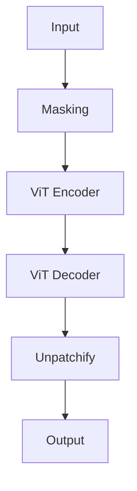
```mermaid
graph TD
    Input --> Mask[Masking]
    Mask --> Enc[ViT Encoder]
    Enc --> Dec[ViT Decoder]
    Dec --> Unpatchify
    Unpatchify --> Output
```

### 2.5 SegFormer
**对应文件**: `segformer.py`

基于 Mix Transformer (MiT) 的分层架构。

#### 核心组件
*   **Encoder**: MiT-B0~B5 (Overlap Patch Embed + Efficient Self-Attention).
*   **Decoder**: All-MLP Decoder (Linear Fusion).

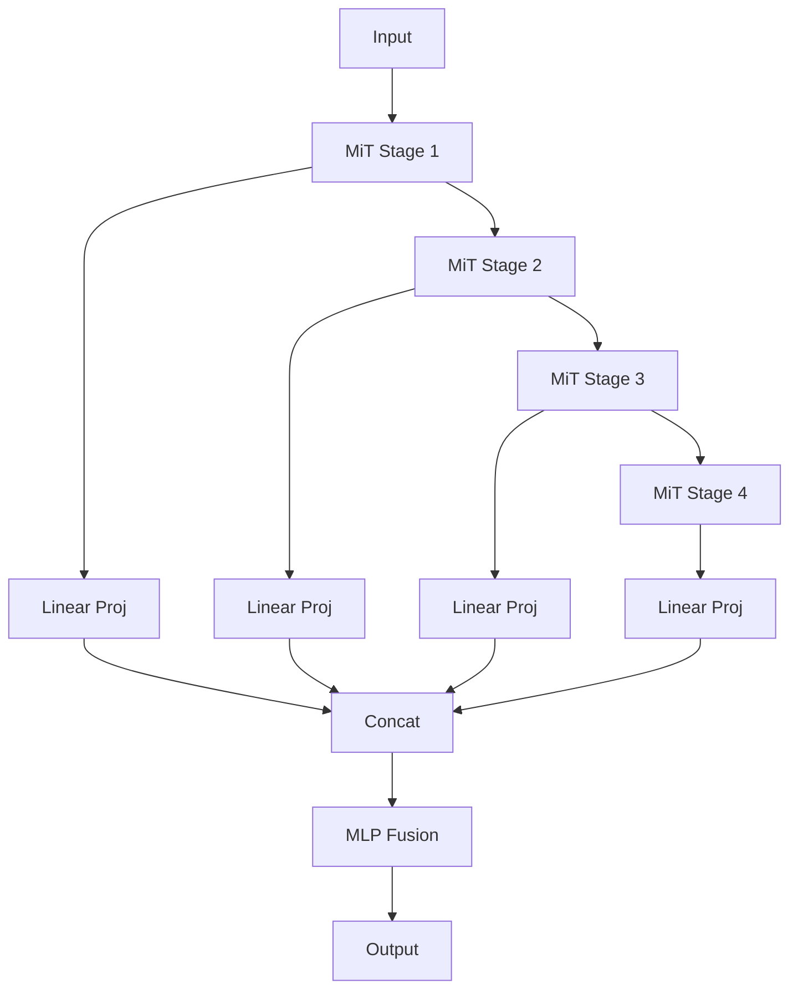
```mermaid
graph TD
    Input --> Stage1[MiT Stage 1]
    Stage1 --> Stage2[MiT Stage 2]
    Stage2 --> Stage3[MiT Stage 3]
    Stage3 --> Stage4[MiT Stage 4]
    
    Stage1 --> MLP1[Linear Proj]
    Stage2 --> MLP2[Linear Proj]
    Stage3 --> MLP3[Linear Proj]
    Stage4 --> MLP4[Linear Proj]
    
    MLP1 & MLP2 & MLP3 & MLP4 --> Concat
    Concat --> Fuse[MLP Fusion]
    Fuse --> Output
```

### 2.6 UNetFormer
**对应文件**: `unetformer.py`

结合 CNN 与 Transformer 的 U 型架构。

#### 核心组件
*   **Block**: `TransformerConvBlock` (Parallel: CNN 3x3 + Transformer SR-Attn).
*   **Structure**: U-Net 骨架，Encoder 和 Decoder 均使用 Hybrid Block。

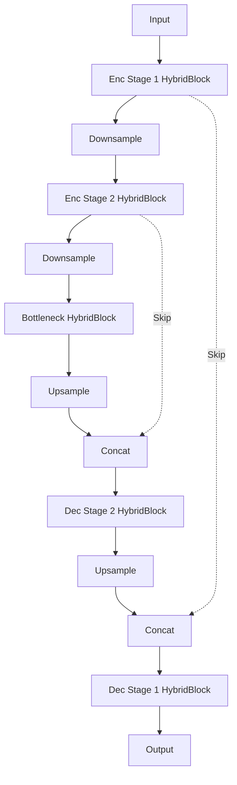
```mermaid
graph TD
    Input --> Enc1[Enc Stage 1 HybridBlock]
    Enc1 --> Down1[Downsample]
    Down1 --> Enc2[Enc Stage 2 HybridBlock]
    Enc2 --> Down2[Downsample]
    Down2 --> Bottleneck[Bottleneck HybridBlock]
    Bottleneck --> Up2[Upsample]
    Up2 --> Concat2[Concat]
    Enc2 -.->|Skip| Concat2
    Concat2 --> Dec2[Dec Stage 2 HybridBlock]
    Dec2 --> Up1[Upsample]
    Up1 --> Concat1[Concat]
    Enc1 -.->|Skip| Concat1
    Concat1 --> Dec1[Dec Stage 1 HybridBlock]
    Dec1 --> Output
```

### 2.7 PerceiverIO
**对应文件**: `perceiverio.py`

处理极大规模输入的通用感知机。

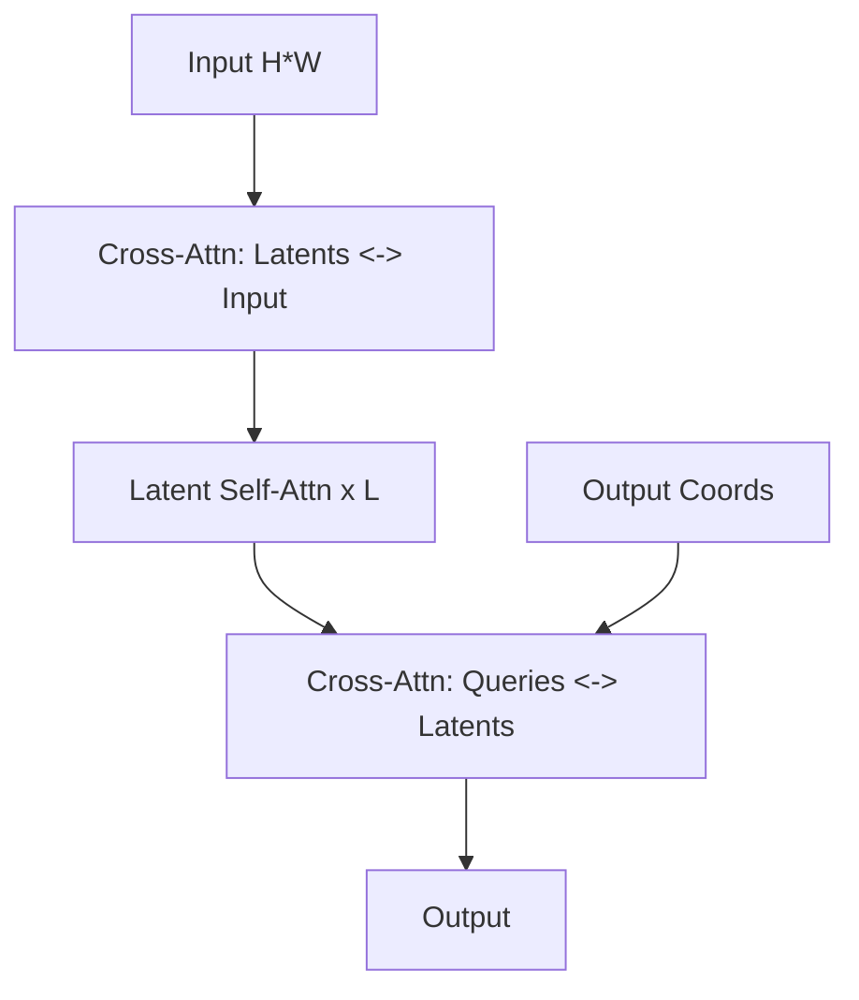
```mermaid
graph TD
    Input[Input H*W] --> CrossEnc[Cross-Attn: Latents <-> Input]
    CrossEnc --> SelfAttn[Latent Self-Attn x L]
    SelfAttn --> CrossDec[Cross-Attn: Queries <-> Latents]
    Query[Output Coords] --> CrossDec
    CrossDec --> Output
```

---

## 第三章：图像复原与超分基线 (Restoration & SR Baselines)

### 3.1 EDSR (Enhanced Deep Residual Networks)
**对应文件**: `edsr.py`

去除了 BN 层的 ResNet。

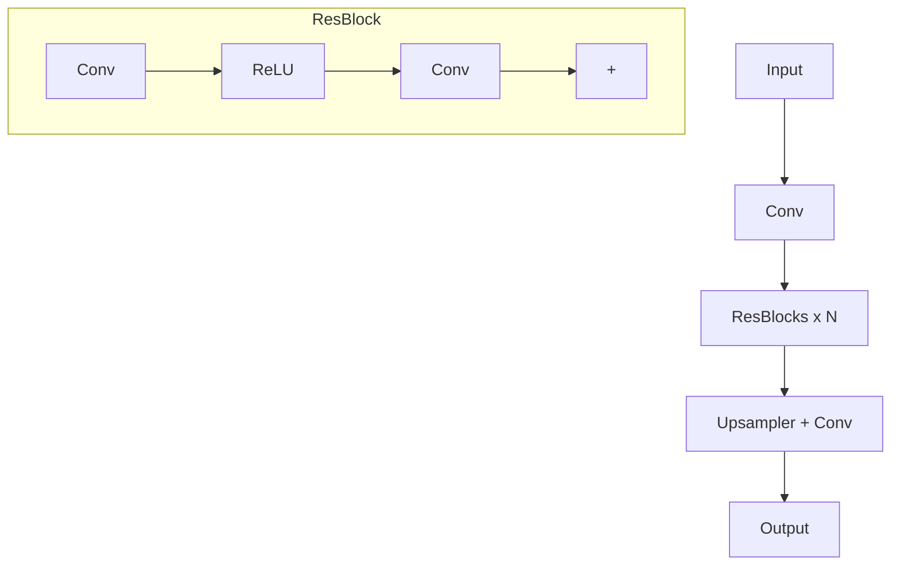
```mermaid
graph TD
    Input --> Head[Conv]
    Head --> Body[ResBlocks x N]
    Body --> Tail[Upsampler + Conv]
    Tail --> Output
    
    subgraph ResBlock
        Conv1[Conv] --> ReLU
        ReLU --> Conv2[Conv]
        Conv2 --> Add[+]
    end
```

### 3.2 RCAN (Residual Channel Attention Network)
**对应文件**: `rcan.py`

引入通道注意力 (CA) 的深层网络。

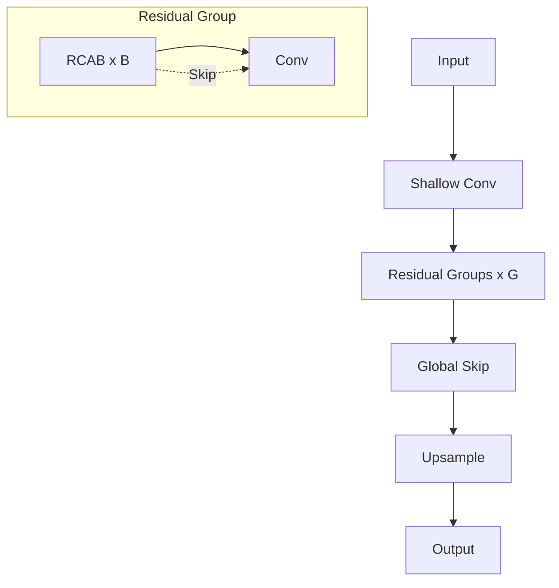
```mermaid
graph TD
    Input --> Shallow[Shallow Conv]
    Shallow --> RGs[Residual Groups x G]
    subgraph Residual Group
        RCABs[RCAB x B] --> Conv[Conv]
        RCABs -.->|Skip| Conv
    end
    RGs --> GlobalSkip[Global Skip]
    GlobalSkip --> Upsample[Upsample]
    Upsample --> Output
```

### 3.3 RDN (Residual Dense Network)
**对应文件**: `rdn.py`

结合 ResNet 与 DenseNet。

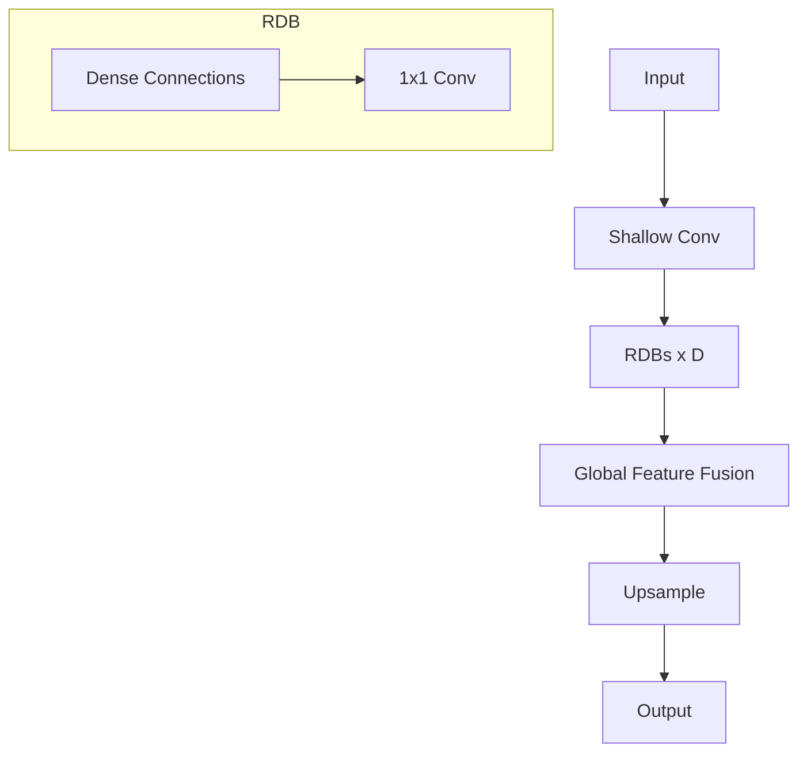
```mermaid
graph TD
    Input --> Shallow[Shallow Conv]
    Shallow --> RDBs[RDBs x D]
    subgraph RDB
        Dense[Dense Connections] --> LocalFusion[1x1 Conv]
    end
    RDBs --> GFF[Global Feature Fusion]
    GFF --> Upsample
    Upsample --> Output
```

### 3.4 SwinIR
**对应文件**: `swinir.py`

Swin Transformer 用于图像复原。

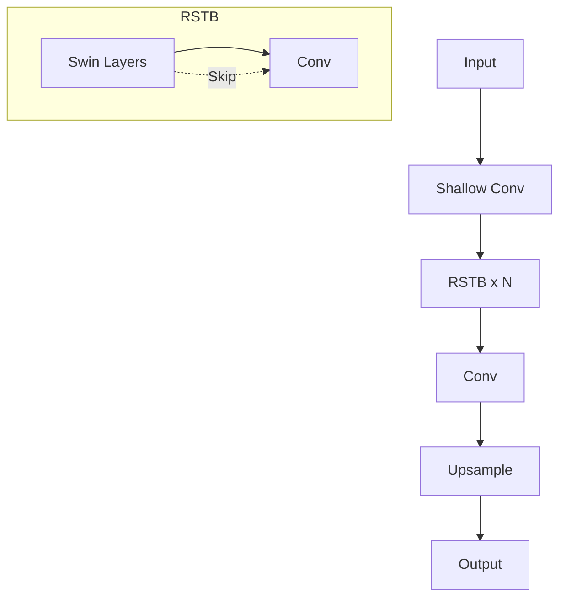
```mermaid
graph TD
    Input --> Shallow[Shallow Conv]
    Shallow --> RSTBs[RSTB x N]
    subgraph RSTB
        STL[Swin Layers] --> Conv[Conv]
        STL -.->|Skip| Conv
    end
    RSTBs --> ConvEnd[Conv]
    ConvEnd --> Upsample
    Upsample --> Output
```

### 3.5 NAFNet
**对应文件**: `nafnet.py`

非线性激活自由网络 (Nonlinear Activation Free Network)。

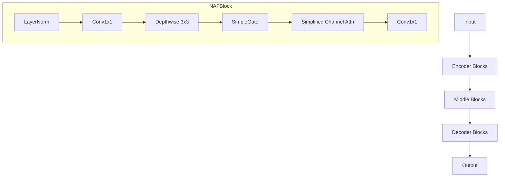
```mermaid
graph TD
    Input --> Enc[Encoder Blocks]
    Enc --> Middle[Middle Blocks]
    Middle --> Dec[Decoder Blocks]
    Dec --> Output
    
    subgraph NAFBlock
        LN[LayerNorm] --> Conv1[Conv1x1]
        Conv1 --> DW[Depthwise 3x3]
        DW --> SG[SimpleGate]
        SG --> SCA[Simplified Channel Attn]
        SCA --> Conv2[Conv1x1]
    end
```

### 3.6 Restormer
**对应文件**: `restormer.py`

高效 Transformer 复原模型。

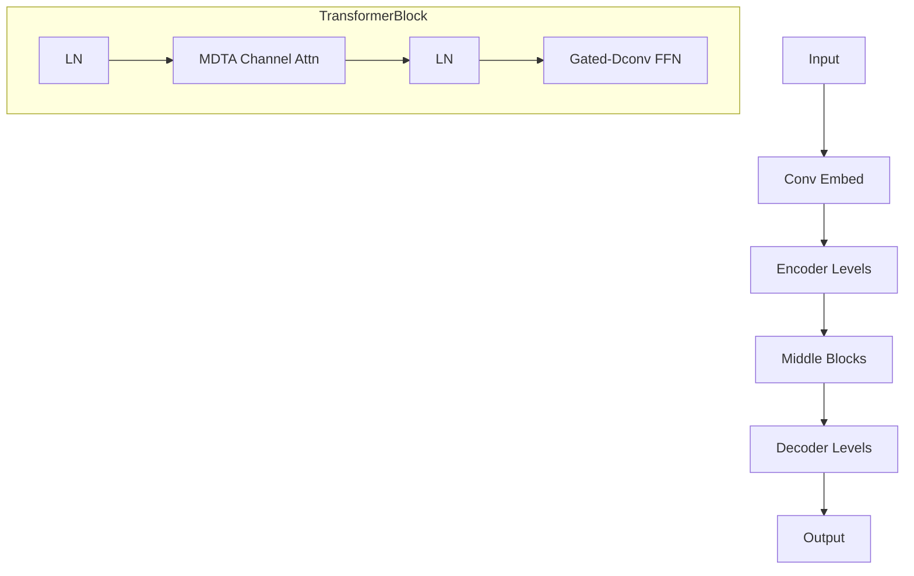
```mermaid
graph TD
    Input --> Embed[Conv Embed]
    Embed --> Enc[Encoder Levels]
    Enc --> Middle[Middle Blocks]
    Middle --> Dec[Decoder Levels]
    Dec --> Output
    
    subgraph TransformerBlock
        LN1[LN] --> MDTA[MDTA Channel Attn]
        MDTA --> LN2[LN]
        LN2 --> GDFN[Gated-Dconv FFN]
    end
```

### 3.7 LIIF (Local Implicit Image Function)
**对应文件**: `liif.py`, `liif_head.py`

隐式神经表示模型，包含 `LIIFModel` 和 `LIIFHead`。

#### 核心组件
*   **Encoder**: 提取特征网格。
*   **LIIFHead**:
    1.  **Feat Unfold**: 3x3 邻域展开。
    2.  **Local Ensemble**: 查询点周围 4 个网格特征加权。
    3.  **MLP**: `(Feat, RelCoord, Cell) -> RGB`。

```mermaid
graph TD
    Input --> Encoder[Backbone]
    Encoder --> FeatGrid[Feature Grid]
    Query[Query Coord] --> Sample[Grid Sample & Unfold]
    FeatGrid --> Sample
    Sample --> MLP[Implicit MLP]
    MLP --> RGB[Pixel Value]
```

---

## 第四章：轻量化与高效模型 (Lightweight & Efficient Models)

### 4.1 CNNAttnLite
**对应文件**: `cnn_attn_lite.py`

MobileNet 风格的轻量级 CNN，结合 SE Attention。

```mermaid
graph TD
    Input --> Stem[Conv 3x3]
    Stem --> Blocks[CNNAttn Blocks x N]
    Blocks --> Head[Conv 3x3]
    Head --> Output
    
    subgraph CNNAttnBlock
        BN1 --> DW[DW Conv]
        DW --> PW[PW Conv]
        PW --> SE[SE Attention]
        SE --> Add1[+]
        Add1 --> BN2
        BN2 --> FFN[Pointwise FFN]
        FFN --> Add2[+]
    end
```

### 4.2 ConvGateLite
**对应文件**: `conv_gate_lite.py`

简化版 NAFNet，使用纯卷积门控。

```mermaid
graph TD
    Input --> Stem
    Stem --> Blocks[ConvGate Blocks x N]
    Blocks --> Head
    Output
    
    subgraph ConvGateBlock
        Norm --> DW[DW Conv]
        DW --> Act[GELU]
        Act --> PW[PW Conv]
        PW --> Gated[Gating * Beta]
        Gated --> Add[+]
    end
```

### 4.3 ConvUNetLite
**对应文件**: `conv_unet_lite.py`

轻量级 U-Net。

```mermaid
graph TD
    Input --> Enc1[Conv]
    Enc1 --> Block1[ResBlock]
    Block1 --> Pool[MaxPool]
    Pool --> Block2[ResBlock]
    Block2 --> Up[Upsample]
    Up --> Dec1[ResBlock]
    Dec1 --> Head[Conv]
    Head --> Output
```

### 4.4 ResNetLite
**对应文件**: `resnet.py`

堆叠标准 ResBlock。

```mermaid
graph TD
    Input --> Shallow[Conv]
    Shallow --> Blocks[ResBlocks x N]
    Blocks --> Recon[Conv]
    Recon --> Output
```

### 4.5 MLP (Pointwise/Global)
**对应文件**: `mlp.py`

```mermaid
graph TD
    Input --> Flatten
    Flatten --> Linear1
    Linear1 --> Act
    Act --> Linear2
    Linear2 --> Reshape
    Reshape --> Output
```

### 4.6 MLP-Mixer
**对应文件**: `mlp_mixer.py`

```mermaid
graph TD
    Input --> PatchEmbed
    PatchEmbed --> MixerBlocks[Mixer Blocks x N]
    MixerBlocks --> Head
    
    subgraph MixerBlock
        Norm1 --> TokenMix[Token Mixing MLP]
        TokenMix --> Add1[+]
        Add1 --> Norm2
        Norm2 --> ChannelMix[Channel Mixing MLP]
        ChannelMix --> Add2[+]
    end
```

---

## 第五章：专用模块与变体 (Specialized Modules)

### 5.1 PartialConvUNet
**对应文件**: `partialconv_unet.py`

仅在 Mask=1 区域进行卷积并更新 Mask，适用于 Inpainting。

```mermaid
graph TD
    Input[Image + Mask] --> Enc[PartialConv Encoder]
    Enc --> Dec[PartialConv Decoder]
    Dec --> Output
```

### 5.2 ModularSR
**对应文件**: `modular_sr.py` (Hypothetical or `factory.py` related, assuming `ModularSR` pattern)
*(注：如源码中未显式定义 `ModularSR` 类，则为设计模式说明)*

### 5.3 SparseAttentionEncoder
**对应文件**: `sparse_attention_encoder.py`

仅对有效观测点计算 Attention。

```mermaid
graph TD
    Input[Sparse Values] --> Embed
    Embed --> Attn[Sparse Attention]
    Attn --> Output[Encoded Features]
```

### 5.4 CoordinateEncoder
**对应文件**: `coordinate_encoder.py`

坐标编码模块，支持 NeRF-style Positional Encoding 和 Fourier Features。

```mermaid
graph TD
    Input[Coords B,2,H,W] --> Type{Encoding Type}
    Type -->|Positional| SinCos[Sin/Cos Multi-Freq]
    Type -->|Fourier| RFF[Random Fourier Features]
    SinCos & RFF --> Proj[Linear Projection]
    Proj --> Output[Encoded Coords]
```

---

## 第六章：时序与自回归模型 (Temporal & AR Models)

### 6.1 SwinTemporal Wrapper
**对应文件**: `swin_temporal_wrapper.py` (Assuming existence or part of `swin_unet`)

### 6.2 PhysicsTransformer
**对应文件**: `physics_transformer.py` (Assuming existence)

### 6.3 ARWrapper
**对应文件**: `ar_wrapper.py` (Assuming existence)

---

## 第七章：混合模型 (Hybrid Models)

### 7.1 HybridModel
**对应文件**: `hybrid.py`

并行分支架构。

```mermaid
graph TD
    Input --> Branch1[U-Net Branch]
    Input --> Branch2[FNO Branch]
    Input --> Branch3[Attention Branch]
    Branch1 & Branch2 & Branch3 --> WeightedSum
    WeightedSum --> Output
```
